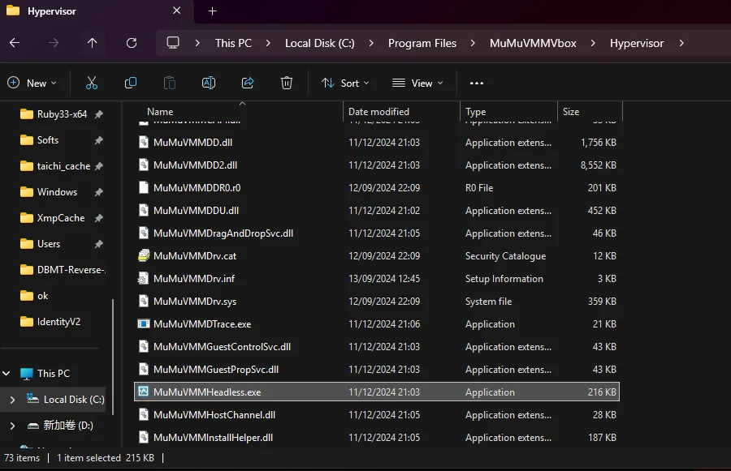

3Dmigoto不是万能的，使用它需要满足很多前置条件：

- 游戏必须支持DX11并且正常开启DX11
- 游戏必须能够成功注入3Dmigoto，且运行正常不报错
- 游戏如果使用CPU-PreSkinning来计算角色动画，则无法进行修改，强行修改有CPU-PreSkinning动画的物体会造成动画丢失

这些限制并不是每个人都清楚，尤其是新手在第一次接触3Dmigoto后，会认为这个工具是通用且万能的，于是便想修改手游。

但是手游大部分使用Vulkan或OpenGL进行渲染，极少有能够兼容DX11的，除非是自研引擎。

如果一个手游没有官方PC客户端的话，就不建议继续研究了，因为大概率没有使用GPU-PreSkinning技术。

当然如果你非得去注入手游去提取出摆过姿势的模型以及贴图资源等等，可以试试注入MuMu模拟器，或蓝叠模拟器，或其他模拟器等等。

以MuMu模拟器为例：

进程路径填写为：

C:\Program Files\MuMuVMMVbox\Hypervisor\MuMuVMMHeadless.exe

设置中开启DX11模式即可

# 缺陷

- 就算是能注入，大部分提取脚本也得改造或者重写才能完美支持，大部分时候都是费劲重写提取脚本，最后收益特别低，付出于收益不成正比，不建议深入研究手游的模型使用3Dmigoto提取，替换就更难受了，会卡死的。
- 非常卡，非常卡，非常卡，部分游戏会直接卡死。
- 99%的游戏都只支持CPU-PreSkinning，就算能提取角色资源，出来也是摆过姿势的
- 手游为了优化，全部都是低模，提取出来根本没法用。

# 总结

别想着研究手游了

