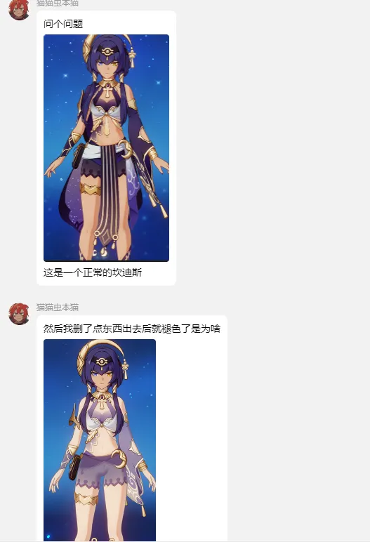
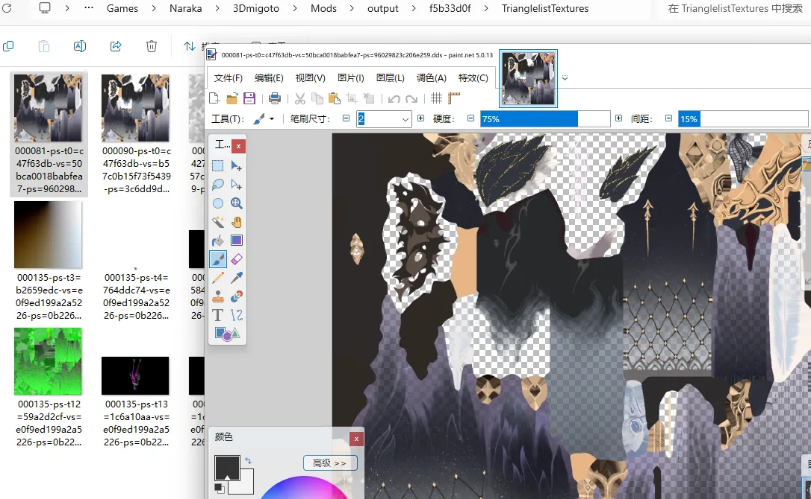
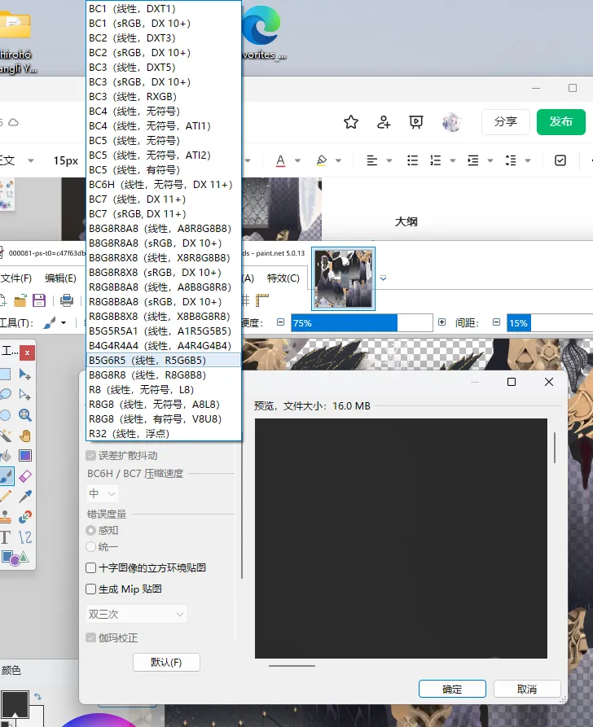
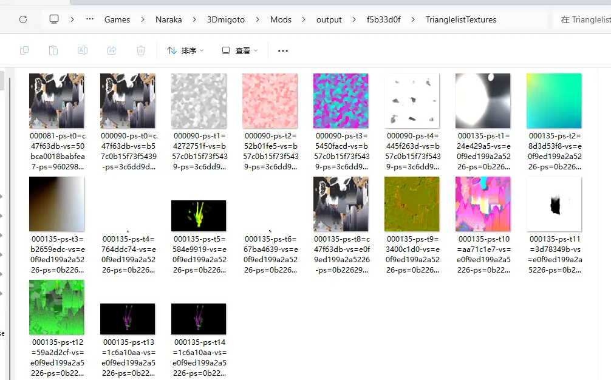
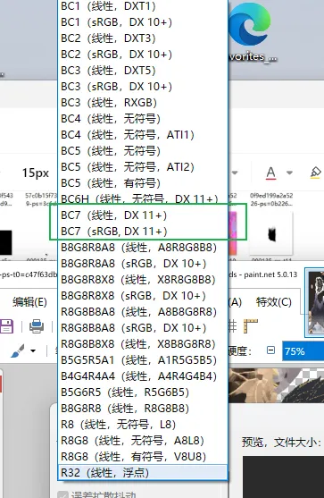

在3Dmigoto的Mod制作中，我们修改贴图后，如果保存的格式不对，就很有可能导致贴图颜色变化或者无法正常加载贴图，例如：

这是因为修改了贴图之后，格式可能默认保存为线性UNORM了，和游戏原本使用的格式不一样，导致Shader读取的信息不一样，所以导致出现色差问题。

# DDS贴图格式有哪些？
.dds格式的贴图，其编码格式有很多，以paint.net为例，我们随便打开一个贴图：

点击另存为，保存为dds格式：

在保存配置的左上角，可以设置贴图的格式，我们来看看dds有哪些格式：

可以看到贴图的格式还是很多的，这是因为DirectX经过这么多年的发展，不断迭代新的格式，那么我们如何确定一个贴图该使用哪种格式呢？
# 如何确定一个DDS贴图该使用哪种格式?
首先打开我们的output文件夹中的hash值命名的文件夹：

你会发现，有三个贴图文件夹：
- DedupedTextures
- DedupedTextures_tga
- TrianglelistTextures
其中TrianglelistTextures中装着你提取用的这个DrawIB渲染模型所用到的所有贴图：

然后打开DedupedTextures文件夹，你会发现重复的贴图不见了，每个贴图都是独一无二的，在其中找到你要看格式的那张贴图：

它的名称是：c47f63db-BC7_UNORM_SRGB.dds

BC7对应我们paint.net里保存时的BC7：

UNORM_SRGB代表它使用的是sRGB格式的贴图，此时你只要选择paint.net里的BC7(sRGB,DX11+)就行了

如果贴图的格式是UNORM结尾没有_SRGB的话，你就选BC7(线性，DX11+)即可。

因为3Dmigoto是DX11的Mod工具，所以99%的贴图格式都是DX11+的，具体是线性还是sRGB就用我们上面的方法判断即可。

所以以后遇到贴图色差问题，可以检查一下贴图的格式是否正确，如果不正确的话，手动另存为正确的格式，然后替换不正确格式的贴图即可。