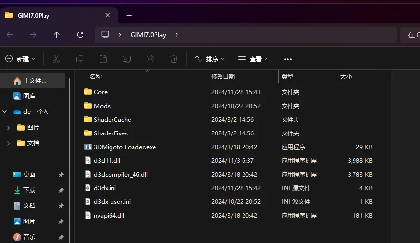
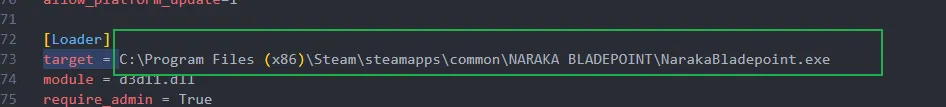
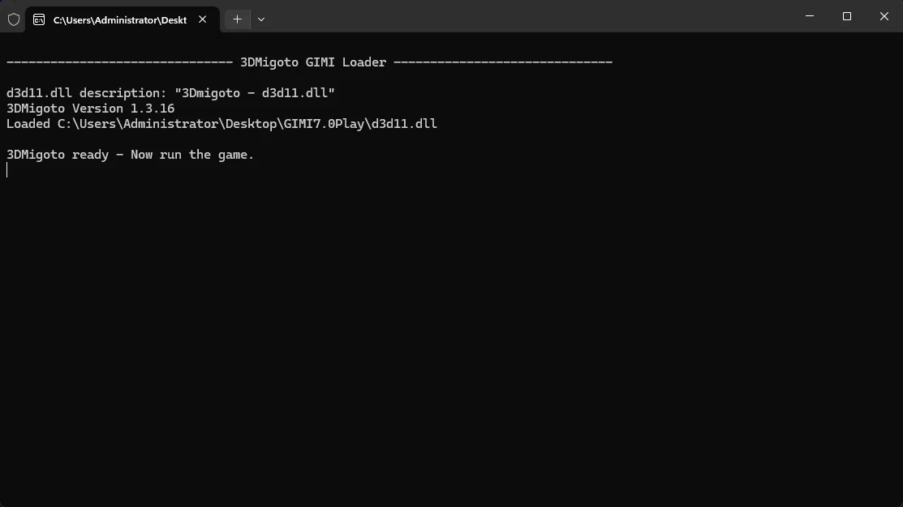
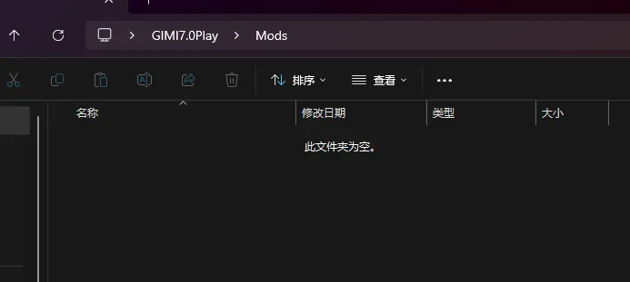
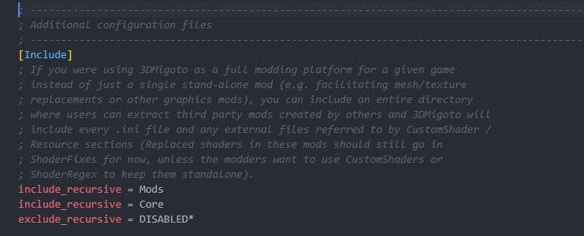

# 解压安装3Dmigoto

获取一份 `3DMigoto`，解压到任选路径，下面以解压至桌面为例：



# 手动配置路径

打开 `d3dx.ini`，找到 `target = `，将对应的路径改为需要注入的目标程序路径：


保存该文件，重新打开 `3Dmigoto Loader.exe` 即可使用。


此处另外存在若干可供配置的参数，如下为原始叙述：

```ini
;------------------------------------------------------------------------------------------------------
; Settings used by the external 3DMigoto Loader
;------------------------------------------------------------------------------------------------------
[Loader]
launch = D:\ZenlessZoneZero Game\ZenlessZoneZero.exe
; Target process to load into. You can optionally include part of the directory
; structure in case the game's executable name is generic.
target = D:\ZenlessZoneZero Game\ZenlessZoneZero.exe

; This tells the loader where to find 3DMigoto. This DLL must be located
; in the same directory as 3DMigoto Loader.exe and will be loaded in the target
; process under the same name. If d3d11.dll doesn't work try 3dmigoto.dll
module = d3d11.dll

; Uncomment to always elevate the loader to support games that run as admin.
; This will display a UAC prompt so only enable it if you actually need it.
require_admin = true

; Automatically launch the game from the loader. If you put the executable name
; here than the loader will need to be located in the game directory. You can
; use the full path, but that is not recommended to ship any fixes with since
; it will vary on a user's system. If the game is on Steam you can use the
; steam browser protocol to launch it, optionally passing it any command line
; arguments you need (unfortunately Steam pops a dialog to confirm command line
; parameters, which tends to end up behind other windows):
;launch = DOA6.exe
;launch = steam://run/838380/
;launch = steam://run/237850//-window-mode exclusive/

; Delay this many extra seconds after confirming that 3DMigoto was loaded in
; the target process. For games that respawn themselves or have multiple
; executables of the same name when the first process we see may not be the
; actual one we need. Set to -1 to disable automatic shut down.
;delay = 20
```

这些参数的部分通俗解释：

| 参数       | 含义 |
| ---------- | ---- |
| `target`          |   目标需注入游戏的进程路径    |
| `module`          |   一般填写 `d3d11.dll` 即可   |
| `require_admin`   |   一般填写 `true` 即可    |
| `launch`          |   `3DMigoto Loader.exe` 启动后将自动唤起的程序路径    |
| `delay`           |   `3DMigoto Loader.exe` 运行后的自动关闭延迟   |

<!-- - target = 填写目标游戏的进程路径
- module = 一般填写d3d11.dll
- require_admin 一般填写true
- launch = 填写3Dmigoto Loader.exe运行后自动调起的程序路径
- delay = 填写3Dmigoto Loader.exe在运行后，经过多少秒自动退出 -->

尽管原初的 3DMigoto 规定了这些参数，但现代的基于 3DMigoto 的 Mod 加载器，包括 SSMT 和 [XXMI](https://github.com/SpectrumQT/XXMI-Launcher)，部分魔改了这些参数，删掉了无用参数 `delay`，`module`，`require_admin`，如，增加了部分参数例如 `launch_args`，


所以这里仅供参考。

# 手动安装Mod到3Dmigoto

把 Mod 文件或 Mod 文件夹**而非 `.zip` 或 `.rar` 压缩包**放到 `Mods` 文件夹中即：



随后启动 3Dmigoto 并启动游戏即可。

# 为什么是安装到Mods文件夹中？

3Dmigoto 的 Mod 安装到什么地方，由 `d3dx.ini` 中的 `include` 参数控制：



如上图，原始 3Dmigoto 一般初始携带一个 Mods 文件夹，同时默认配置了 `include = Mods`。

所以按照约定俗成的使用方法，我们会把 Mod 文件放到 Mods 文件夹中。
