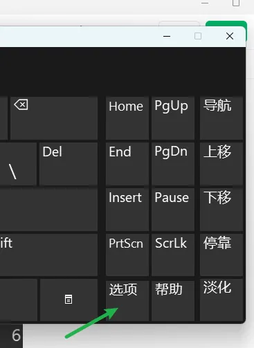
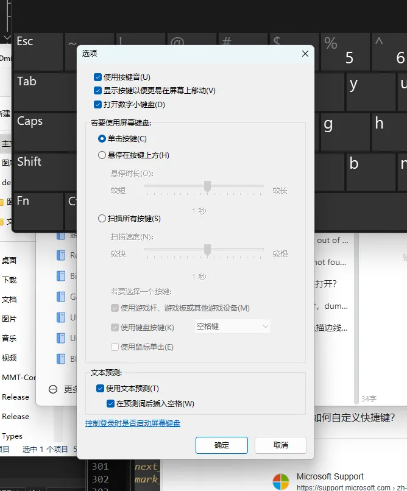
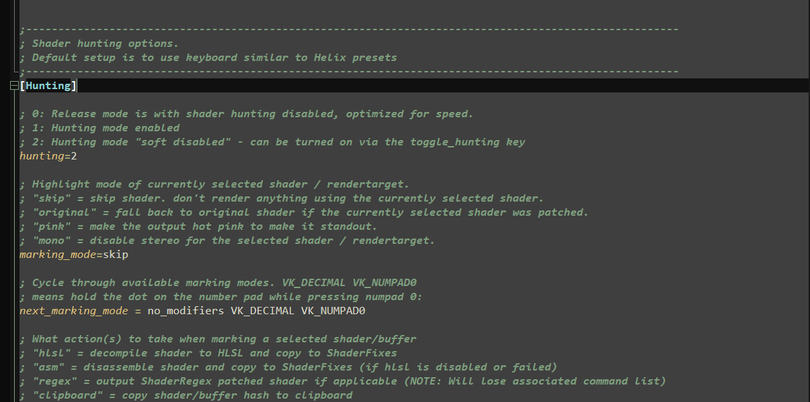
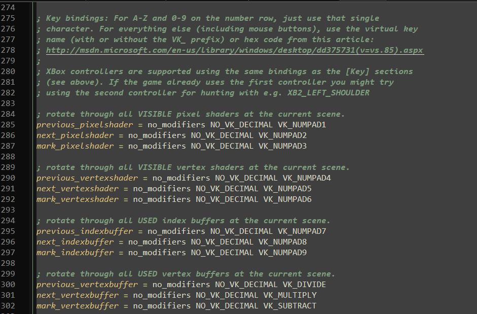
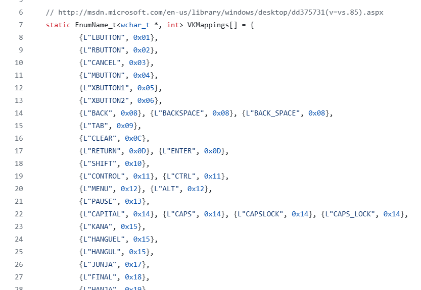

# (1) 使用Windows自带的虚拟键盘

快捷键： Win + Ctrl + O

如上图，点选项，出来如下界面勾选打开数字小键盘

然后就能用了

# (2) d3dx.ini中更改键位设置

打开你的d3dx.ini，然后去到[Hunting]部分：

往下滑找到小键盘键位绑定部分：

然后修改这些键位设置的值即可

但是我们怎么知道填哪些值呢？此时必须查看3Dmigoto源码里的值的定义：

https://github.com/bo3b/3Dmigoto/blob/master/vkeys.h

# (3) 买个新键盘

（实在不行买个键盘把，拼多多9.9凑合用）

