# 工具版本
最低使用和我一样的版本，建议使用你当时观看日期的最新版本:

DBMT V1.1.9.6

Herta V1.3.0

现在DBMT已淘汰，建议升级到SSMT和SSMT插件。

# 首先我们老规矩提取模型：

(1) 首先确定我们要做Mod的部位，是删掉这个裙子的遮羞布：

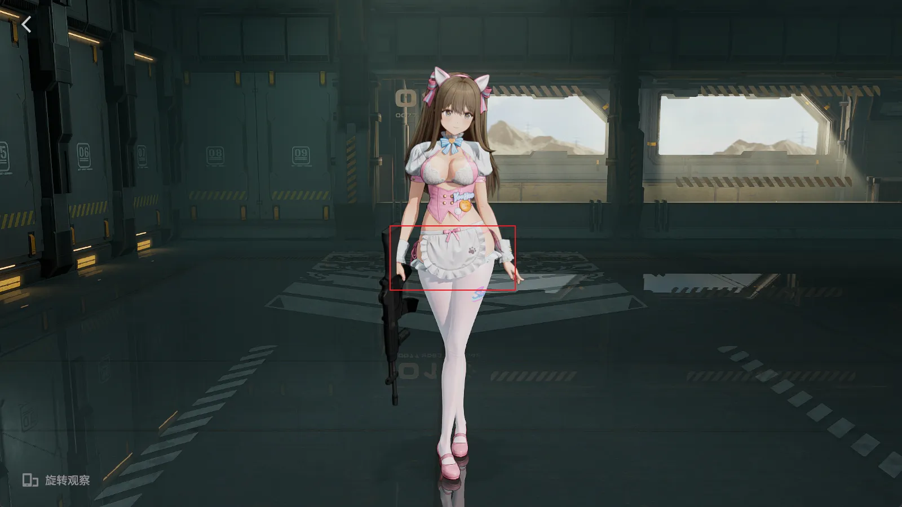

(2) 打开Hunting界面按小键盘7和8切换IB，直到我们想做Mod的部位消失

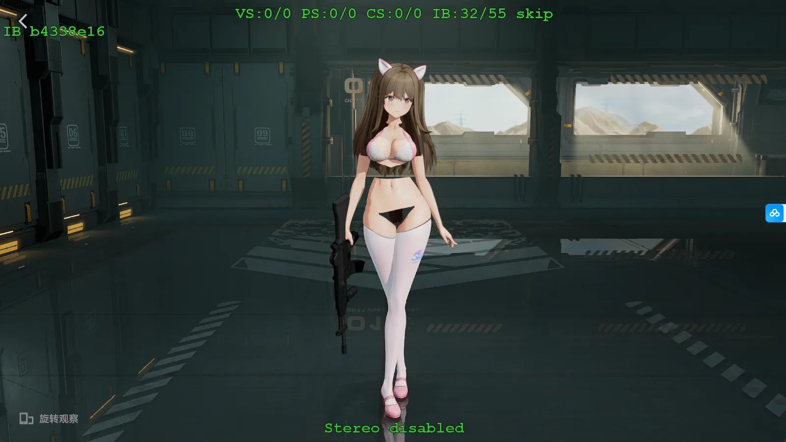

(3) 按小键盘9 复制这个IB值，按小键盘 + 重置Hunting界面，按F8 Dump FrameAnalysis文件夹

随后去工作台创建工作空间并填写DrawIB:

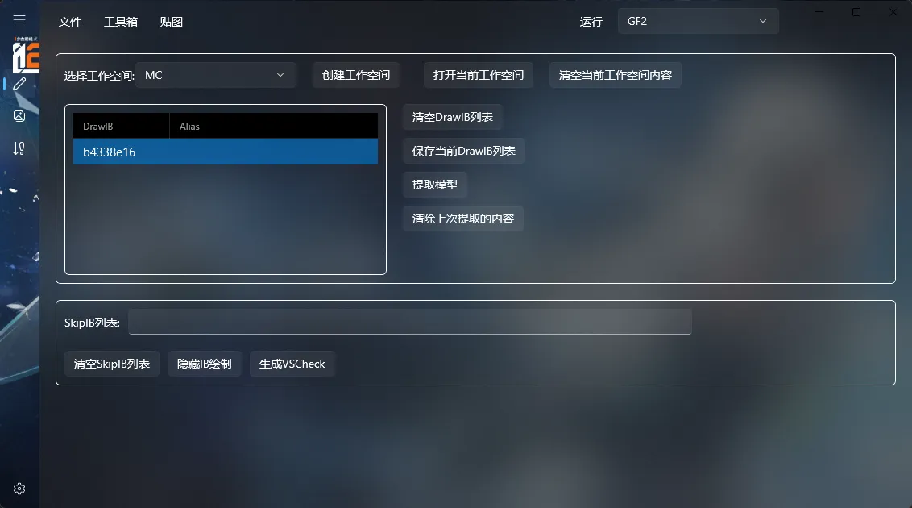

(4) 随后点击提取模型，提取运行完成后自动弹出当前工作空间文件夹

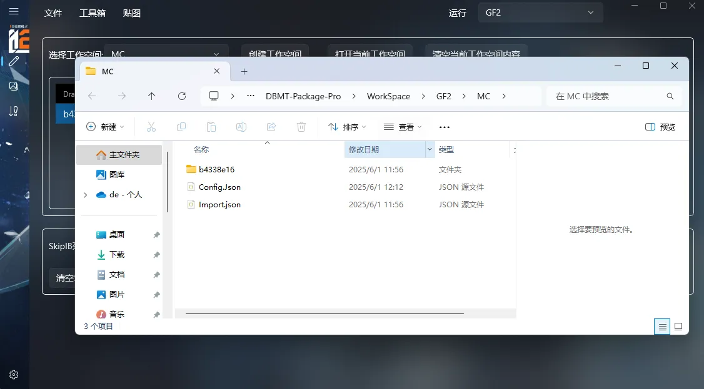

(5) 随后打开Blender，点击一键导入当前工作空间内容：

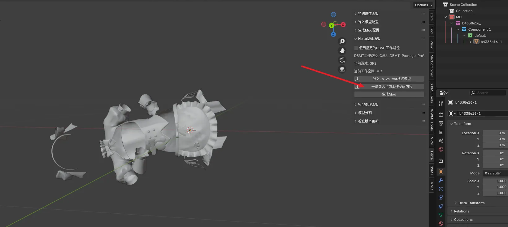

(6) 随后我们进行顶点偏移，因为GF2使用的是CPU-PreSkinning，所以我们只能通过形态键顶点偏移技术的衍生版：基于顶点偏移距离决定顶点消失技术的hlsl来达成删除顶点的效果。

所以这里我们选中裙摆的顶点，xyz轴都移动到两格以上的位置

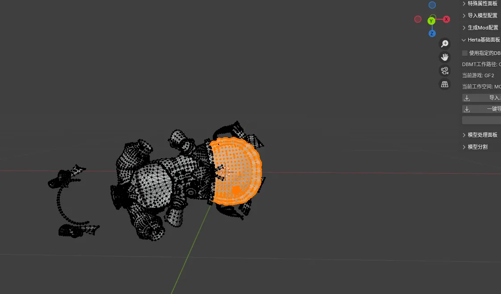

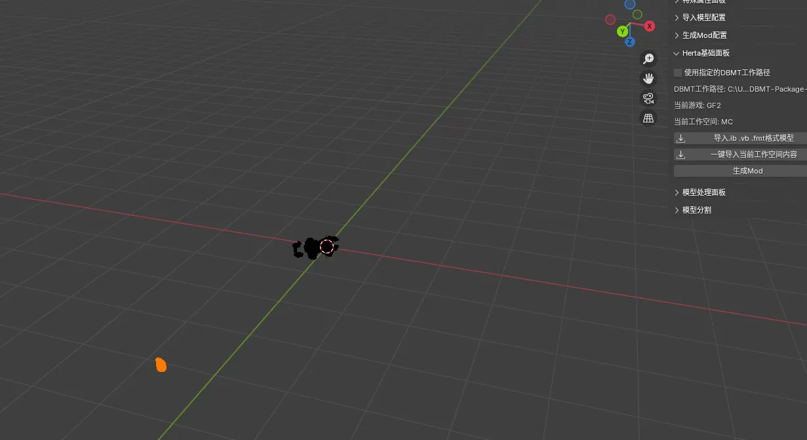

(7) 随后生成Mod，生成Mod后会自动打开生成的Mod的文件夹：

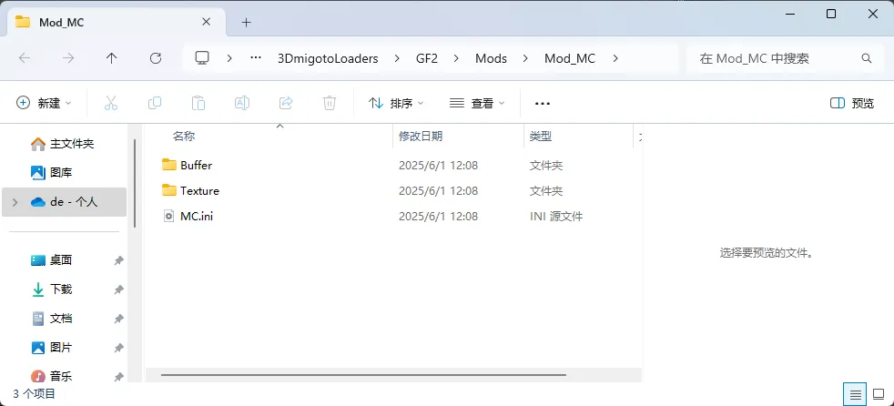

(8) 随后进入Buffer文件夹，复制Position.buf，并改名为Key.buf，放到我们提前准备好的模板文件夹CustomShader_CPU-PreSkinning里：

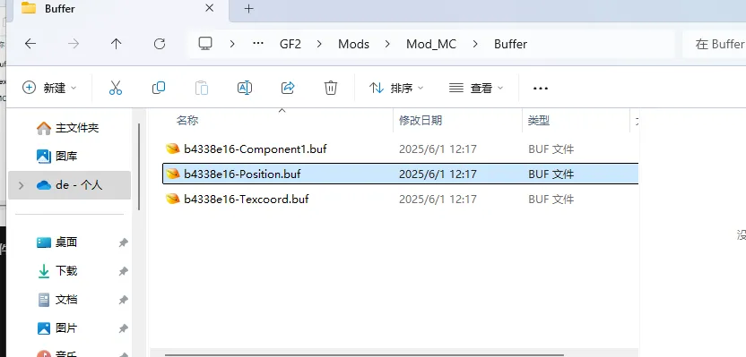

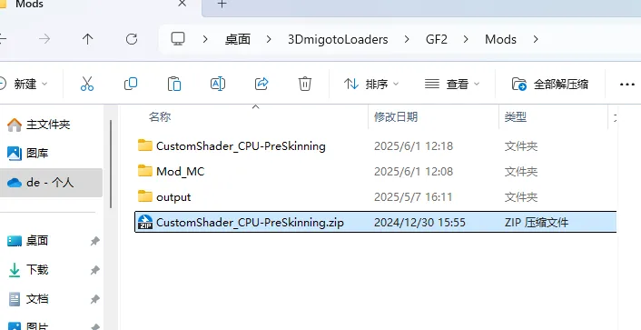

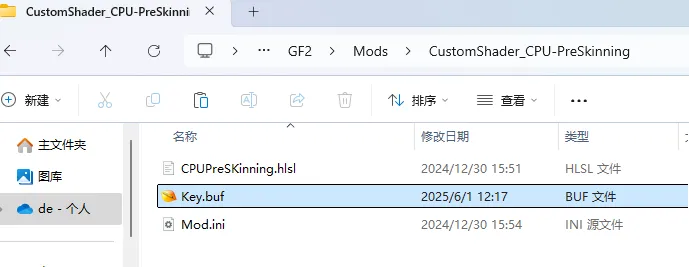

这里注意，CustomShader_CPU-PreSkinning.zip位于DBMT-Package的3Dmigoto-GameMod-Fork文件夹下，可自行复制过来使用：

(9) 随后返回Blender，重新一键导入当前工作空间内容，并且直接生成Mod，随后去Buffer文件夹中复制Position.buf到我们的模板文件夹中并改名为Base.buf

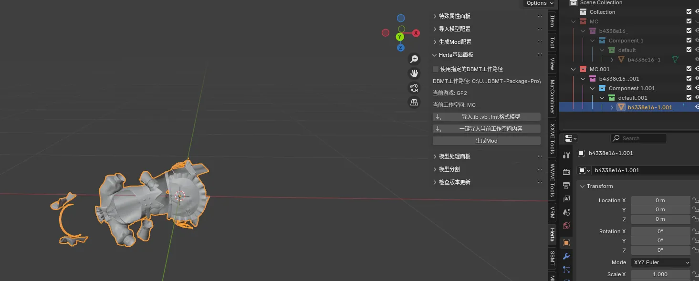

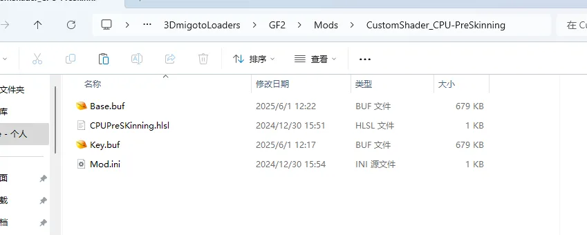

(10) 接下来打开我们刚才直接导入直接生成Mod的ini，查看顶点数：

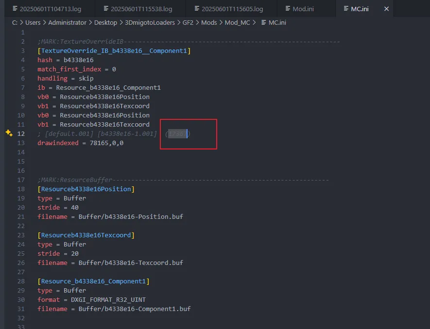

这里可以看到是17367，记下这个数字，打开我们模板文件夹中的Mod.ini进行修改，把dispatch后面的数字改为13767,1,1

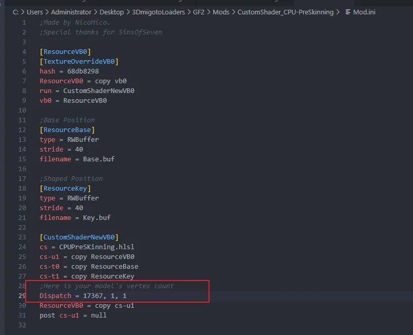

(11) 随后我们打开提取的工作空间文件夹，进入对应数据类型的文件夹下面，有个tmp.json:

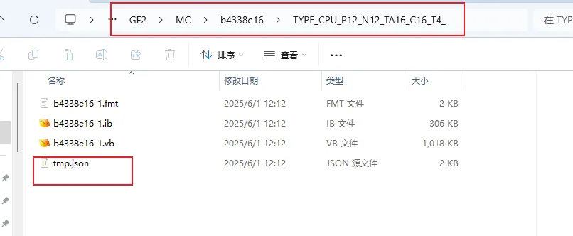

点开后发现可以看到Position的hash值是40d32b21，复制并替换到模板文件夹的Mod.ini中对应vb0的Hash值：

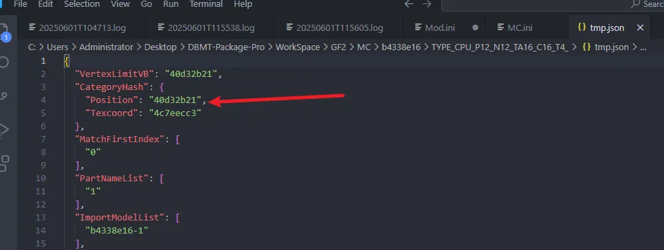

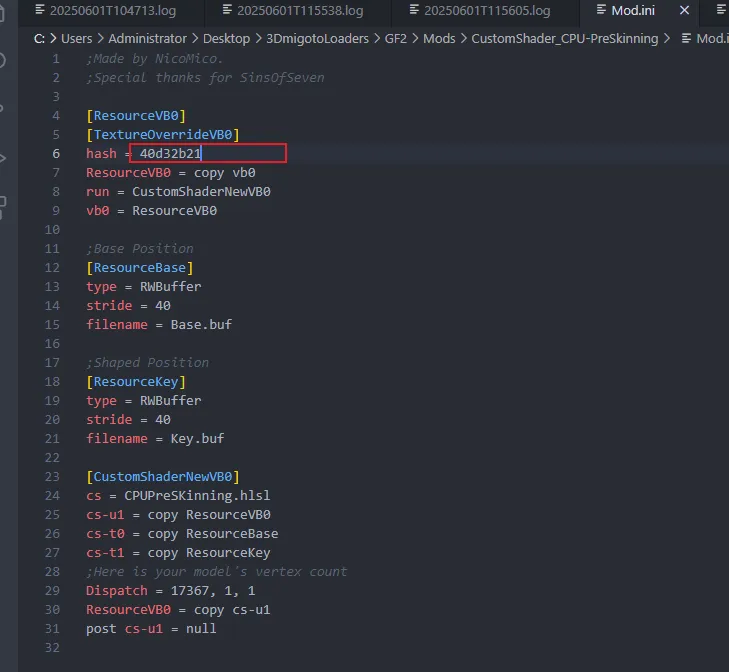

(12) 随后保存，删除我们之前生成的Mod的文件夹防止它和我们的模板文件夹的ini冲突，到游戏里F10刷新查看效果

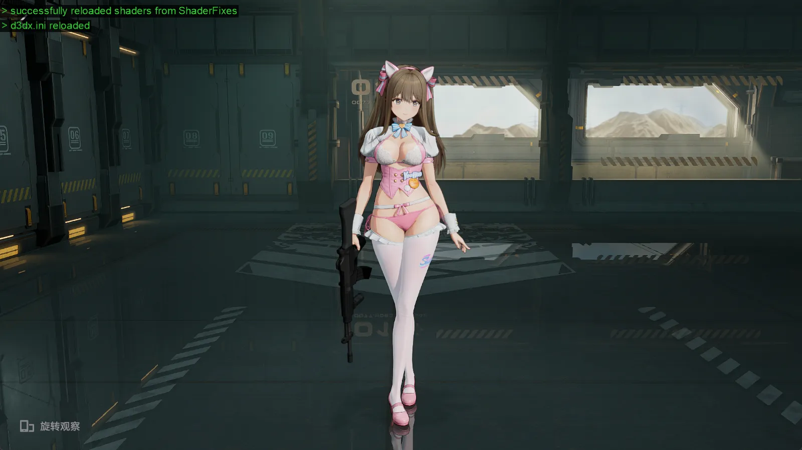

(13) 到这里就制作完成了，那么这个就是模型删减的过程，值得一提的是，如果把刚才的步骤中，编辑模式下模型的移动距离，移动的不是那么远的话，就不是删减的效果，而是顶点偏移的形态键效果。

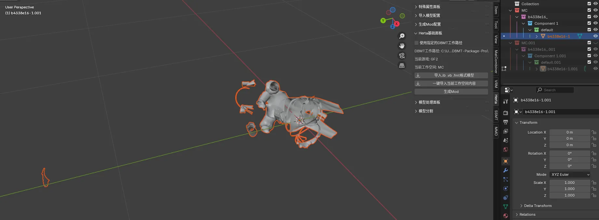

这里我们还返回刚才的编辑过的地方，我们刚才把遮羞布移动到很远的位置，所以通过HLSL就产生了顶点删除的效果，现在我们要实现一个顶点偏移的效果，进入雕刻模式，雕刻内裤：

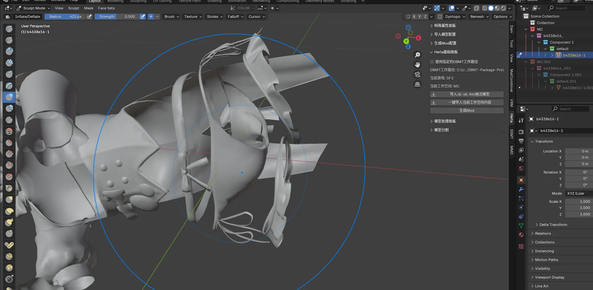

这里使用膨胀工具让它膨胀一点，当然你也可以自己去雕刻想要的效果，随后生成Mod，找到Position.buf复制为Key.buf并替换模板文件夹中的Key.buf，删除刚才生成Mod的文件夹防止冲突，游戏里F10刷新查看效果：

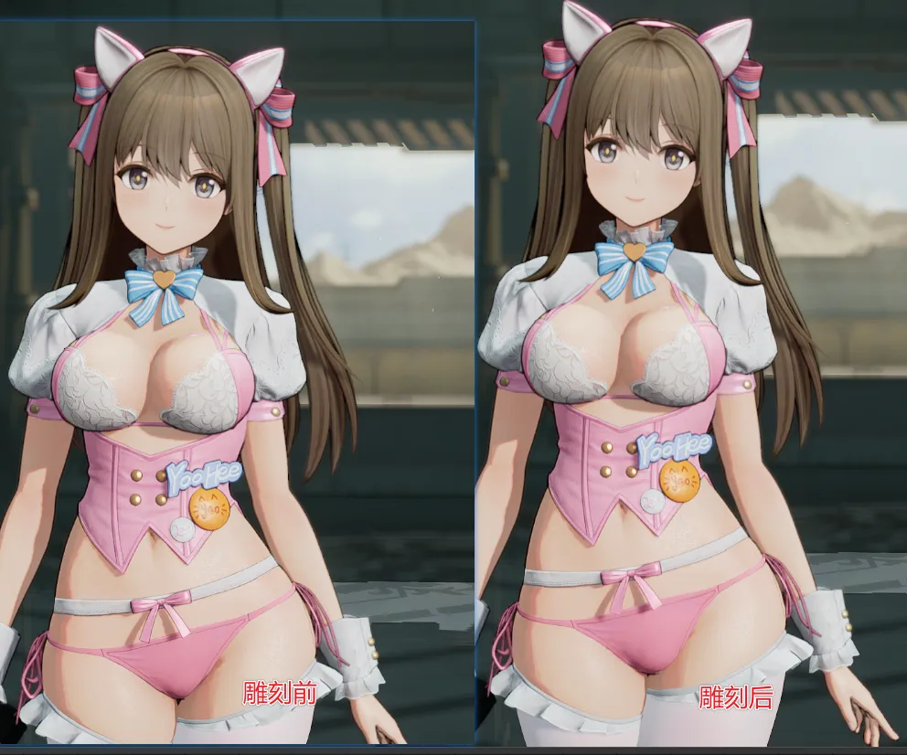

由于不能改变顶点数，只能做形态键Mod，所以灵活运用雕刻和模型删减，也能做出不错的效果。
这里就不得不提到跨IB渲染技术，如果你会用的话，用衣服的部位雕刻为身体的形状，并且使用身体的渲染，就能达到你想要的效果。
