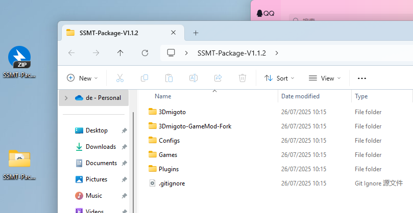
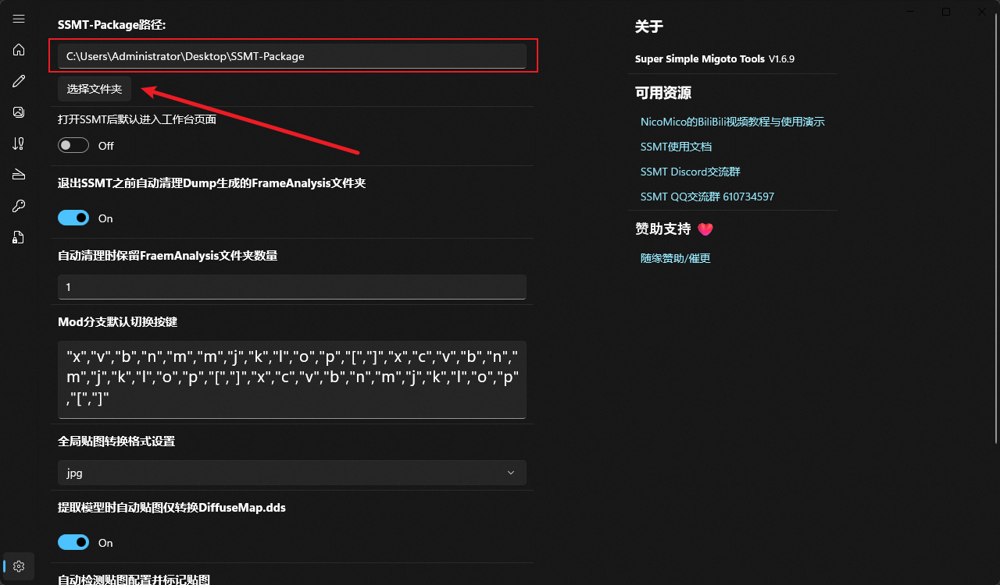

## 仅能做到尽力而为

由于游戏不断热更新，只能做到尽力而为，请理解。

## 使用有风险吗？

自行斟酌，俺只能做到尽可能避免报错，不能提供任何形式的其它保证。

# 15-4001报错和10612-4001报错已解决。

目前我们需要把SSMT更新到最新版，SSMT-Package更新到最新版，直接使用SSMT就可以规避掉这两个报错。

SSMT和SSMT-Package的更新，可以在内部群文件中下载获取。

SSMT和SSMT-Package放在不同路径或盘符下，不要放一起。

SSMT和SSMT-Package放在不同路径或盘符下，不要放一起。

SSMT和SSMT-Package放在不同路径或盘符下，不要放一起。

这俩更新好之后，我们进入主页，点击下面的更新加载器：

更新完成之后，3Dmigoto路径会自动设置为SSMT-Package里的3Dmigoto路径，这里注意不要更改为你自己的3Dmigoto路径，否则不能用了就：

然后如果你使用Mod管理器管理Mod的话，别忘了把你的Mod放到这个SSMT自带的3Dmigoto路径的Mods下面，管理器只用于管理Mod。

最后，一定要使用【一键启动】按钮来启动。

重要的事情说三遍：

1.只有通过【一键启动】按钮启动才能规避掉报错。

1.只有通过【一键启动】按钮启动才能规避掉报错。

1.只有通过【一键启动】按钮启动才能规避掉报错。

2.必须使用【检查加载器版本更新】自动更新好之后自动设置的默认的SSMT-Package下面的加载器，不要自己更换3Dmigoto路径

2.必须使用【检查加载器版本更新】自动更新好之后自动设置的默认的SSMT-Package下面的加载器，不要自己更换3Dmigoto路径

2.必须使用【检查加载器版本更新】自动更新好之后自动设置的默认的SSMT-Package下面的加载器，不要自己更换3Dmigoto路径

此功能仅为Mod作者设计，所以只能在按照规范使用SSMT的情况下生效，如果你还额外开了解锁帧率或者其它插件，可能报错是由于其它东西导致的。

后续所有15-4001的报错和10612-4001的报错如果再次出现，只需要反馈给我，等我更新之后你再更新一下SSMT和SSMT-Package即可解决。

## 启动器一直不关闭怎么办？

如图，游戏Mod都生效了，为什么启动器不会自动退出？

这个你每次手动关一下就好了，其它游戏都能自动关闭，只有GI被HYP锁定了进程导致无法自己关闭。

## 为什么还是报错？

提问之前先确定一下：

1.你的SSMT更新到最新版了吗？如果不确定，自己去Github看最新版版本号

2.你的SSMT-Package更新到最新版了吗？如果不确定，自己去Github看最新版版本号

3.只有通过【一键启动】按钮启动才能规避掉报错，你是这么操作的吗？

4.必须使用【检查加载器版本更新】自动更新好之后自动设置的默认的SSMT-Package下面的加载器，不要自己更换3Dmigoto路径，这步骤做正确了吗？

5.去群里问问，如果别人都能用，只有你不能用，你确定自己的步骤全部都正确了嘛？

如果还是报错，及时喊我更新。

## 我从其它 Mod管理器/XXMI Launcher/散装3Dmigoto 迁移过来后之前设置好的按键切换丢失了怎么办？

只需要把你的其它的启动器里的d3dx_user.ini复制过来覆盖放到SSMT的3Dmigoto目录下即可解决，不需要手动一个一个再切换回来。

## 切换到SSMT之后，左上角全是 黄字/红字 报错，怎么办？

两个办法：

第一种：开启屏蔽游戏内红字功能：

开启后游戏内F10刷新即可。

第二种：使用Play版dll模式：

但是这个会切换dll文件，所以需要关闭游戏防止进程占用d3d11.dll导致无法切换，同时Play版无法开启Hunting界面。

两种都可以解决，自行决定即可。

## 是不是只有大世界可以使用，无法进行联机活动？

不是，SSMT从根本上解决了15-4001以及10612-4001的问题，在任何情况都不会出现这两个报错。

## 为什么SSMT能解决15-4001报错和10612-4001报错？原理是什么？

别问，用就行了。

## 类似d3dxSkinManager这种工具不允许改变3Dmigoto加载器的位置，我该如何迁移到SSMT？

目前不兼容d3dxSkinManager，也可以使用映射强行关联到SSMT-Packages对应加载器的Mods。

可参考如下文档：

https://starbobis.github.io/SSMT-Documents/Tutorials/SSMT/%E5%90%8C%E6%97%B6%E4%BD%BF%E7%94%A8%20d3dx%20%E4%B8%8E%20SSMT/%E5%90%8C%E6%97%B6%E4%BD%BF%E7%94%A8%20d3dx%20%E4%B8%8E%20SSMT.html

但是映射错误会有一定几率导致报错问题，确保映射这个功能完全摸清楚再用。

## 仍然报错怎么办？

全部删掉，在磁盘里新开一个单独的文件夹给SSMT-Package。

并且换个盘符换个文件夹位置，规避之前扫盘留下的记录，就不会报错了，简单地说就是要挪窝。

## 如何手动设置SSMT-Package?

这里我们下载完解压出来

然后在SSMT的设置里选择SSMT-Package路径为解压的这个文件夹即可：

