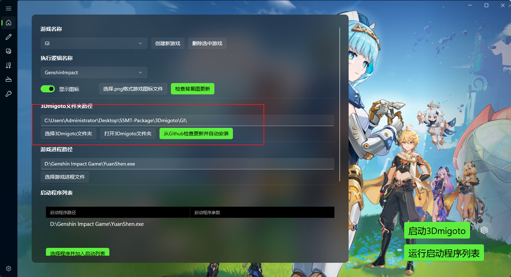
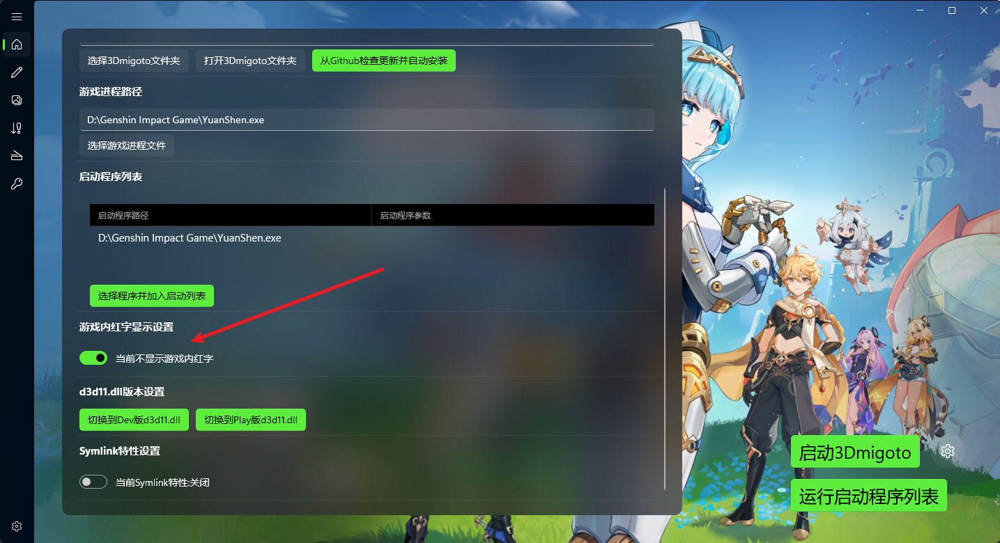
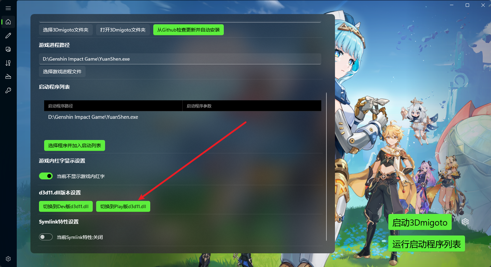

# SSMT

使用SSMT的优势在于无需通过复杂的5分钟断网操作，直接从根源上避免15-4001和10612-4001报错，在任何情况下都不会出现报错，包括深渊、联机、联机活动等等。

SSMT仅为Mod作者设计，此功能是为了解决作者频繁测试Mod时，每次启动都需要5分钟断网的问题，此功能只能在按照规范使用SSMT的情况下生效，如果你还额外开了解锁帧率或者其它插件，可能报错是由于其它东西导致的。

后续所有15-4001的报错和10612-4001的报错如果再次出现，只需要反馈给我，等我更新之后你再更新一下SSMT和SSMT-Package或群文件中的dll即可解决。

请按照顺序往下看，仔细看。

# 15-4001报错和10612-4001报错已解决。

目前我们需要把SSMT更新到最新版，SSMT-Package更新到最新版


随后直接使用SSMT就可以规避掉这两个报错。

由于游戏不断热更新，只能做到尽力而为，请理解。

关于使用风险，请自行斟酌，俺只能做到尽可能避免报错，不能提供任何形式的其它保证。


## 注意事项

- SSMT和SSMT-Package放在不同路径或盘符下，不要放一起。
- 3Dmigoto路径要使用默认的SSMT-Package下面的路径，不可以手动选择其它位置，例如d3dxSkinManager下面的路径，否则扫盘时扫到黑名单内容就会报错，如图设置为默认路径：



- 启动时，必须点击【启动3Dmigoto】按钮，才能规避报错，然后点击【运行启动程序列表】来启动游戏进程。

- 然后如果你使用Mod管理器管理Mod的话，别忘了把你的Mod放到这个SSMT自带的3Dmigoto路径的Mods下面，管理器只用于管理Mod。
  

# SSMT与各工具兼容情况测试与黑名单机制

目前的情况是，部分软件已加入反作弊检测的黑名单，经过测试使用这些软件100%报错：

- XXMI Launcher (重点打击的Mod加载器，100%报错)

XXMI运行一次后会有无法关闭的进程残留，此后不管怎样使用SSMT都会导致报错15-4001，建议彻底卸载此工具。

残留的进程可以在重启电脑后恢复正常，但是只要开启XXMI就一定会导致游戏内报错。

感谢 自殇无色 参与测试。

- 胡桃工具箱 (本质上属于作弊软件，100%报错) （但是测试发现Better GI仍然能用，所以可以用Better GI代替胡桃工具箱，估计是还没加入黑名单）

部分用户只要开启胡桃工具箱就会导致SSMT报错，但是部分用户反馈只开启胡桃工具箱不会导致报错，可能是胡桃工具箱的解锁帧率和Mod不能同时开启。

- FPS解锁 (本质上属于作弊软件)

1.FPS Unlocker 和Mod一起使用会导致报错

2.ExM的帧率解锁技术更好，可以和Mod同时使用而不报错。

- 超广角解锁 (本质上属于作弊软件)

单独使用没问题，但是和Mod一起使用会导致报错

- d3dxSkinManager(100%重点打击的Mod管理器) 
  
此工具已彻底坠机，除非你手动编译源码并且去掉所有的检测特征。

现在已经严重到，只要你开启了d3dxSkinManager，再玩原神Mod就会100%报错，这玩意已经加入进程检测的黑名单了，在任何情况下都不要用这个软件。

所以各位测试时尽量只使用SSMT，如果SSMT稳定不报错，再去启动列表里加入其它程序来测试。

注意，以上程序不能开启，在任何时候都不能开启，只要开启就会被检测进程，然后报错，尤其是d3dxSkinManager这种铁黑名单报错程序，开了之后都不用开门，10秒就报错了，即使你先用SSMT启动游戏，再开启觉得没事了，过段时间也依然会报错10612-4001，反正别用就对了。

- 脚本自动断网/手动断网

使用SSMT不需要断网，但是部分玩家需要所以在这里提一嘴。

断网请认准BiliBili往生堂堂主的断网工具，部分UP主的断网工具含有外挂行为特征，会导致封号10年。

使用XXMI 加上断网导致了部分用户出现封号7天的问题。

## 启动器一直不关闭怎么办？

如图，游戏Mod都生效了，为什么启动器不会自动退出？


这个你每次手动关一下就好了，其它游戏都能自动关闭，只有GI被HYP锁定了进程导致无法自己关闭。


## 为什么还是报错？

提问之前先确定一下：

1.你的SSMT更新到最新版了吗？如果不确定，自己去Github看最新版版本号

2.你的SSMT-Package更新到最新版了吗？如果不确定，自己去Github看最新版版本号

3.只有通过【启动3Dmigoto按钮】按钮启动才能规避掉报错，你是这么操作的吗？

4.必须使用默认3Dmigoto路径，并点击【从Github检查更新并自动安装】安装3Dmigoto，且不要自己更换3Dmigoto路径，这步骤做正确了吗？

5.去群里问问，如果别人都能用，只有你不能用，你确定自己的步骤全部都正确了嘛？

如果大规模出现报错，及时喊我更新。

## 我从其它 Mod管理器/XXMI Launcher/散装3Dmigoto 迁移过来后之前设置好的按键切换丢失了怎么办？

只需要把你的其它的启动器里的d3dx_user.ini复制过来覆盖放到SSMT的3Dmigoto目录下即可解决，不需要手动一个一个再切换回来。

## 切换到SSMT之后，左上角全是 黄字/红字 报错，怎么办？

两个办法：

第一种：开启屏蔽游戏内红字功能：



开启后游戏内F10刷新即可。


第二种：使用Play版dll模式：



但是这个会切换dll文件，所以需要关闭游戏防止进程占用d3d11.dll导致无法切换，同时Play版无法开启Hunting界面。

两种都可以解决，自行决定即可。

## 是不是只有大世界可以使用，无法进行联机活动？

不是，SSMT从根本上解决了15-4001以及10612-4001的问题，在任何情况都不会出现这两个报错。

## 为什么SSMT能解决15-4001报错和10612-4001报错？原理是什么？

别问，用就行了。

## 类似d3dxSkinManager这种工具不允许改变3Dmigoto加载器的位置，我该如何迁移到SSMT？

目前不兼容d3dxSkinManager，也可以使用映射强行关联到SSMT-Packages对应加载器的Mods。

可参考如下文档：

https://starbobis.github.io/SSMT-Documents/Tutorials/SSMT/%E5%90%8C%E6%97%B6%E4%BD%BF%E7%94%A8%20d3dx%20%E4%B8%8E%20SSMT/%E5%90%8C%E6%97%B6%E4%BD%BF%E7%94%A8%20d3dx%20%E4%B8%8E%20SSMT.html

但是映射错误会有一定几率导致报错问题，确保映射这个功能完全摸清楚再用。

如果实在不想使用映射，也不想移动文件怎么办？

可以点开你的d3dx.ini，找到Include部分
```ini
[Include]
; If you were using 3DMigoto as a full modding platform for a given game
; instead of just a single stand-alone mod (e.g. facilitating mesh/texture
; replacements or other graphics mods), you can include an entire directory
; where users can extract third party mods created by others and 3DMigoto will
; include every .ini file and any external files referred to by CustomShader /
; Resource sections (Replaced shaders in these mods should still go in
; ShaderFixes for now, unless the modders want to use CustomShaders or
; ShaderRegex to keep them standalone).
; include = Core\Debugger\Debugger.ini
include = Core\GIMI\main.ini
include_recursive = Mods
exclude_recursive = DISABLED*
exclude_recursive = desktop.ini
```
然后添加一行include_recursive，这里填你的Mod管理器里的相对路径即可。

这个应该是最简单方便的方法了，但是注意是相对路径。

## 仍然报错怎么办？

全部删掉，在磁盘里新开一个单独的文件夹给SSMT-Package。

并且换个盘符换个文件夹位置，规避之前扫盘留下的记录，就不会报错了，简单地说就是要挪窝。

有条件的可以重装一下原神

## 使用SSMT后，切人的时候要等1秒贴图才会变正常怎么办？

这是因为SSMT点击【检查加载器版本更新】后自动获取的3Dmigoto中已经自带安装了ORFix。

当你把自己的Mod迁移到Mods文件夹下时，有时候会额外附带一个ORFix。

就会导致贴图加载出现延迟或者贴图不正常的问题。

此时删掉你的Mods文件夹里自己复制过来的ORFix即可解决。


