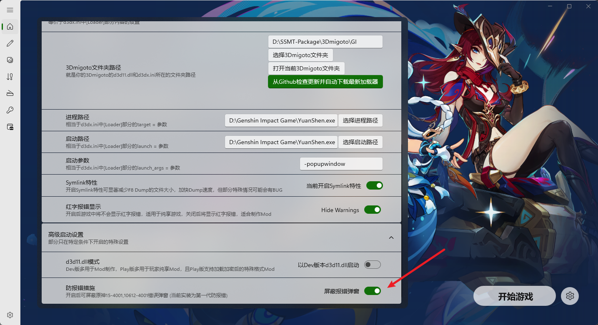
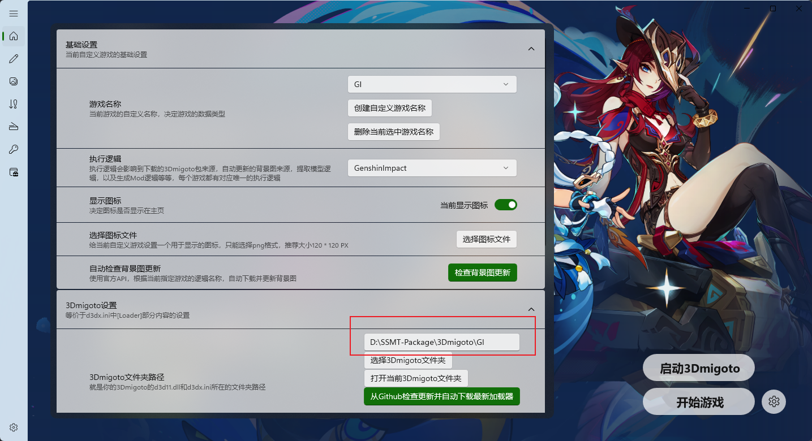

# SSMT

尊重原神官方，SSMT随时可能被加入进程和扫盘检测黑名单，届时SSMT将移除对原神的所有功能支持，SSMT属于第三方工具，不代表任何明示或暗示的官方态度，请自行评估使用风险并决定是否使用。

SSMT通过内置集成第二代Mod防报错技术，直接从根源上避免15-4001和10612-4001报错，在任何情况下都不会出现报错，包括深渊、联机、联机活动等等。此功能是为了解决每次启动都需要5分钟断网的问题。

此功能只能在按照规范，单独使用SSMT的情况下生效，如果你还额外开启了其它的第三方软件，或进程列表中含有其它第三方软件残留，则报错可能是由于其它第三方软件引起的，请先确保单独使用SSMT可以解决报错后再考虑使用其它工具，为确保使用结果不受环境影响，请重启电脑并将SSMT-Package安装到单独一个磁盘上，避免扫盘和扫进程导致的报错问题。

后续所有15-4001的报错和10612-4001的报错如果再次出现，只需要反馈给我，等待SSMT迭代Mod防报错功能即可解决。
# 防报错原理

原神Mod导致报错属于反作弊误判导致的，并非专门针对Mod，内行看门道，真正懂的人都知道要检测Mod只需要扫描自身的模块列表中的d3d11.dll是否被篡改就能直接做到一刀切，0秒踢下线或者直接无法进门都可以，而且如果是真的针对Mod，那么B站那些倒卖和搬运Mod造成大规模影响的视频早就被投诉下架了，个人认为不是专门针对Mod。

原神启动后会出现扫描进程和扫描磁盘文件的行为，同时伴随TCP和UDP发包收包行为。

所以解决这个问题很简单，有如下思路：

- 精准拦截转发UDP/TCP封包，私服就是这样实现的，用来解决报错小菜一碟。
- 手动断网/脚本自动断网 导致UDP封包丢失/TCP连接丢失，导致扫盘结果无法上传，解决报错。

第二代Mod防报错技术与d3d11.dll无关，也不是传统的加壳(加壳在2025年6月份左右就已经失效)具体原理不便于公开，第三代Mod防报错技术已准备就绪，但需要谨慎观察官方态度，如果UGC上线后Mod仍然可以使用，将会同步更新第三代Mod防报错技术。

已失效的技术：
- d3d11.dll加壳，包括但不限于UPX以及其它种类的壳。
- 火绒防扫盘拦截。
- 魔改d3d11.dll

# 在启动SSMT后，需要开启防报错选项

在正确配置了所有内容，包括进程路径和启动路径后，开启下方屏蔽报错弹窗选项。



随后先点【启动3Dmigoto】按钮来运行3Dmigoto Loader.exe，再点【开始游戏】按钮来启动游戏，即可避免报错弹窗。


## 注意事项

- SSMT和SSMT-Package放在不同路径或盘符下，不要放一起，SSMT-Package最好新开一个磁盘单独放置。
- 3Dmigoto路径要使用默认的SSMT-Package下面的路径，不建议手动选择其它位置，例如d3dxSkinManager下面的路径，否则扫盘时扫到黑名单内容就会报错，如图设置为默认路径，如果你使用Mod管理器管理Mod的话，别忘了把你的Mod放到这个SSMT自带的3Dmigoto路径的Mods下面，管理器只用于管理Mod。



- 第二代防报错技术无需替换d3d11.dll文件，各位如果仍出现错误可以排查一下其它原因，因为现在会扫全盘和进程，如果仍然无法解决，建议全新电脑，或者点击重置此电脑，格式化其它无关磁盘后，再安装SSMT进行测试。

# SSMT与各工具兼容情况测试与黑名单机制

目前的情况是，部分软件已加入反作弊检测的黑名单，经过测试使用这些软件100%报错：

- XXMI Launcher (重点打击的Mod加载器，100%报错)

XXMI运行一次后会有无法关闭的进程残留，此后不管怎样使用SSMT都会导致报错15-4001。

残留的进程可以在重启电脑后恢复正常，但是只要开启XXMI就一定会导致游戏内报错。


- 胡桃工具箱 (本质上属于作弊软件) 

部分用户只要开启胡桃工具箱就会导致SSMT报错，但是部分用户反馈只开启胡桃工具箱不会导致报错，可能是胡桃工具箱的解锁帧率和Mod不能同时开启。

- FPS解锁 (本质上属于作弊软件)

1.FPS Unlocker 和Mod一起使用会导致报错

2.ExM的帧率解锁技术更好，可以和Mod同时使用而不报错。

- 超广角解锁 (本质上属于作弊软件)

单独使用没问题，但是和Mod一起使用会导致报错，原理未知。

- d3dxSkinManager(100%重点打击的Mod管理器) 
  
此工具已彻底坠机，除非你手动编译源码并且去掉所有的检测特征。

现在已经严重到，只要你开启了d3dxSkinManager，再玩原神Mod就会100%报错，这玩意已经加入进程检测的黑名单了，在任何情况下都不要用这个软件。

所以各位测试时尽量只使用SSMT，如果SSMT稳定不报错，再去启动列表里加入其它程序来测试。

注意，以上程序不能开启，在任何时候都不能开启，只要开启就会被检测进程，然后报错，尤其是d3dxSkinManager这种铁黑名单报错程序，开了之后都不用开门，10秒就报错了，即使你先用SSMT启动游戏，再开启觉得没事了，过段时间也依然会报错10612-4001，反正别用就对了。

因为现在会扫进程，只要识别到d3dxSkinManager就会报错。

- Just Another Skin Manager (JASM)

情况和d3dxSkinManager一模一样，也是黑名单了现在。

- 脚本自动断网/手动断网

使用SSMT不需要断网，但是部分玩家需要所以在这里提一嘴。

断网请认准BiliBili 往生堂桃姐 的断网工具，部分UP主的断网工具含有外挂行为特征，会导致封号10年。

AA-往生堂桃姐:  https://space.bilibili.com/15539707

使用XXMI加上断网脚本导致了部分用户出现封号7天的问题，这里再强调一遍不明来源的断网脚本不要使用，统一使用桃姐发布的版本。

- 部分用户仍然报错

由于现在扫盘 + 扫进程，部分用户操作完全正确了，但是仍然报错，此时就必须排除掉一切可能的第三方工具，既重装系统 + 格式化磁盘，随后只安装SSMT和SSMT-Package以及原神进行测试。

## 启动器一直不关闭怎么办？

如图，游戏Mod都生效了，为什么启动器不会自动退出？


这个你每次手动关一下就好了，其它游戏都能自动关闭，只有GI被HYP锁定了进程导致无法自己关闭。

## 我从其它 Mod管理器/XXMI Launcher/散装3Dmigoto 迁移过来后之前设置好的按键切换丢失了怎么办？

只需要把你的其它的启动器里的d3dx_user.ini复制过来覆盖放到SSMT的3Dmigoto目录下即可解决，不需要手动一个一个再切换回来。

## 切换到SSMT之后，左上角全是 黄字/红字 报错，怎么办？

两个办法：

第一种：开启屏蔽游戏内红字功能：


开启后游戏内F10刷新即可。


第二种：使用Play版dll模式：


但是这个会切换dll文件，所以需要关闭游戏防止进程占用d3d11.dll导致无法切换，同时Play版无法开启Hunting界面。

两种都可以解决，自行决定即可。


## 类似d3dxSkinManager这种工具不允许改变3Dmigoto加载器的位置，我该如何迁移到SSMT？

目前不兼容d3dxSkinManager，也可以使用映射强行关联到SSMT-Packages对应加载器的Mods。

可参考如下文档：

https://starbobis.github.io/SSMT-Documents/Tutorials/SSMT/%E5%90%8C%E6%97%B6%E4%BD%BF%E7%94%A8%20d3dx%20%E4%B8%8E%20SSMT/%E5%90%8C%E6%97%B6%E4%BD%BF%E7%94%A8%20d3dx%20%E4%B8%8E%20SSMT.html

但是映射错误会有一定几率因为扫盘导致报错问题，确保映射这个功能完全摸清楚再用。

如果实在不想使用映射，也不想移动文件怎么办？

可以点开你的d3dx.ini，找到Include部分
```ini
[Include]
; If you were using 3DMigoto as a full modding platform for a given game
; instead of just a single stand-alone mod (e.g. facilitating mesh/texture
; replacements or other graphics mods), you can include an entire directory
; where users can extract third party mods created by others and 3DMigoto will
; include every .ini file and any external files referred to by CustomShader /
; Resource sections (Replaced shaders in these mods should still go in
; ShaderFixes for now, unless the modders want to use CustomShaders or
; ShaderRegex to keep them standalone).
; include = Core\Debugger\Debugger.ini
include = Core\GIMI\main.ini
include_recursive = Mods
exclude_recursive = DISABLED*
exclude_recursive = desktop.ini
```
然后添加一行include_recursive，这里填你的Mod管理器里的相对路径即可。

这个应该是最简单方便的方法了，但是注意是相对路径。


## 使用SSMT后，切人的时候要等1秒贴图才会变正常怎么办？

这是因为SSMT点击【检查加载器版本更新】后自动获取的3Dmigoto中已经自带安装了ORFix。

当你把自己的Mod迁移到Mods文件夹下时，有时候会额外附带一个ORFix。

就会导致贴图加载出现延迟或者贴图不正常的问题。

此时删掉你的Mods文件夹里自己复制过来的ORFix即可解决。


