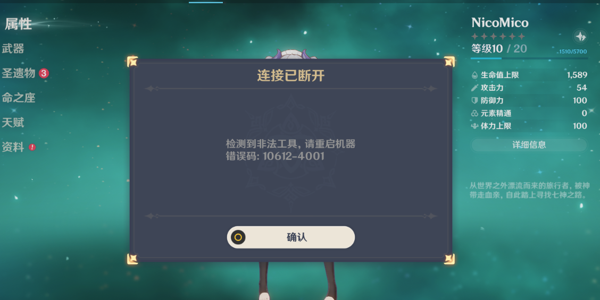
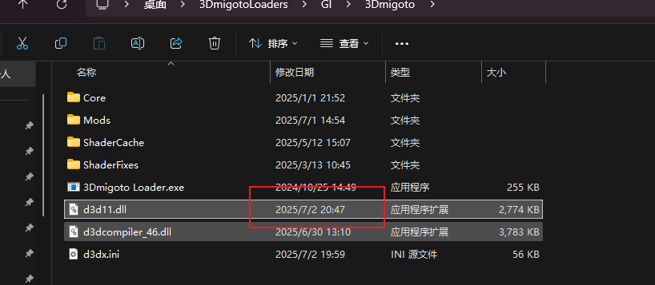
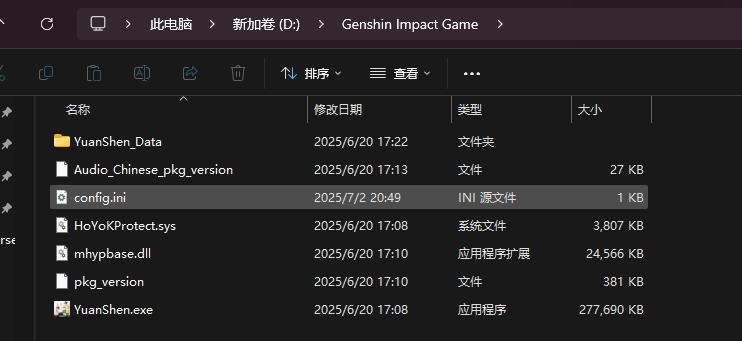
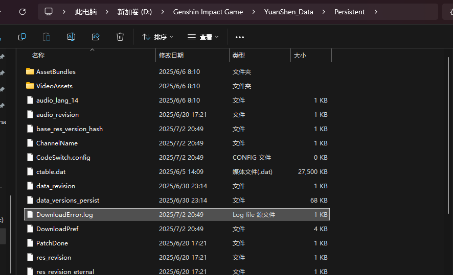
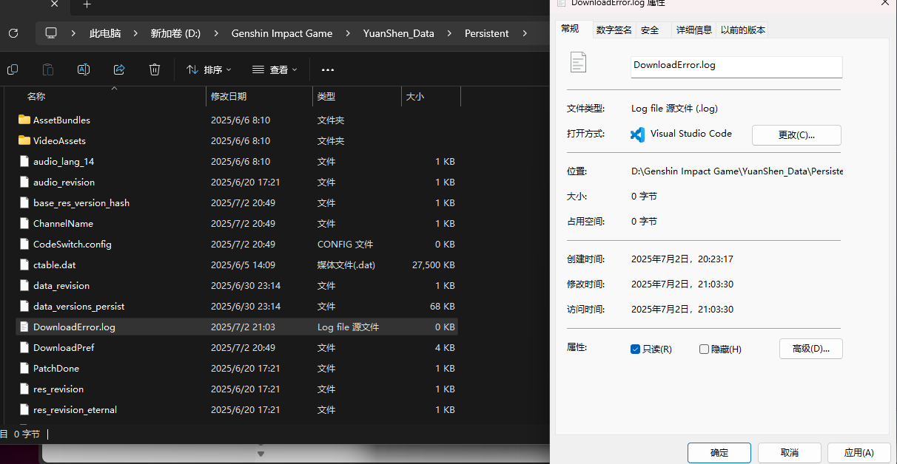

更新日期：2025-07-02 21:00 只能保证此版本有效。

首先我们如果正常进入游戏，应该会出现10612-4001报错，如下图：

此时关闭游戏，按如下步骤操作：

首先用我发的d3d11.dll，注意创建时间是7月2号8点41，也就是我刚编译出来发在内部群的版本

替换你的d3d11.dll

然后我们打开原神安装目录：

进入YuanShen_Data下的Persistent目录下：

将DownloadError.log内容打开，删掉所有内容，然后保存，然后属性里设为只读

随后重启电脑，重启后直接使用我们的替换过d3d11.dll的加载器进入游戏。

# 注意
- 3Dmigoto安装的路径，不能和原神在相同的盘符中，否则会出现另外的错误15-4001
- 不要填启动参数
- 不要填启动路径，重启电脑后先打开3Dmigoto Loader.exe从官方启动器启动游戏
- 不要任何断网操作
- 不一定适配XXMI
