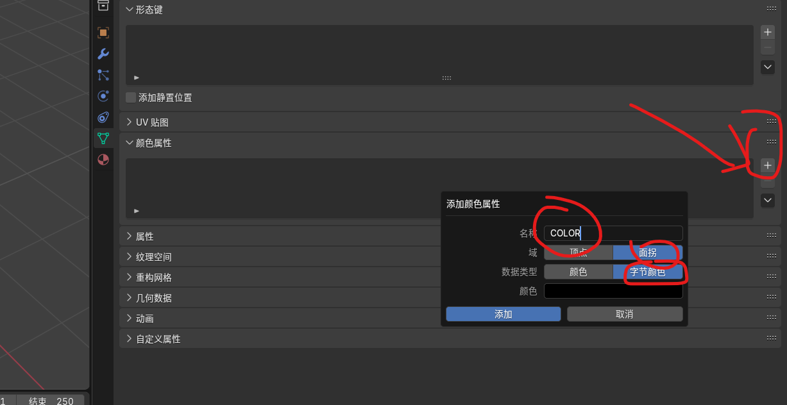
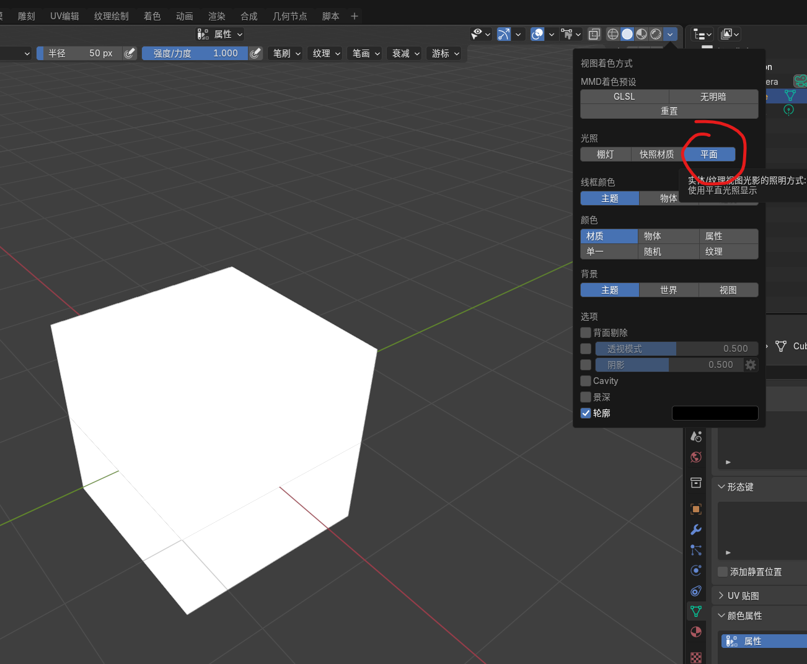
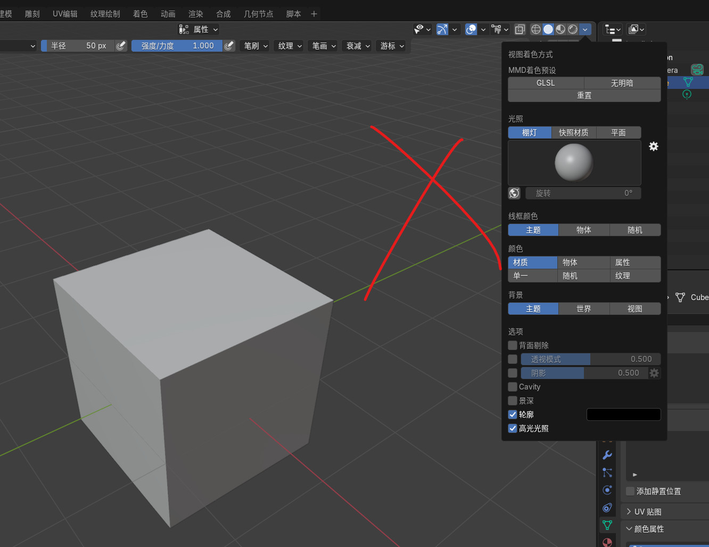

<!-- 现在原神Mod也和崩铁Mod一样，需要COLOR值完全和原模型对上才能显示了：
注意在吸取原模型的COLOR值时，这里的设置改为Flat，就能避免光影导致每次吸到的值不精确/不一样的问题 -->

目前，原神 Mod 须要同崩铁一样，COLOR 值与原模型完全一致，否则无法显示。

推荐直接新建一个 COLOR 颜色属性覆盖原本的 COLOR：

需要注意，名称应为 `COLOR`（而非因重复而自动改名的 `COLOR.001`），域为 `面拐`，数据类型为 `字节颜色`。在颜色处吸取原模型的顶点色：

1. 在 3D 视图界面按 `Ctrl+Tab`，鼠标向上后松开，或者按 `Ctrl+Tab+NUMPAD8`，进入顶点绘制模式；
2. [ 重要 ] 将视图着色方式由 `栅灯` 切为 `平面`，否则将会吸取到经过修饰的颜色，并不可用。
3. 在需要之处按要求吸取即可。

以此方式可以直接指定一个网格物体的顶点色。

亦有别的方式设定顶点色，但视图着色方式一定要位于平面而非栅灯。