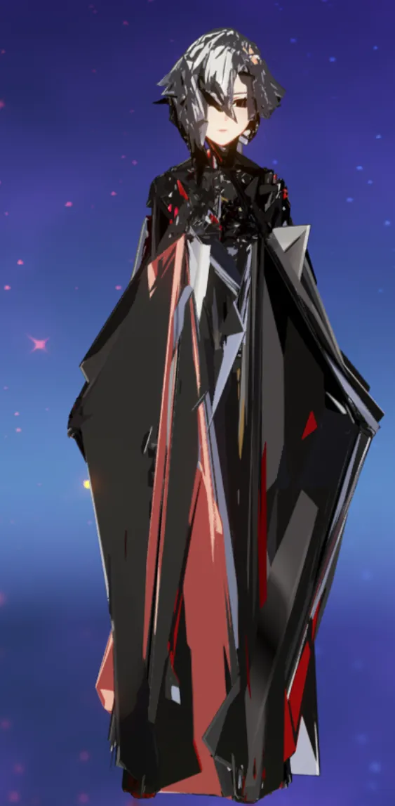
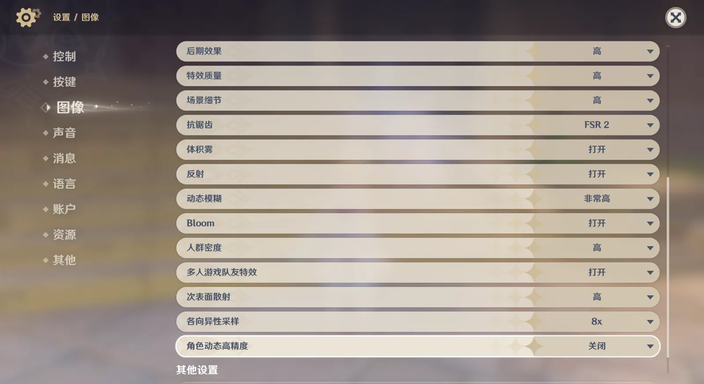

<!-- # 问题描述 -->

<!-- # 可能的原因 -->

<!-- 1.原神需要关闭角色动态高精度才能使用Mod。 -->

<!-- 2.Mod的权重炸了，一般作者会更新。 -->

<!-- 3.Mod的Hash值炸了，需要修复到最新版本，一般作者会更新。 -->

<!-- # 请关闭动态高精度 -->

<!-- 动态高精度使用的渲染过程不同，目前还没添加模型提取和Mod制作支持，所以使用Mod和制作Mod都需要关闭动态高精度。 -->

**前提：确保手中的 mod 曾经可用。**

如果版本更新后 mod 失效，可能的原因：

1. 是否忘记关闭角色动态高精度？

角色动态高精度，渲染过程与常规方式不同，目前尚无模型提取与 Mod 制作支持，请勿启用；
2. 顶点组存在变动，请重新 dump 一份下来，校对顶点组名称；
3. Hash 存在变动：
    1. 如果是 `Index Buffer` 变动（或/和少数上古 mod 的 `Vertex Buffer`），直接在 Hunting 模式下找到，替换掉原本的 IB （或/和 VB）即可;
    2. 如果是 `Position`/`Texcoord`/`Blend` 变动，需要 dump 下来，提取模型。对于其他制作工具，可以直接于 `config.json` 中找到对应值，对于 SSMT，打开工作空间，定位到每个 `.<IB>\TYPE_<something>\tmp.json`，其中拥有所需信息。

