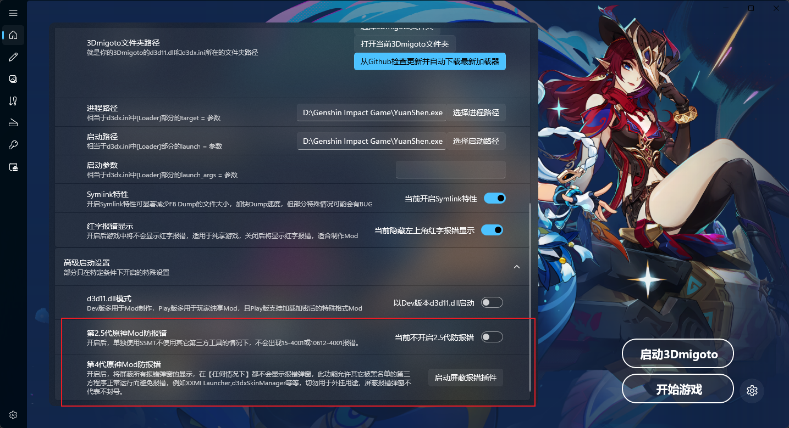

# Mod报错弹窗问题

原神现在使用3Dmigoto会出现15-4001或10612-4001的报错弹窗。

此问题的产生有一定几率和UGC即将上线有关。

# 第四代原神Mod防报错

为防止倒卖（因为之前发布防报错功能，被到处倒卖）现在防报错作为插件提供，且加VMP壳锁且锁机器码，只有在激活后的电脑上才能正常运行。

插件本身是免费的，但只提供给内部群的群友使用，不会公开发布，防止惹怒原神官方导致失效。

首先在群文件的【密钥生成器】中下载【DBMT-KeyGenerator.vmp.exe】

运行后会生成一个.key文件，类似下图：

随后把这个.key文件发给我，我会把激活好的【IgnoreErrorGI.vmp.exe】发给你

随后你把这个【IgnoreErrorGI.vmp.exe】安装到SSMT-Package的Plugins文件夹中，重启SSMT

即可解锁第2.5代和第4代Mod防报错功能。

# 第2.5代防报错

在只使用SSMT，不使用其它第三方工具的情况下，不会导致报错弹窗

# 第4代防报错

开启后可屏蔽一切由于使用Mod导致的报错弹窗的弹出，只会对使用Mod导致的报错生效，不会成为所谓"外挂的帮凶"。

# 什么时候会失效？

- 具体取决于原神封禁Mod的力度，随时可能失效，不做任何功能性保障的承诺。

# 扫盘与进程黑名单是什么？

原神启动进门后，会立刻扫描所有正在运行的进程，判断是否有黑名单程序存在，如果有则立刻弹出15-4001错误弹窗。

原神启动进门后，2分30秒开始会扫描当前电脑所有的程序运行记录。

会判断自身所有dll模块是否被修改，如果修改则检测这些进程对应文件，

判断是否有黑名单程序对原神产生过注入行为，如果有则弹出10612-4001错误代码。

