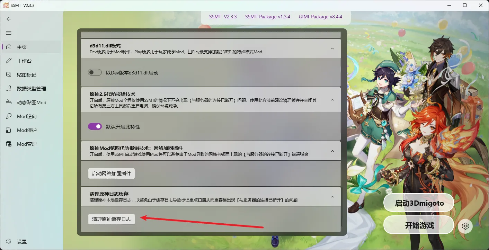
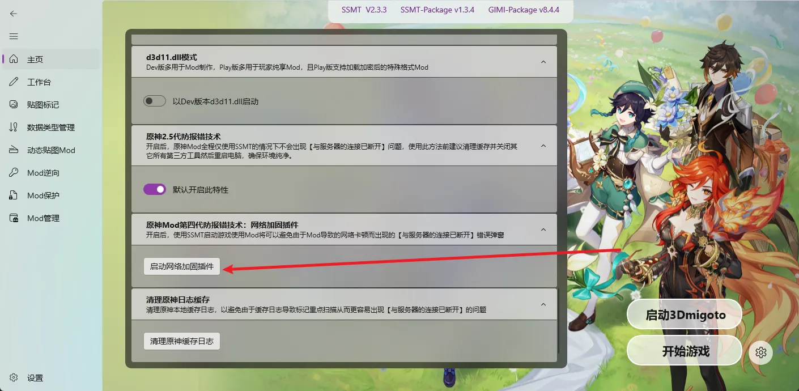
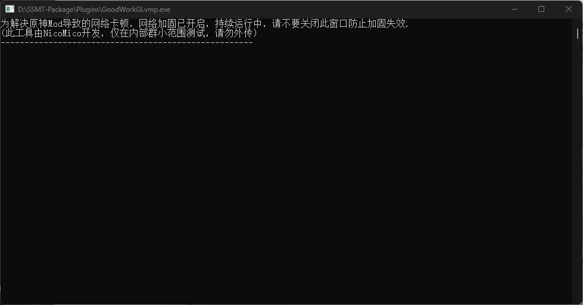
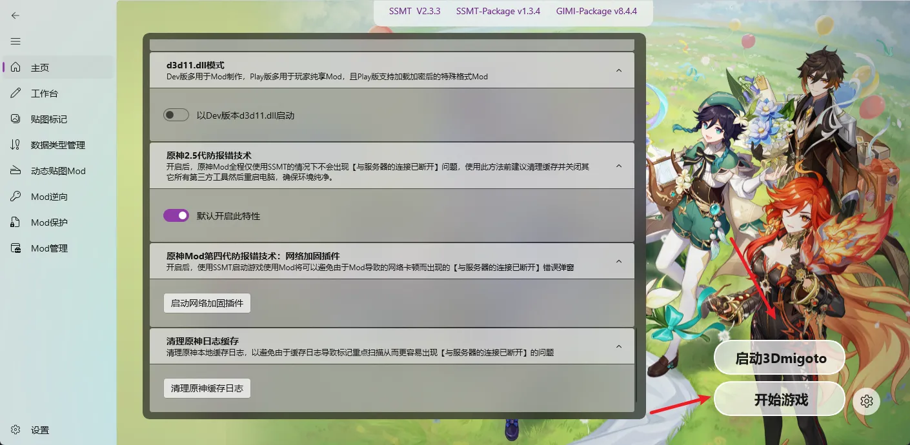

开始此步骤之前，确保你已经正确配置好SSMT。

最后一次更新日期：`2025/10/01`

### 1.清理日志

首先点击此按钮，清理原神缓存日志。

### 2.重启电脑
清理完成后，需要重启电脑。

此步骤是为了防止某些第三方程序或插件在后台运行导致被扫进程扫盘报错问题。

### 3.开启SSMT的2.5代防报错选项

### 4.启动网络加固插件

网络加固插件可以赞助技术社群获取。

### 5.点击启动3Dmigoto、再点击开始游戏

这一步是确保你全程使用SSMT启动，不使用其它任何第三方工具。

确认不报错后再考虑使用其它第三方工具。