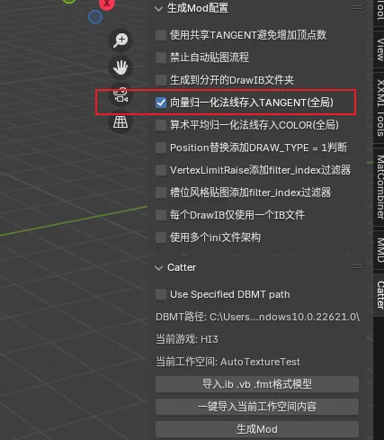
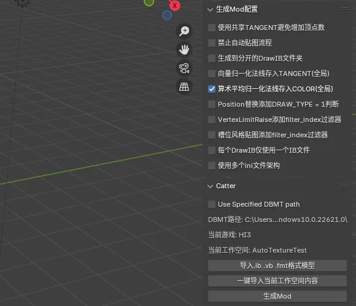
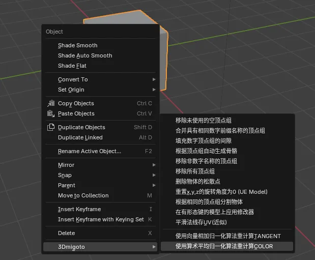
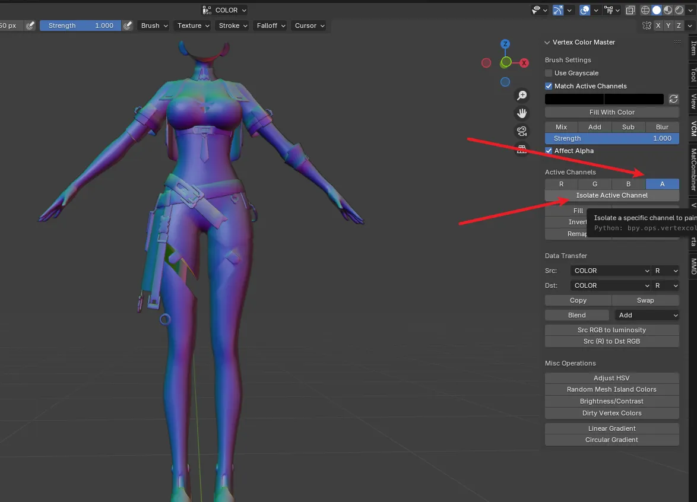
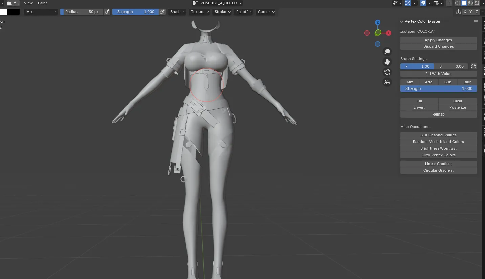
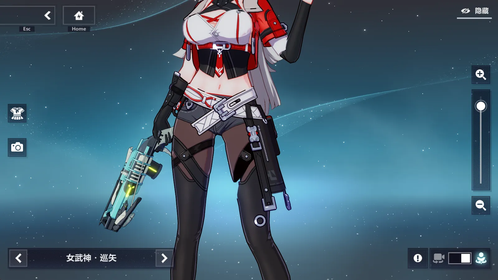

# 崩坏三1.0角色轮廓线
在Catter中勾选【向量归一化法线存入TANGENT(全局)】后生成的Mod的轮廓线即可得到修复。

也可以右键模型=>3Dmigoto=>使用向量相加归一化算法重计算TANGENT，来精确控制每个物体是否需要修复轮廓线

此方法只能99%修复身体轮廓线，角色头发的轮廓线只能得到60%近似修复。

# 崩坏三2.0角色轮廓线

在Catter中勾选【算术平均归一化法线存入COLOR(全局)】后生成的Mod的轮廓线即可得到修复。

也可以右键模型=>3Dmigoto=>使用算术平均归一化算法重计算COLOR，来精确控制每个物体是否需要修复轮廓线

# 崩坏三2.0角色轮廓线粗细调节

当我们使用重计算COLOR值来修复轮廓线时，可以使用VCM插件，把A通道隔离开来单独刷来控制轮廓线的粗细，因为A通道就是控制轮廓线粗细的通道。

刷之前先隔离A通道

此时F设为1.0，然后Fill With Color，则轮廓线会变成最粗的样子：

0到1之间的值，越低轮廓线越细。

