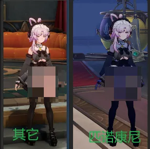
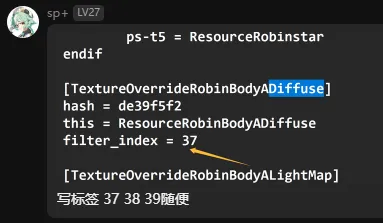
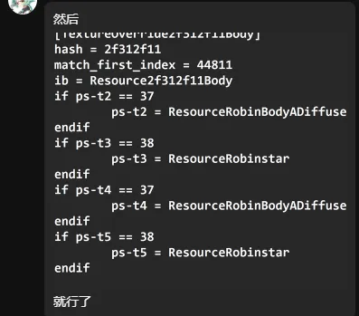
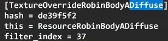
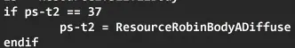
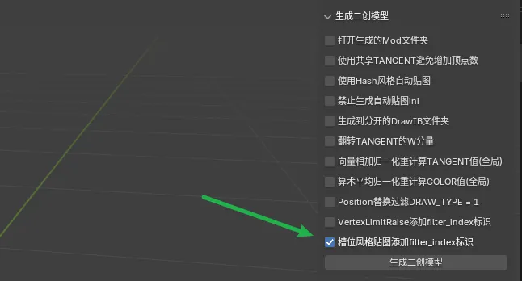

# HSR匹诺康尼贴图问题

人物角色会在匹诺康尼部分地区出现变色问题，这是因为匹诺康尼独特的Shader导致的，要解决这个问题可以参考sp+大佬的教学：

简单地说就是为了避免ps槽位在贴图未加载时就被替换导致的槽位污染问题，我们给每个对应的贴图都加一个filter_index，数值随便填不一样的。

然后使用到贴图的时候判断对应槽位加载的是不是对应的贴图即可。

要是看不懂的话，可以先照着写下来去游戏里测试看效果，或者找个其他人做好的Mod看一下别人是怎么写的，照猫画虎。

如果你用的是SSMT，也可以勾选来全自动生成：

顺带提一下，ZZZ全NPC仰视和俯视窜贴图槽位跟上面一样，用filter_index给贴图的hash打标签，用的时候判断是具体的贴图再去使用。

