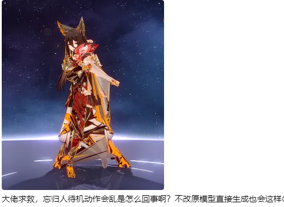

# 问题演示

此问题常见于：

- 特殊待机动作
- 跑步急停动作
- 大招释放动作
# 解决方案
这是因为有一些特殊的动作的VB0的Hash和我们正常状态下提取的VB0的Hash不同。

此时如果需要修复，需要在特殊状态动作下F8 Dump，然后提取模型来找对应的VB0的Hash值

然后把我们Mod中TextureOverride_Position部分复制一个出来，hash值改为这个找到的特殊状态的VB0的Hash值，就能解决了。

