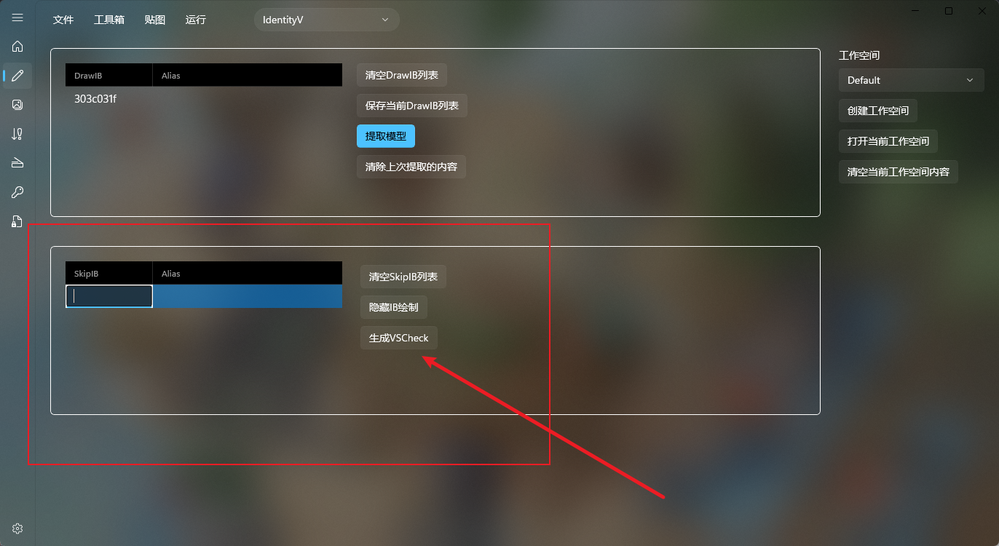

# Mod制作说明

首先我们的SSMT对于IdentityV也就是第五人格的Mod制作流程比较特殊。

特殊点：
- 使用了槽位还原技术来支持任意顶点数量
- 使用了手动Vertex Shader Check架构，来解决使用槽位还原技术和全局Check冲突导致的BUG。

这导致了一个严重的问题，你在GameBanana下载的第五人格的Mod以及3Dmigoto加载器，和我们SSMT制作的Mod存在根本性的冲突。

因为gamebanana上的IdentityV的3Dmigoto使用了全局check技术。

例如：
- 我们的3Dmigoto无法加载gamebanana上的Mod
- gamebanana的3Dmigoto无法加载我们SSMT制作的Mod

# SSMT制作流程

目前制作流程分为SSMT流程和老外的制作流程。

1.如果使用SSMT制作流程，请务必使用SSMT-Package下面自带的3Dmigoto，如果你用gamebanana的3Dmigoto版本会出现两个问题：

- 秒dump，但是dump出来没有任何东西
- 制作出来Mod后，部分身体模型破损（全局check与IB还原技术冲突）

2.IdentityV需要在不同的场景都生成VSCheck来让Mod在对应场景生效。

正常在我们的Blender中使用SSMT插件生成Mod后，是无法立刻看到显示效果的，必须生成VSCheck。

VSCheck就是下面这个功能：

在对应Mod无法生效的场景F8 dump（Dump时务必关掉Mod）之后，把你的模型的DrawIB填写在这里，然后点击生成VSCheck，即可让Mod生效。

每个无法生效的场景都需要这么做。

# 比较复杂

第五人格存在以下问题：
- 竞技游戏，Mod天然存在作弊的可能性。
- 制作方式存在分歧，开源版本比较方便，不需要生成VSCheck，但是无法突破顶点数量上限，SSMT流程需要生成VSCheck，可以突破顶点数量上限。
- SSMT流程和Gamebanana的Mod制作流程存在冲突，且互相不兼容。

所以大部分技巧都是群友口口相传，如果你看完这个还不懂可以在群里问群友，如果觉得文档需要补充什么东西欢迎提交PR或者向NicoMico反馈。

# 无法显示绿字

无法显示绿字大概率是注入失败了。

需要注意一点的是，第五人格客户端版本如果要使用3Dmigoto则必须在设置中开启【兼容模式】而不是【流畅模式】

因为只有【兼容模式】能够支持DX11，【流畅模式】可能使用的是OpenGL。

