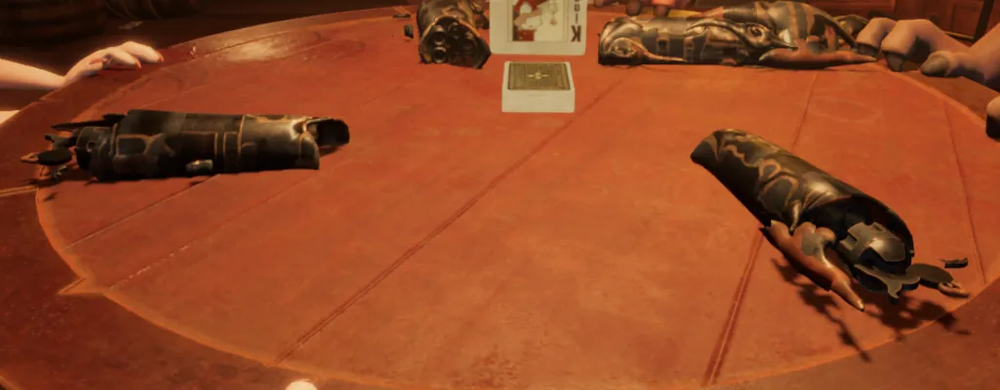

这里LiarsBar使用了drawindexedinstanced来显示多个手枪模型，我们改了之后只能有一个显示成功，其它的都会少显示很多顶点。

如图右上角是完整的，其它三个不完整。

即使我们使用了drawindexedinstanced = auto，仍然是一样的情况。

推测可能原因如下：

1.3Dmigoto的drawindexedinstanced的底层实现有问题。

2.没有搞懂3Dmigoto的正确用法导致的。

经过研究发现，其它三个不完整的模型绘制时使用的顶点数还是模型原本的顶点数，所以暂时的解决方案是制作Mod时，对于使用drawindexedinstanced绘制的物体，顶点数不要超过原模型的顶点数。

