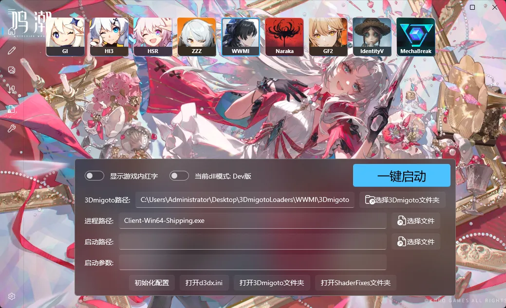

# 正确配置dx11
对于鸣潮这个游戏，我们需要设置为dx11启动：

快速启动界面设置如下：

注意这里的进程路径非常简单地填写了：Client-Win64-Shipping.exe

启动游戏的过程就是先点击右上角的启动3Dmigoto Loader.exe，然后通过游戏的启动器来启动游戏就行了。

如注入失败请把3Dmigoto Loader.exe设置为管理员权限启动。

# 如何一键启动？
如果要配置成一键启动，建议学会快速启动界面的设置项，然后填入正确的启动路径和启动参数，此时进程路径和启动路径应该是一致的，通过启动参数控制游戏进程正确启动。
