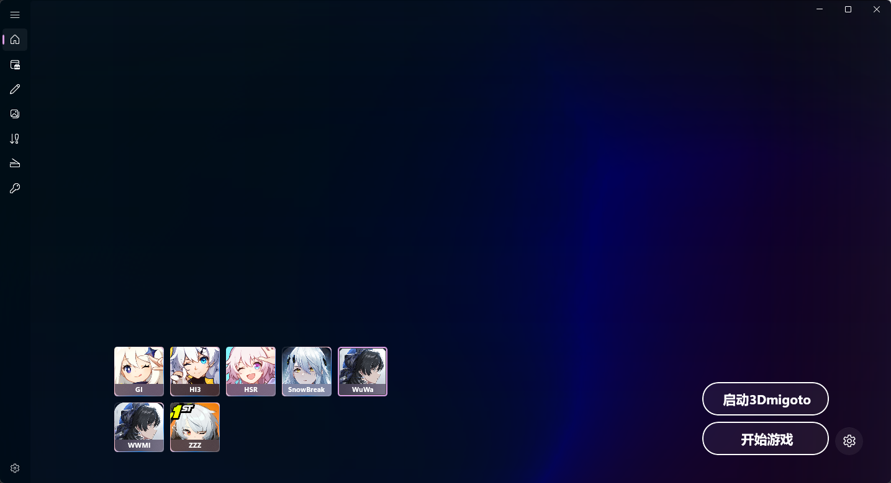
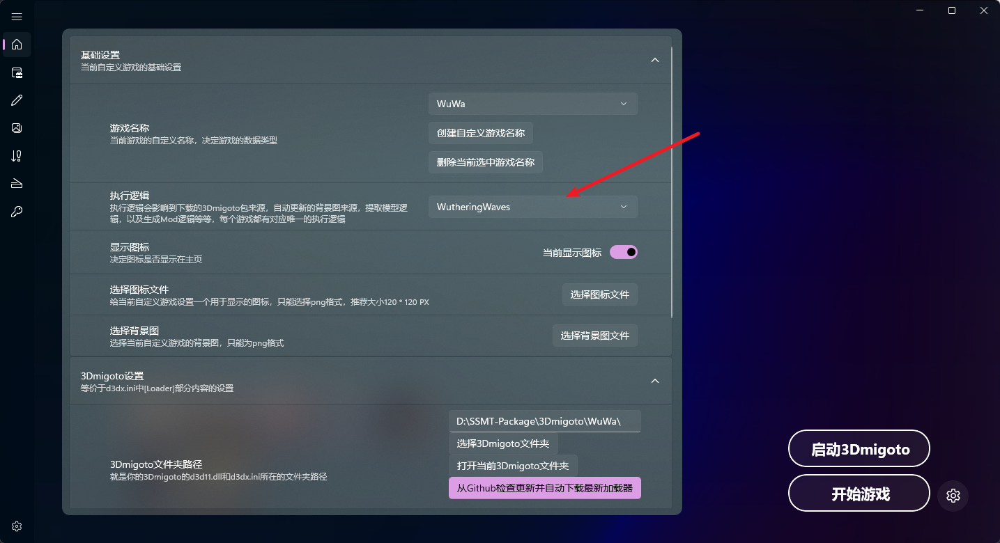
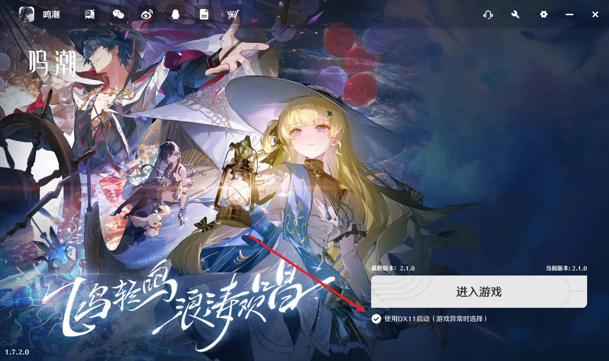
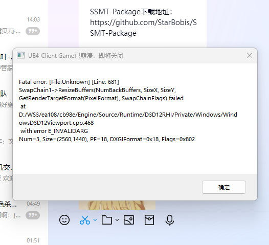

# (1)主页配置

MMT中有两个鸣潮，分别叫WuWa和WWMI，其中WuWa是MMT的数据类型，WWMI是WWMITools的数据类型，数据类型在提取模型和Mod逆向时都会用到，所以习惯使用SSMT流程的可以选择WuWa，只使用SSMT提取模型或逆向Mod使用WWMITools生成Mod的用户可以选择WWMI

对于鸣潮来说，执行逻辑要选择Wuthering Waves，这样才能确保你自动下载的加载器是XXMI Launcher中的同款WWMI加载器。

进程路径要填写Client-Win64-Shipping.exe那个进程路径，而不是WutheringWaves.exe那个。

启动路径要么不填，要么填写官方启动器的路径，否则无法正确注入。

# (2)官方启动器设置

对于鸣潮这个游戏，我们需要设置为dx11启动：

如果不勾选DX11启动的话，到游戏里就会出现这个报错：

# (3)启动过程

启动游戏的过程就是先点击右上角的启动3Dmigoto Loader.exe，然后通过游戏的启动器来启动游戏就行了。

