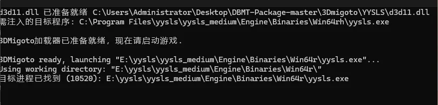
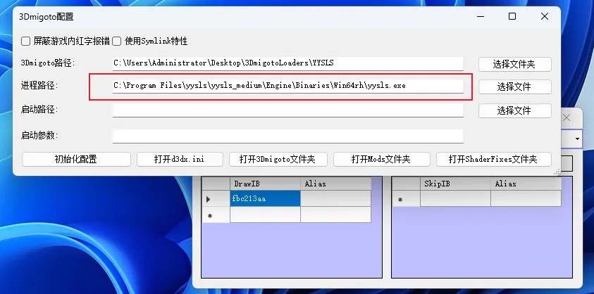
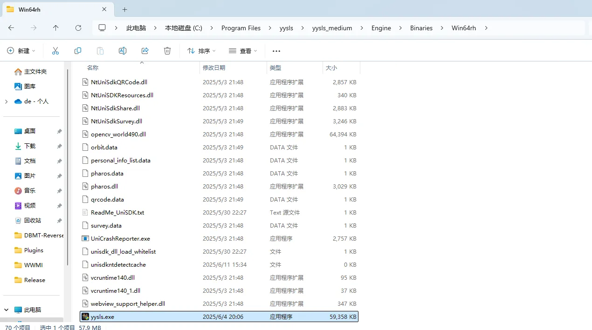
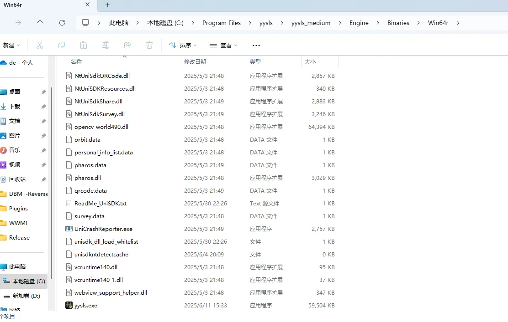

# 多个游戏主程序问题
YYSLS有俩路径，一个是Win64rh，一个是Win64r
游戏启动时，会随机启动其中一个。
所以如果你填写win64rh的话，有时候它启动的是win64r的，如果你填写win64r的话，有时候它启动的是win64rh的。
但是即便进程路径选错了，这里注入器也会显示注入成功，具有迷惑误导性。

此时最好是先启动一遍YYSLS主程序，然后在任务管理器中查找进程名称，确定启动的到底是哪个，然后再去3Dmigoto配置中填写正确的进程路径。

当然有时候其实你已经注入成功了，但是由于绿字界面默认是不显示的，此时可以按小键盘0开关绿字显示。

# win64rh

# win64r

