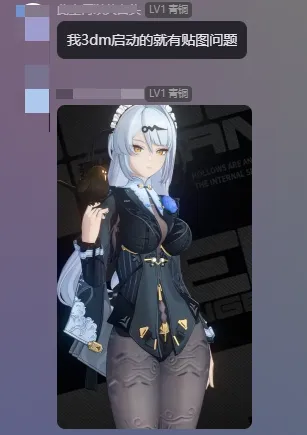

# 问题描述

# 解决方案
这是因为自从某个ZZZ版本更新之后，法线贴图不能再使用Hash风格进行替换，必须使用槽位风格进行替换，而这个Mod是用XXMI-Tools工具制作的，不支持贴图标记，只能生成Hash风格贴图替换，或者作者手写。

在作者没有把Mod的法线贴图搞成槽位风格时，XXMI中内置了全局法线替换逻辑，用一张平坦的法线图替换所有角色的法线贴图，所以看起来“修复了”法线贴图的BUG，但其实是一种摆烂处理的方法。

而普通的3Dmigoto并没有添加全局法线贴图替换，所以在普通的3dm里显示的就是上图的样子。

