# 绝区零上下身体分开的问题
在解析一个新的Mod的时候，发现了一个新的方法可以解决上下半身色差不一致的问题，首先ini文件如下：

<details>
<summary>点击展开详细代码</summary>

```ini
; Lighter

; Constants -------------------------

[Constants]
global $active = 0
global persist $pants = 0
global persist $pubes = 0
global persist $jacket = 0
global persist $sunglasses = 0
; pants/undies/soft/hard
[KeySwapClothes]
key = down
back = up
condition = $active == 1
type = cycle
$pants = 0,1,2,3

; jacket/scarf/shirtless
[KeySwapJacket]
key = right
back = left
condition = $active == 1
type = cycle
$jacket = 0,1,2

[KeySwapPubes]
key = 5
condition = $active == 1
type = cycle
$pubes = 0,1

[KeySwapSunglasses]
key = 6
condition = $active == 1
type = cycle
$sunglasses = 0,1

[Present]
post $active = 0

; Overrides -------------------------


[ResourceLighterVirtualHeadPosition]
type = Buffer
stride = 40
[TextureOverrideLighterHeadPosition]
hash = 037b6287
if draw_type == 1
vb0 = ResourceLighterHeadPosition
vb2 = ResourceLighterHeadBlend
handling = skip

draw = 37909,0
ResourceLighterVirtualHeadPosition = ref so0
endif
$active = 1

[TextureOverrideLighterHeadTexcoord]
hash = 22a08e39
vb1 = ResourceLighterHeadTexcoord

[TextureOverrideLighterBodyTexcoord]
hash = 710bca71
vb1 = ResourceLighterBodyTexcoord

[TextureOverrideLighterBodyVertexLimitRaise]
hash = 84ed822e
override_byte_stride = 40
override_vertex_count = 95226

[TextureOverrideLighterBodyPosition]
hash = 0baec6b7
vb0 = ResourceLighterBodyPosition
vb2 = ResourceLighterBodyBlend
handling = skip
draw = 95226,0

[TextureOverrideLighterHeadVertexLimitRaise]
hash = bd669b85

[TextureOverrideLighterHeadIB]
hash = 542b8aa9
handling = skip

[TextureOverrideLighterHeadA]
hash = 542b8aa9
match_first_index = 0
run = CommandListSkinTexture
ib = ResourceLighterHeadAIB
if $active == 1
ps-t4 = ResourceLighterBodyANormalMap
endif
; LighterHeadA-vb0=037b6287.txt
drawindexed = 0, 0, 0
; LighterHeadA
	; Boots
	drawindexed = 9504, 0, 0
	; HairNew
	drawindexed = 11016, 9504, 0
	; RegularPants
	if $pants == 0 && $jacket == 0
	drawindexed = 8901, 20520, 0
	endif
	; UndiesBlackFinal
	if $pants == 1
	drawindexed = 8772, 29421, 0
	endif

	; Pants Shirtless
	if $pants == 0 && $jacket > 0
		; Pants.001
		drawindexed = 156, 100449, 0
		; Pants.002
		drawindexed = 108, 100605, 0
		; Pants.003
		drawindexed = 8991, 100713, 0
	endif
	; Pubes
	if $pants > 1 && $pubes == 0
		; Pubes.001
		drawindexed = 13038, 109704, 0
		; Pubes.003
		drawindexed = 690, 122742, 0
	endif

;[TextureOverrideLighterHeadANormalMap]
;hash = d9a12c0a
;this = ResourceLighterBodyANormalMap

[TextureOverrideLighterHeadADiffuse]
hash = c5d60a1d
this = ResourceLighterBodyADiffuse

[TextureOverrideLighterHeadALightMap]
hash = 6d3f91bc
this = ResourceLighterBodyALightMap

[TextureOverrideLighterHeadAMaterialMap]
hash = d5ba9ea6
this = ResourceLighterBodyAMaterialMap

;[ShaderOverrideBlur]
;hash = cdfbf528028e3828
;ps-t2 = null

[ResourceTemp0]
[ResourceTemp1]
[TextureOverrideLighterBodyA]
hash = 8899e0fd
match_first_index = 0
handling = skip
run = CommandListSkinTexture

ib = ResourceLighterBodyAIB
if $active == 1
ps-t4 = ResourceLighterBodyANormalMap
endif
; LighterBodyA
	; BodySkin
		; BaseTorso
		if $jacket > 0
		drawindexed = 63624, 0, 0
		endif
		; BaseTorsowJacket
		if $pants > 1 && $jacket == 0
		drawindexed = 4380, 63624, 0
		endif
		; Ears
		if $jacket > 0
		drawindexed = 660, 68004, 0
		endif
		; Hard Cock
		if $pants == 3
		drawindexed = 46512, 68664, 0
		endif
		; Soft Cock
		if $pants == 2
		drawindexed = 39051, 115176, 0
		endif
		; UndiesBaseTorso
		;if $pants <= 1 && $jacket > 0
		;drawindexed = 62352, 154227, 0
		;endif
	; Clothes
		; Calydon Buckle
		if $pants == 0
		drawindexed = 732, 216579, 0
		endif
		; Gloves
		if $jacket > 0
		drawindexed = 14739, 217311, 0
		endif
		; JacketNoPants
		if $jacket == 0 && $pants > 0
		drawindexed = 33882, 232050, 0
		endif
		; JacketNorm
		if $jacket == 0 && $pants == 0
		drawindexed = 33762, 265932, 0
		endif
		; ScarfTopEdit
		if $jacket == 1
		drawindexed = 3663, 299694, 0
		endif
		; SideBag
		if $pants == 0
		drawindexed = 1074, 303357, 0
		endif
		; UndiesWaistbandFinal
		if $pants == 1
		drawindexed = 624, 304431, 0
		endif

ib = ResourceLighterHeadAIB

vb0 = ResourceLighterVirtualHeadPosition
vb1 = ResourceLighterHeadTexcoord
vb2 = ResourceLighterHeadBlend
vb3 = ResourceLighterVirtualHeadPosition
if $active == 1
ps-t4 = ResourceLighterBodyANormalMap
endif
	; BaseLegs
	if $pants > 1
	drawindexed = 39228, 38193, 0
	endif
	; BaseLegsUndies
	if $pants == 1
	drawindexed = 23028, 77421, 0
	endif

; vs-cb0 = ref ResourceTemp0
; vs-cb1 = ref ResourceTemp1

[TextureOverrideLighterBodyADiffuse]
hash = 5ed96bf2
this = ResourceLighterBodyADiffuse

;[TextureOverrideLighterBodyANormalMap]
;hash = bd4953af
;this = ResourceLighterBodyANormalMap

[TextureOverrideLighterBodyALightMap]
hash = da6f4dc0
this = ResourceLighterBodyALightMap

[TextureOverrideLighterBodyAMaterialMap]
hash = 94aebd7e
this = ResourceLighterBodyAMaterialMap

;LOD1 1024

[TextureOverrideLighterBodyADiffuseLOD1]
hash = be46890b
this = ResourceLighterBodyADiffuse

;[TextureOverrideLighterBodyANormalMapLOD1]
;hash = 2983a5c4
;this = ResourceLighterBodyANormalMap

[TextureOverrideLighterBodyALightMapLOD1]
hash = 5b828635
this = ResourceLighterBodyALightMap

[TextureOverrideLighterBodyAMaterialMapLOD1]
hash = 65f3bb7c
this = ResourceLighterBodyAMaterialMap

[TextureOverrideLighterHeadADiffuseLOD1]
hash = 1cd2d442
this = ResourceLighterBodyADiffuse

;[TextureOverrideLighterHeadANormalMapLOD1]
;hash = 5f8171fd
;this = ResourceLighterBodyANormalMap

[TextureOverrideLighterHeadALightMapLOD1]
hash = 62ec7f01
this = ResourceLighterBodyALightMap

[TextureOverrideLighterHeadAMaterialMapLOD1]
hash = 8687f7b8
this = ResourceLighterBodyAMaterialMap

;LOD2 512

[TextureOverrideLighterHeadADiffuseLOD2]
hash = 0df66c75 
this = ResourceLighterBodyADiffuse

[TextureOverrideLighterHeadALightMapLOD2]
hash = 56e9fc40
this = ResourceLighterBodyALightMap

[TextureOverrideLighterHeadAMaterialMapLOD2]
hash = f8eb9d77 
this = ResourceLighterBodyAMaterialMap

[TextureOverrideLighterBodyADiffuseLOD2]
hash = fcb51928
this = ResourceLighterBodyADiffuse

[TextureOverrideLighterBodyALightMapLOD2]
hash = e11cdbb2
this = ResourceLighterBodyALightMap

[TextureOverrideLighterBodyAMaterialMapLOD2]
hash = 1ba1e201 
this = ResourceLighterBodyAMaterialMap

;LOD3 256

[TextureOverrideLighterHeadADiffuseLOD3]
hash = 0d85546c
this = ResourceLighterBodyADiffuse

[TextureOverrideLighterHeadALightMapLOD3]
hash = d1f8cd3f
this = ResourceLighterBodyALightMap

[TextureOverrideLighterHeadAMaterialMapLOD3]
hash = e36c52ae
this = ResourceLighterBodyAMaterialMap

[TextureOverrideLighterBodyADiffuseLOD3]
hash = 2fd12b19
this = ResourceLighterBodyADiffuse

[TextureOverrideLighterBodyALightMapLOD3]
hash = 97484ab8
this = ResourceLighterBodyALightMap

[TextureOverrideLighterBodyAMaterialMapLOD3]
hash = 707d0900
this = ResourceLighterBodyAMaterialMap

[TextureOverrideLighterArmPosition]
hash = 5841afbd
if $jacket > 0
handling = skip
vb0 = ResourceLighterArmPosition
vb2 = ResourceLighterArmBlend
draw = 4221,0
endif

[TextureOverrideLighterArmTexcoord]
hash = af2e48a6
if $jacket > 0
vb1 = ResourceLighterArmTexcoord
endif

[TextureOverrideLighterArmVertexLimitRaise]
hash = 390caccd
; override_vertex_count = 4221
; override_byte_stride = 68

[TextureOverrideLighterArmIB]
hash = 018b03f0
if $jacket > 0
handling = skip
drawindexed = auto
endif

[TextureOverrideLighterArmA]
hash = 018b03f0
match_first_index = 0
if $jacket > 0
;run = CommandListSkinTexture
ib = ResourceLighterArmAIB
endif

[TextureOverrideLighterScarfIB]
hash = 2de659bd
if $jacket == 2
handling = skip
endif

[TextureOverrideLighterScarfGlowIB]
hash = 2afb8fc8
if $jacket == 2
handling = skip
endif

[TextureOverrideLighteGlowEffect]
hash = ed757a44 
this = ResourceLighterGlowEffect

[TextureOverrideLighterSunglasses]
hash = b20b7cd5
if $sunglasses == 1
handling = skip
endif

; CommandList -----------------------

; Resources -------------------------

[ResourceLighterHeadPosition]
type = Buffer
stride = 40
filename = LighterHeadPosition.buf

[ResourceLighterHeadBlend]
type = Buffer
stride = 32
filename = LighterHeadBlend.buf

[ResourceLighterHeadTexcoord]
type = Buffer
stride = 24
filename = LighterHeadTexcoord.buf

[ResourceLighterBodyPosition]
type = Buffer
stride = 40
filename = LighterBodyPosition.buf

[ResourceLighterBodyBlend]
type = Buffer
stride = 32
filename = LighterBodyBlend.buf

[ResourceLighterBodyTexcoord]
type = Buffer
stride = 20
filename = LighterBodyTexcoord.buf

[ResourceLighterScarfPosition]
type = Buffer
stride = 40
filename = LighterScarfPosition.buf

[ResourceLighterScarfBlend]
type = Buffer
stride = 32
filename = LighterScarfBlend.buf

[ResourceLighterScarfTexcoord]
type = Buffer
stride = 24
filename = LighterScarfTexcoord.buf

[ResourceLighterGlassesPosition]
type = Buffer
stride = 40
filename = LighterGlassesPosition.buf

[ResourceLighterGlassesBlend]
type = Buffer
stride = 8
filename = LighterGlassesBlend.buf

[ResourceLighterGlassesTexcoord]
type = Buffer
stride = 20
filename = LighterGlassesTexcoord.buf

[ResourceLighterHeadAIB]
type = Buffer
format = DXGI_FORMAT_R32_UINT
filename = LighterHeadA.ib

[ResourceLighterBodyAIB]
type = Buffer
format = DXGI_FORMAT_R32_UINT
filename = LighterBodyA.ib

[ResourceLighterScarfAIB]
type = Buffer
format = DXGI_FORMAT_R32_UINT
filename = LighterScarfA.ib

[ResourceLighterGlassesAIB]
type = Buffer
format = DXGI_FORMAT_R32_UINT
filename = LighterGlassesA.ib

[ResourceLighterGlassesBIB]
type = Buffer
format = DXGI_FORMAT_R32_UINT
filename = LighterGlassesB.ib

[ResourceLighterHeadADiffuse]
filename = LighterHeadADiffuse.dds

[ResourceLighterHeadANormalMap]
filename = LighterHeadANormalMap.dds

[ResourceLighterHeadALightMap]
filename = LighterHeadALightMap.dds

[ResourceLighterHeadAMaterialMap]
filename = LighterHeadAMaterialMap.dds

[ResourceLighterBodyADiffuse]
filename = LighterBodyADiffuse.dds

[ResourceLighterBodyANormalMap]
filename = LighterBodyANormalMap.dds

[ResourceLighterBodyALightMap]
filename = LighterBodyALightMap.dds

[ResourceLighterBodyAMaterialMap]
filename = LighterBodyAMaterialMap.dds

[ResourceLighterArmPosition]
type = Buffer
stride = 40
filename = LighterArmPosition.buf

[ResourceLighterArmBlend]
type = Buffer
stride = 8
filename = LighterArmBlend.buf

[ResourceLighterArmTexcoord]
type = Buffer
stride = 20
filename = LighterArmTexcoord.buf

[ResourceLighterArmAIB]
type = Buffer
format = DXGI_FORMAT_R32_UINT
filename = LighterArmA.ib

[ResourceLighterGlowEffect]
filename = LighterGlowEffect.dds

; .ini generated by XXMI (XX-Model-Importer)
; If you have any issues or find any bugs, please open a ticket at https://github.com/leotorrez/XXMI-Tools/issues
```
</details>

在上半身中，使用多次替换绘制技术也绘制了下半身的内容：

<details>
<summary> 点击展开详细代码 </summary>

```ini
[ResourceTemp0]
[ResourceTemp1]
[TextureOverrideLighterBodyA]
hash = 8899e0fd
match_first_index = 0
handling = skip
run = CommandListSkinTexture

ib = ResourceLighterBodyAIB
if $active == 1
ps-t4 = ResourceLighterBodyANormalMap
endif
; LighterBodyA
	; BodySkin
		; BaseTorso
		if $jacket > 0
		drawindexed = 63624, 0, 0
		endif
		; BaseTorsowJacket
		if $pants > 1 && $jacket == 0
		drawindexed = 4380, 63624, 0
		endif
		; Ears
		if $jacket > 0
		drawindexed = 660, 68004, 0
		endif
		; Hard Cock
		if $pants == 3
		drawindexed = 46512, 68664, 0
		endif
		; Soft Cock
		if $pants == 2
		drawindexed = 39051, 115176, 0
		endif
		; UndiesBaseTorso
		;if $pants <= 1 && $jacket > 0
		;drawindexed = 62352, 154227, 0
		;endif
	; Clothes
		; Calydon Buckle
		if $pants == 0
		drawindexed = 732, 216579, 0
		endif
		; Gloves
		if $jacket > 0
		drawindexed = 14739, 217311, 0
		endif
		; JacketNoPants
		if $jacket == 0 && $pants > 0
		drawindexed = 33882, 232050, 0
		endif
		; JacketNorm
		if $jacket == 0 && $pants == 0
		drawindexed = 33762, 265932, 0
		endif
		; ScarfTopEdit
		if $jacket == 1
		drawindexed = 3663, 299694, 0
		endif
		; SideBag
		if $pants == 0
		drawindexed = 1074, 303357, 0
		endif
		; UndiesWaistbandFinal
		if $pants == 1
		drawindexed = 624, 304431, 0
		endif

ib = ResourceLighterHeadAIB

vb0 = ResourceLighterVirtualHeadPosition
vb1 = ResourceLighterHeadTexcoord
vb2 = ResourceLighterHeadBlend
vb3 = ResourceLighterVirtualHeadPosition
if $active == 1
ps-t4 = ResourceLighterBodyANormalMap
endif
	; BaseLegs
	if $pants > 1
	drawindexed = 39228, 38193, 0
	endif
	; BaseLegsUndies
	if $pants == 1
	drawindexed = 23028, 77421, 0
	endif

; vs-cb0 = ref ResourceTemp0
; vs-cb1 = ref ResourceTemp1

```
</details>

这里的：

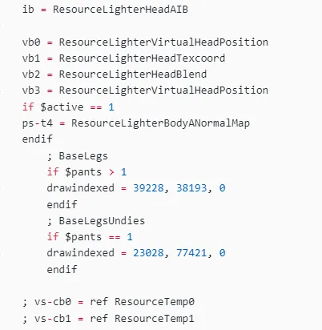

原理为先把上半身该渲染的内容渲染一下，然后把ib替换为下半身的ib，开始下半身的绘制

这里要把vb0设为下半身已经通过GPU-PreSkinning运算完成的vb0

它的来源是：

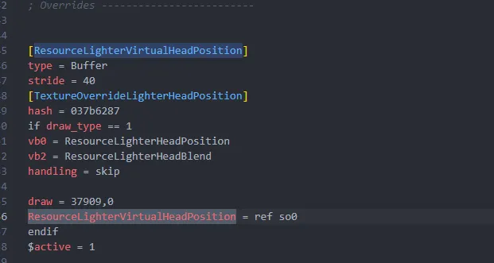

这里使用了Resource定义技术，在GPU-PreSkinning绘制完成后把so0的内容放到了声明好的vb0Resource中。

随后覆盖vb1纹理UV信息 和 vb2权重信息，以及vb3用于修复绘制后的轮廓线缺失抗锯齿的问题

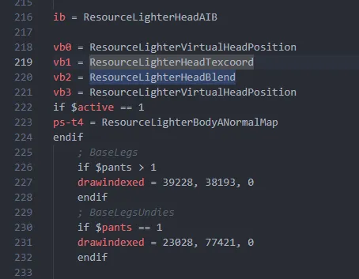

随后是一个ps-t4用法的NormalMap替换（因为Hash方式无法替换了）
随后开始drawindexed。

通过这种方法，即可实现使用上半身IB的渲染去渲染下半身的身体。
# 总结
- 此技术暂时无法通过一键逆向DrawIndexed方式一键逆向出来。
- 此技术获取可以用于其它Action游戏。
- 此技术可解决上下半身色差问题，可以使用。

值得注意的是，之前看到过的一个鲨鱼妹的Mod，好像使用了vs-cb0和vs-cb1的替换。
这个Mod里注释掉了，可能是用不上：

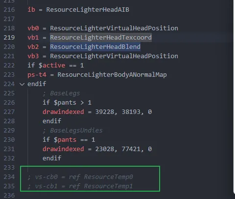

# 如何复现
首先你需要如下前置：

前置技术：

- Mod生成到统一的ini中的技术（Mod制作工具）
- DrawIndexed分割技术（Mod制作工具）
- DrawIndexed注释技术（Mod制作工具）
- 模型分块儿不影响权重和顶点位置技术（blender）

很显然，DBMT满足所有Mod制作工具的前置要求。

首先使用DBMT制作一个包含多个IB的绝区零Mod，这里我们以雅为演示：

我们这里直接提取雅的模型，只进行简单的修改演示，只为了快速查看跨IB渲染的效果和流程，在你操作的时候，应该是在Mod制作完成后进行：

首先假设我们已经做好了Mod，现在我们上半身需要用到下半身的渲染


上半身需要用到下半身渲染的部分我们要进行分割，并且需要保证分割后权重正常，这里最简单的分割方法是按V键：

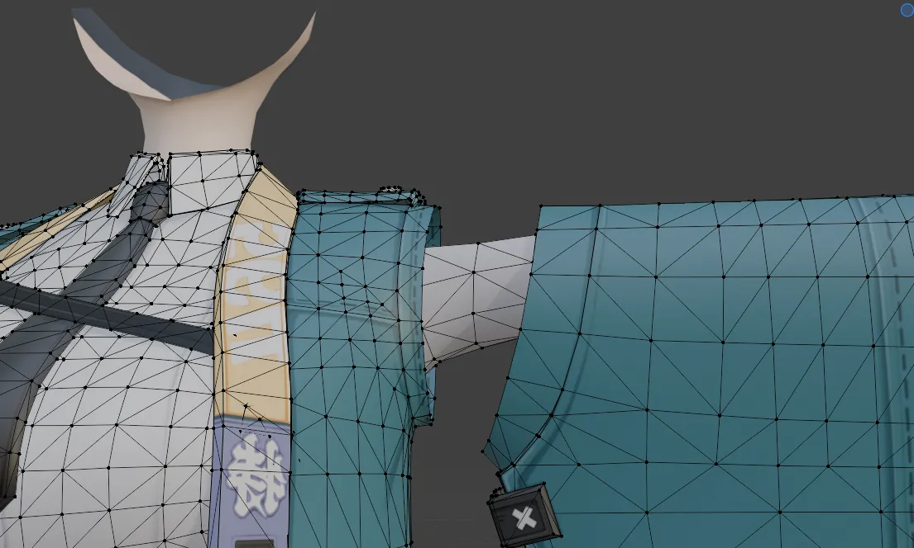

按V后分开了两个部位：

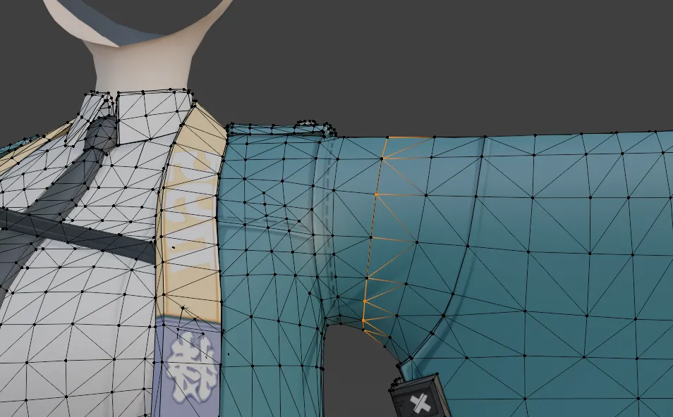

按V断离要保证这里移动的XYZ都是0：

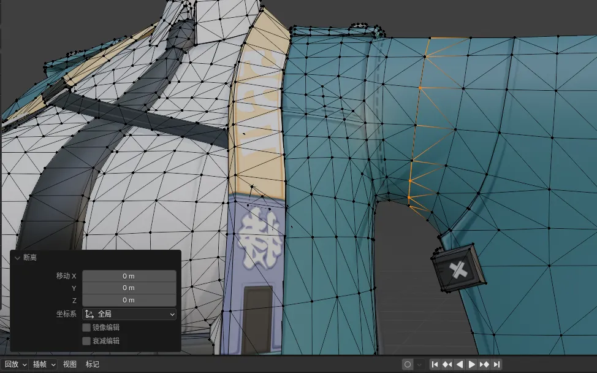

断离之后我们就能分割模型了：

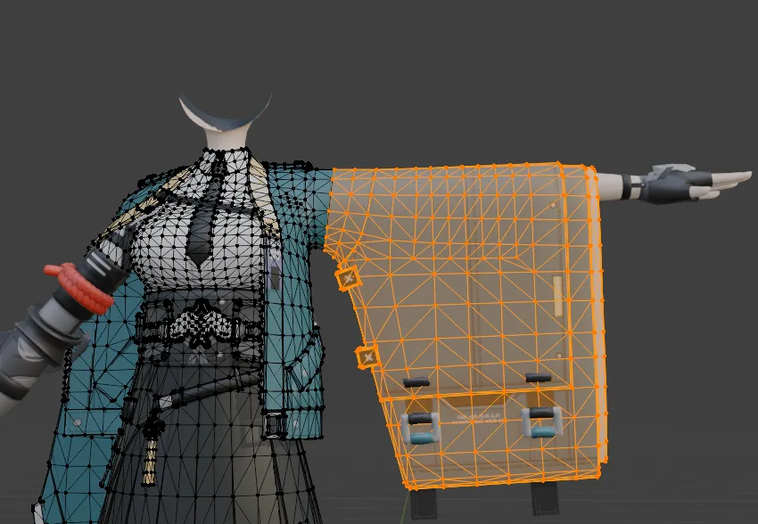

按P分割选中项，变为两个部分：

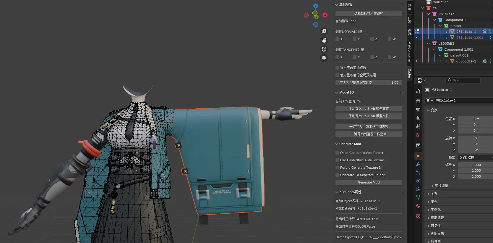

接下来给每个物体取名字，比如这部分我们取名为UpperArm，意为上半身手臂：

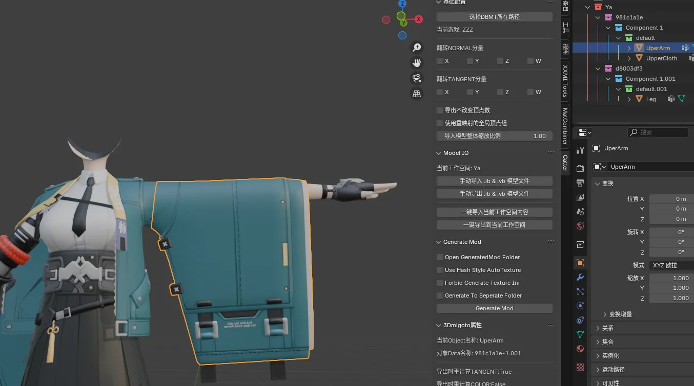

然后选中工作空间集合Ya，然后点生成Mod：


随后查看ini文件：

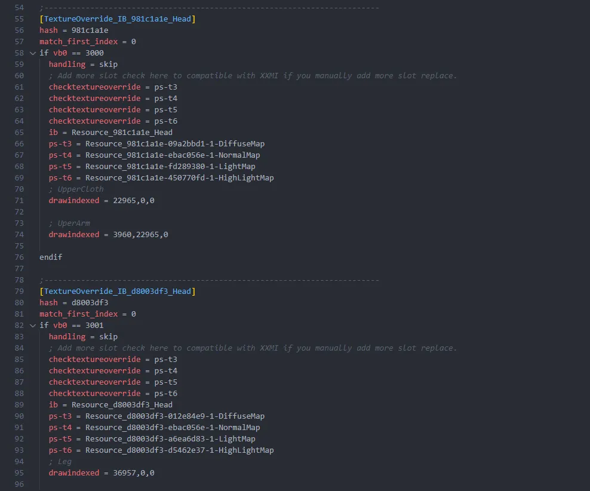

找到我们UpperArm的drawindexed：

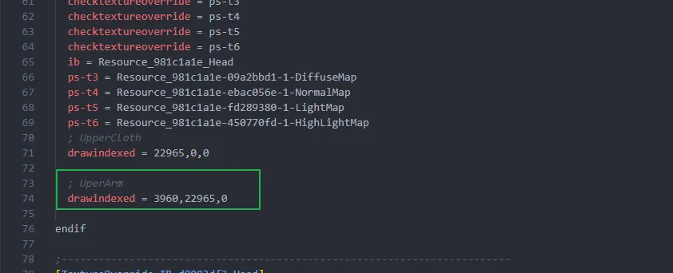

像这样，把上半身的ib和胳膊这个drawindexed放到下半身的TextureOverrideIB中：

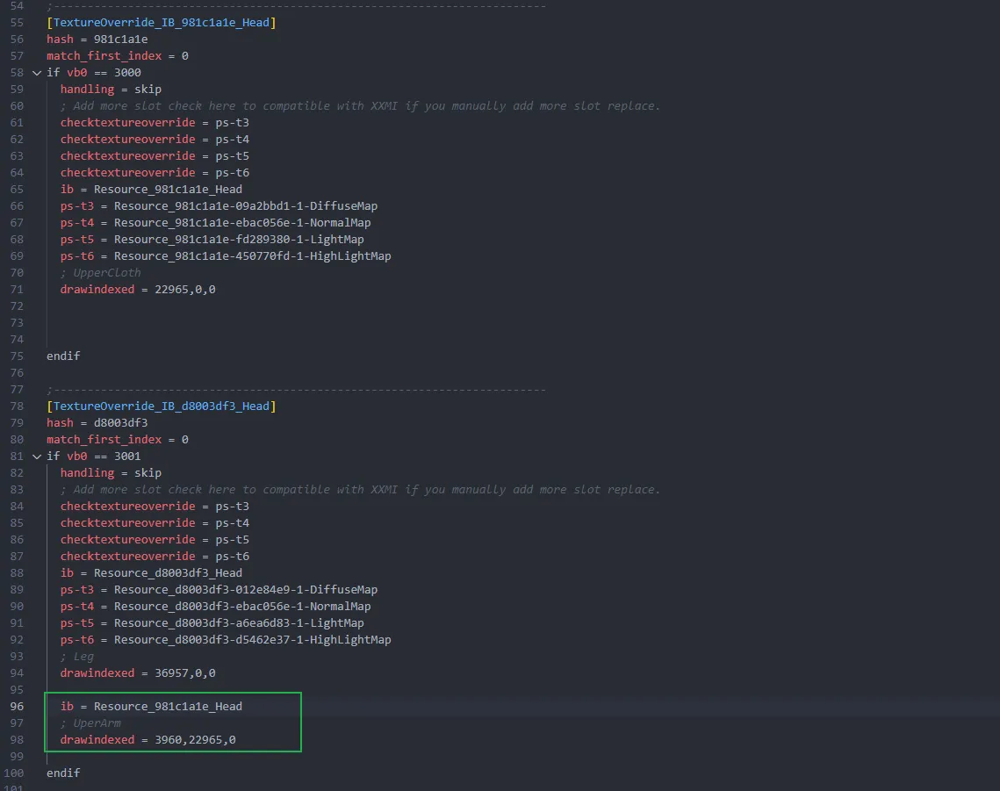

随后我们需要用到上半身计算完成的so0，首先找到上半身计算GPU-PreSkinning的部分

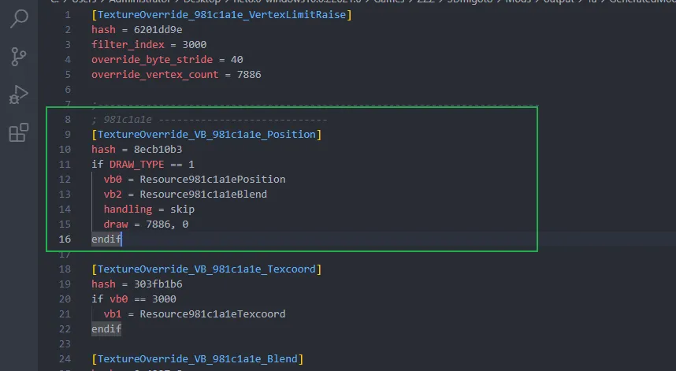

复制VB0的Resource，放到旁边进行修改，去掉filename部分即可，改个不一样的名字：

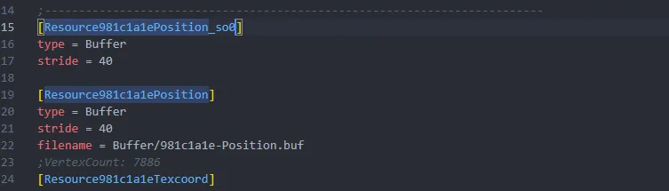

然后在上面Position那里计算完毕后，把vb0放到这个新建的Resource中：


随后我们找到下半身的TextureOverrideIB部分，把vb0设为这个计算完成后的so0的资源：

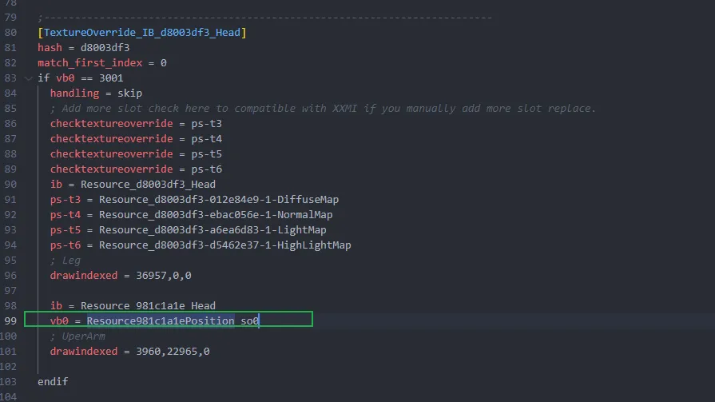

随后把上半身的vb1的Texcoord数据也放到这里，vb2的Blend数据也放到这里，最后补充vb3的Position数据，vb3和vb0一样：

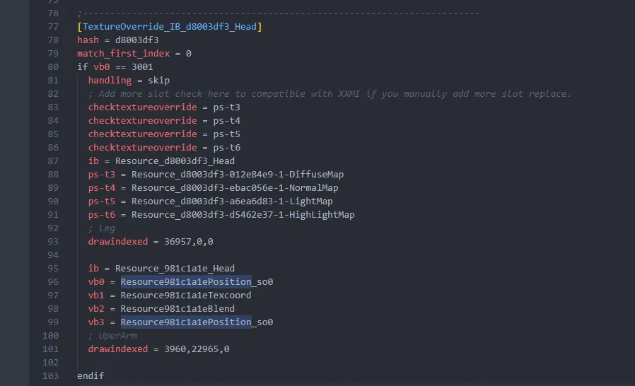

随后游戏里F10刷新即可看到效果。

# 更简单的复现

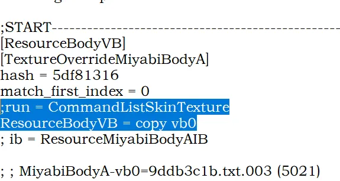

在上半身copy vb0，下半身的时候就能用了，不需要去Copy so0

<details>
<summary> 点击展开详细代码 </summary>

```ini
; Miyabi

; Constants -------------------------

; Overrides -------------------------

[TextureOverrideMiyabiHeadPosition]
hash = a60e533c
handling = skip
vb0 = ResourceMiyabiHeadPosition
vb2 = ResourceMiyabiHeadBlend
draw = 7221,0

[TextureOverrideMiyabiHeadTexcoord]
hash = c7ac9d3d
vb1 = ResourceMiyabiHeadTexcoord

[TextureOverrideMiyabiHeadVertexLimitRaise]
hash = f1936bfc
; override_vertex_count = 2779
; override_byte_stride = 92

[TextureOverrideMiyabiFacePosition]
hash = c5c5779e
handling = skip
vb0 = ResourceMiyabiFacePosition
vb2 = ResourceMiyabiFaceBlend
draw = 2751,0

[TextureOverrideMiyabiFaceTexcoord]
hash = 45f75ac5
vb1 = ResourceMiyabiFaceTexcoord

[TextureOverrideMiyabiFaceVertexLimitRaise]
hash = ffd7e4d9
; override_vertex_count = 396
; override_byte_stride = 108

[TextureOverrideMiyabiBodyPosition]
hash = 9ddb3c1b
handling = skip
vb0 = ResourceMiyabiBodyPosition
vb2 = ResourceMiyabiBodyBlend
draw = 18892,0

[TextureOverrideMiyabiBodyTexcoord]
hash = 85fa045b
vb1 = ResourceMiyabiBodyTexcoord

[TextureOverrideMiyabiBodyVertexLimitRaise]
hash = 176d6c2b
; override_vertex_count = 18892
; override_byte_stride = 96

[TextureOverrideMiyabiArmsLegsPosition]
hash = 825e0e2b
handling = skip
vb0 = ResourceMiyabiArmsLegsPosition
vb2 = ResourceMiyabiArmsLegsBlend
draw = 38902,0

[TextureOverrideMiyabiArmsLegsTexcoord]
hash = cdadcd73
vb1 = ResourceMiyabiArmsLegsTexcoord

[TextureOverrideMiyabiArmsLegsVertexLimitRaise]
hash = b0625293
; override_vertex_count = 38902
; override_byte_stride = 92

[TextureOverrideMiyabiHeadIB]
hash = 1123fd9b
handling = skip
drawindexed = auto

[TextureOverrideMiyabiHeadA]
hash = 1123fd9b
match_first_index = 0
run = CommandListSkinTexture
ib = ResourceMiyabiHeadAIB

[TextureOverrideMiyabiHeadADiffuse]
hash = 012e84e9
this = ResourceMiyabiHeadADiffuse

[TextureOverrideMiyabiHeadANormalMap]
hash = ebac056e
this = ResourceMiyabiHeadANormalMap

[TextureOverrideMiyabiHeadALightMap]
hash = a6ea6d83
this = ResourceMiyabiHeadALightMap

[TextureOverrideMiyabiHeadAMaterialMap]
hash = 6d2be344
this = ResourceMiyabiHeadAMaterialMap

[TextureOverrideMiyabiHeadB]
hash = 1123fd9b
match_first_index = 15132
run = CommandListSkinTexture
ib = ResourceMiyabiHeadBIB

[TextureOverrideMiyabiFaceIB]
hash = 31b0ceff
handling = skip
drawindexed = auto

[TextureOverrideMiyabiFaceA]
hash = 31b0ceff
match_first_index = 0
run = CommandListSkinTexture
ib = ResourceMiyabiFaceAIB

[TextureOverrideMiyabiFaceADiffuse]
hash = 9eb8384a
this = ResourceMiyabiFaceADiffuse

[TextureOverrideMiyabiFaceALightMap]
hash = 0061a33f
this = ResourceMiyabiFaceALightMap

[TextureOverrideMiyabiFaceB]
hash = 31b0ceff
match_first_index = 7290
run = CommandListSkinTexture
ib = ResourceMiyabiFaceBIB

[TextureOverrideMiyabiFaceC]
hash = 31b0ceff
match_first_index = 9234
run = CommandListSkinTexture
ib = ResourceMiyabiFaceCIB

[TextureOverrideMiyabiBodyIB]
hash = 5df81316
handling = skip

;START---------------------------------------------------------------------
[ResourceBodyVB]
[TextureOverrideMiyabiBodyA]
hash = 5df81316
match_first_index = 0
;run = CommandListSkinTexture
ResourceBodyVB = copy vb0
; ib = ResourceMiyabiBodyAIB

; ; MiyabiBodyA-vb0=9ddb3c1b.txt.003 (5021)
; drawindexed = 27786, 0, 0
; ; MiyabiBodyA
; 	; MiyabiBodyA-vb0=9ddb3c1b.txt.003 (5021)
; 	drawindexed = 27786, 27786, 0

[TextureOverrideMiyabiBodyADiffuse]
hash = 09a2bbd1
this = ResourceMiyabiBodyADiffuse

[TextureOverrideMiyabiBodyALightMap]
hash = fd289380
this = ResourceMiyabiBodyALightMap

[TextureOverrideMiyabiBodyAMaterialMap]
hash = 450770fd
this = ResourceMiyabiBodyAMaterialMap

[TextureOverrideMiyabiArmsLegsIB]
hash = 86467bba
handling = skip

[TextureOverrideMiyabiArmsLegsA]
hash = 86467bba
match_first_index = 0
run = CommandListSkinTexture

ib = ResourceMiyabiArmsLegsAIB
; MiyabiArmsLegsA-Body Bottom (15092)
drawindexed = 78504, 0, 0
; MiyabiArmsLegsA
	; MiyabiArmsLegsA-Body Bottom (15092)
	drawindexed = 78504, 78504, 0
	; MiyabiArmsLegsA 1
		; Miyabi ArmsLegsA-AnkleStrap (233)
		drawindexed = 648, 157008, 0
		; Miyabi ArmsLegsA-Boots (2037)
		drawindexed = 6726, 157656, 0
		; Miyabi ArmsLegsA-GloveArmor (2608)
		drawindexed = 10209, 164382, 0
		; Miyabi ArmsLegsA-GlovesSmall (1458)
		drawindexed = 5793, 174591, 0
		; Miyabi ArmsLegsA-JacketStraps (2332)
		drawindexed = 7455, 180384, 0
		; Miyabi ArmsLegsA-NameBadge (50)
		drawindexed = 132, 187839, 0

ib = ResourceMiyabiBodyAIB
vb0 = ResourceBodyVB
vb1 = ResourceMiyabiBodyTexcoord
vb2 = ResourceMiyabiBodyBlend
vb3 = ResourceBodyVB

; MiyabiBodyA-Body Top (4675)
drawindexed = 25410, 0, 0
; MiyabiBodyA
	; Miyabi BodyA-Nipples (434)
	drawindexed = 2376, 25410, 0
	; MiyabiBodyA-Body Top (4675)
	drawindexed = 25410, 27786, 0
	; MiyabiBodyA 1
		; Miyabi BodyA-Belt (2942)
		drawindexed = 7872, 53196, 0
		; Miyabi BodyA-CollarTie (1163)
		drawindexed = 3390, 61068, 0
		; Miyabi BodyA-Jacket (3227)
		drawindexed = 12147, 64458, 0
		; Miyabi BodyA-Shirt.Cropped (1322)
		;drawindexed = 3624, 76605, 0
		; Miyabi BodyA-Skirt.Short (454)
		drawindexed = 1392, 80229, 0

;END---------------------------------------------------------------------

; [TextureOverrideMiyabiBodyA]
; hash = 5df81316
; match_first_index = 0
; run = CommandListSkinTexture
; ib = ResourceMiyabiBodyAIB
; ; MiyabiBodyA-Body Top (4675)
; drawindexed = 25410, 0, 0
; ; MiyabiBodyA
; 	; Miyabi BodyA-Nipples (434)
; 	drawindexed = 2376, 25410, 0
; 	; MiyabiBodyA-Body Top (4675)
; 	drawindexed = 25410, 27786, 0
; 	; MiyabiBodyA 1
; 		; Miyabi BodyA-Belt (2942)
; 		drawindexed = 7872, 53196, 0
; 		; Miyabi BodyA-CollarTie (1163)
; 		drawindexed = 3390, 61068, 0
; 		; Miyabi BodyA-Jacket (3227)
; 		drawindexed = 12147, 64458, 0
; 		; Miyabi BodyA-Shirt.Cropped (1322)
; 		drawindexed = 3624, 76605, 0
; 		; Miyabi BodyA-Skirt.Short (454)
; 		drawindexed = 1392, 80229, 0

; [TextureOverrideMiyabiBodyADiffuse]
; hash = 09a2bbd1
; this = ResourceMiyabiBodyADiffuse

; [TextureOverrideMiyabiBodyALightMap]
; hash = fd289380
; this = ResourceMiyabiBodyALightMap

; [TextureOverrideMiyabiBodyAMaterialMap]
; hash = 450770fd
; this = ResourceMiyabiBodyAMaterialMap

; [TextureOverrideMiyabiArmsLegsIB]
; hash = 86467bba
; handling = skip

; [TextureOverrideMiyabiArmsLegsA]
; hash = 86467bba
; match_first_index = 0
; run = CommandListSkinTexture
; ib = ResourceMiyabiArmsLegsAIB
; ; MiyabiArmsLegsA-Body Bottom (15092)
; drawindexed = 78504, 0, 0
; ; MiyabiArmsLegsA
; 	; MiyabiArmsLegsA-Body Bottom (15092)
; 	drawindexed = 78504, 78504, 0
; 	; MiyabiArmsLegsA 1
; 		; Miyabi ArmsLegsA-AnkleStrap (233)
; 		drawindexed = 648, 157008, 0
; 		; Miyabi ArmsLegsA-Boots (2037)
; 		drawindexed = 6726, 157656, 0
; 		; Miyabi ArmsLegsA-GloveArmor (2608)
; 		drawindexed = 10209, 164382, 0
; 		; Miyabi ArmsLegsA-GlovesSmall (1458)
; 		drawindexed = 5793, 174591, 0
; 		; Miyabi ArmsLegsA-JacketStraps (2332)
; 		drawindexed = 7455, 180384, 0
; 		; Miyabi ArmsLegsA-NameBadge.001 (50)
; 		drawindexed = 132, 187839, 0

; CommandList -----------------------

; Resources -------------------------

[ResourceMiyabiHeadPosition]
type = Buffer
stride = 40
filename = MiyabiHeadPosition.buf

[ResourceMiyabiHeadBlend]
type = Buffer
stride = 32
filename = MiyabiHeadBlend.buf

[ResourceMiyabiHeadTexcoord]
type = Buffer
stride = 20
filename = MiyabiHeadTexcoord.buf

[ResourceMiyabiFacePosition]
type = Buffer
stride = 40
filename = MiyabiFacePosition.buf

[ResourceMiyabiFaceBlend]
type = Buffer
stride = 32
filename = MiyabiFaceBlend.buf

[ResourceMiyabiFaceTexcoord]
type = Buffer
stride = 36
filename = MiyabiFaceTexcoord.buf

[ResourceMiyabiBodyPosition]
type = Buffer
stride = 40
filename = MiyabiBodyPosition.buf

[ResourceMiyabiBodyBlend]
type = Buffer
stride = 32
filename = MiyabiBodyBlend.buf

[ResourceMiyabiBodyTexcoord]
type = Buffer
stride = 24
filename = MiyabiBodyTexcoord.buf

[ResourceMiyabiArmsLegsPosition]
type = Buffer
stride = 40
filename = MiyabiArmsLegsPosition.buf

[ResourceMiyabiArmsLegsBlend]
type = Buffer
stride = 32
filename = MiyabiArmsLegsBlend.buf

[ResourceMiyabiArmsLegsTexcoord]
type = Buffer
stride = 20
filename = MiyabiArmsLegsTexcoord.buf

[ResourceMiyabiHeadAIB]
type = Buffer
format = DXGI_FORMAT_R32_UINT
filename = MiyabiHeadA.ib

[ResourceMiyabiHeadBIB]
type = Buffer
format = DXGI_FORMAT_R32_UINT
filename = MiyabiHeadB.ib

[ResourceMiyabiFaceAIB]
type = Buffer
format = DXGI_FORMAT_R32_UINT
filename = MiyabiFaceA.ib

[ResourceMiyabiFaceBIB]
type = Buffer
format = DXGI_FORMAT_R32_UINT
filename = MiyabiFaceB.ib

[ResourceMiyabiFaceCIB]
type = Buffer
format = DXGI_FORMAT_R32_UINT
filename = MiyabiFaceC.ib

[ResourceMiyabiBodyAIB]
type = Buffer
format = DXGI_FORMAT_R32_UINT
filename = MiyabiBodyA.ib

[ResourceMiyabiArmsLegsAIB]
type = Buffer
format = DXGI_FORMAT_R32_UINT
filename = MiyabiArmsLegsA.ib

[ResourceMiyabiHeadADiffuse]
filename = MiyabiBodyADiffuse.dds

[ResourceMiyabiHeadANormalMap]
filename = MiyabiBodyANormalMap.jpg

[ResourceMiyabiHeadALightMap]
filename = MiyabiBodyALightMap.dds

[ResourceMiyabiHeadAMaterialMap]
filename = MiyabiBodyAMaterialMap.dds

[ResourceMiyabiFaceADiffuse]
filename = MiyabiFaceADiffuse.dds

[ResourceMiyabiFaceALightMap]
filename = MiyabiFaceALightMap.jpg

[ResourceMiyabiBodyADiffuse]
filename = MiyabiBodyADiffuse.dds

[ResourceMiyabiBodyALightMap]
filename = MiyabiBodyALightMap.dds

[ResourceMiyabiBodyAMaterialMap]
filename = MiyabiBodyAMaterialMap.dds


; .ini generated by XXMI (XX-Model-Importer)
; If you have any issues or find any bugs, please open a ticket at https://github.com/leotorrez/XXMI-Tools/issues

```
</details>

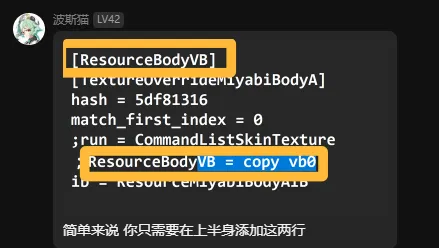

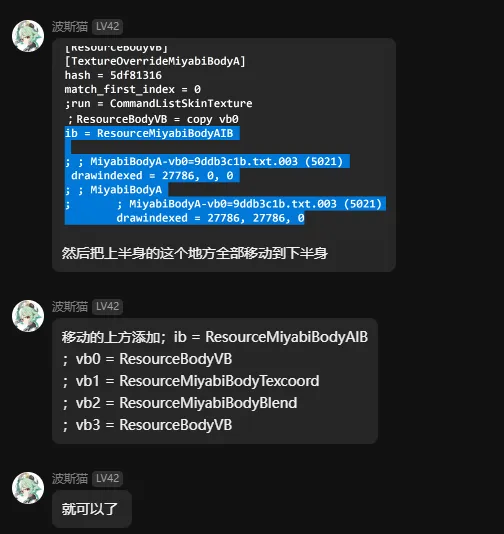

缺陷：


# 注意事项
- 鲨鱼妹需要额外copy vs-cb0来解决上下身体坐标系不一致的问题，不在此赘述，建议查看别人已做好的Mod的ini文件来学习。
- 别忘了vb3来修复抗锯齿消失的问题。
- 使用copy so0会导致一个问题，例如，角色操控的雅和地图上的NPC雅相遇时，NPC雅的身体会胡乱抽搐，所以部分Mod作者会使用copy vb0而不是copy so0进行跨IB渲染。