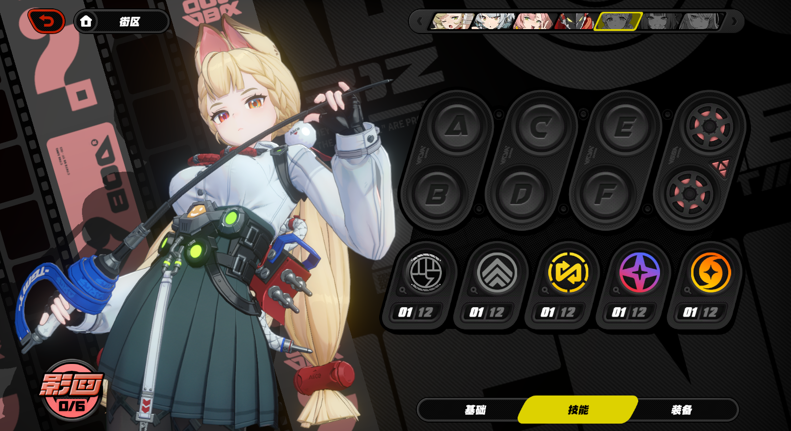
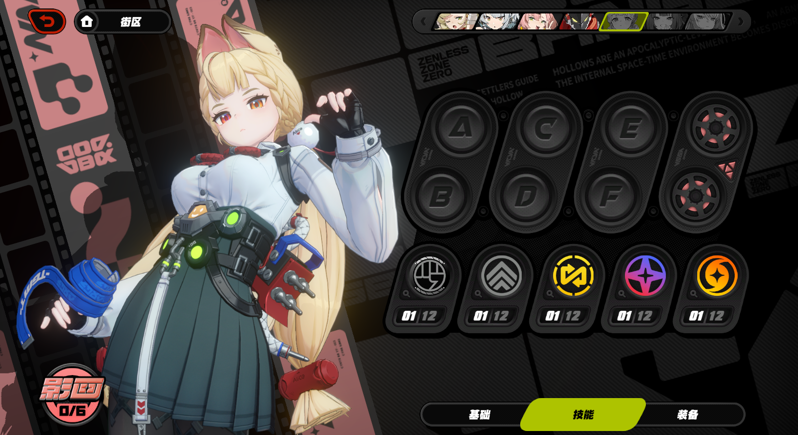
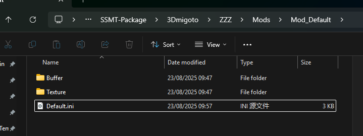
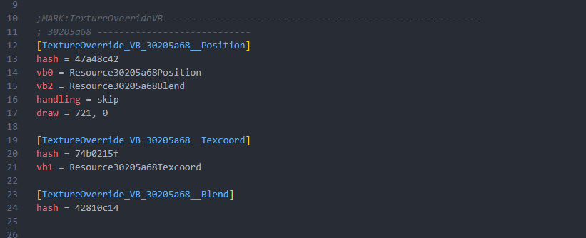
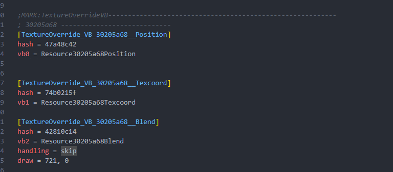
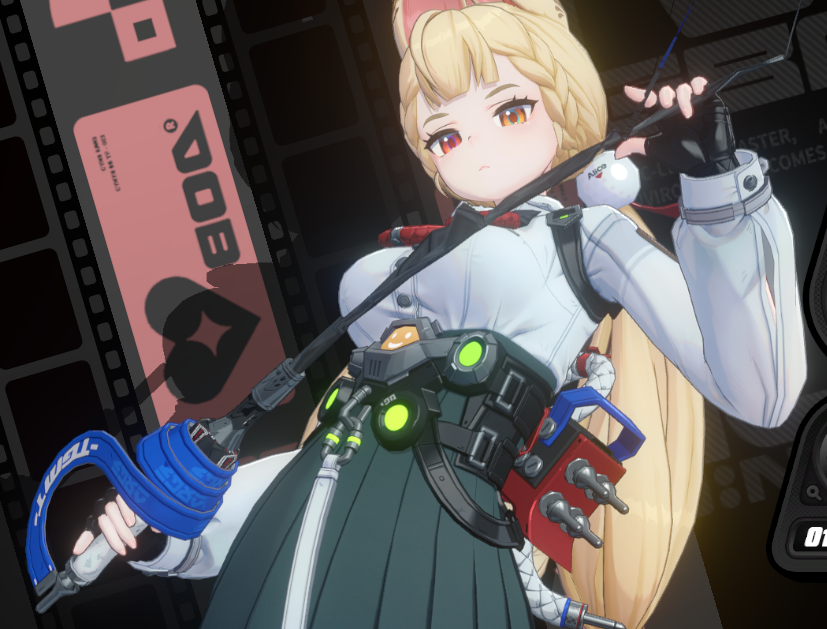
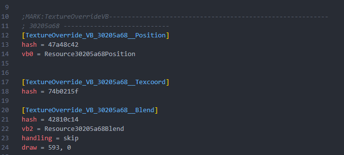
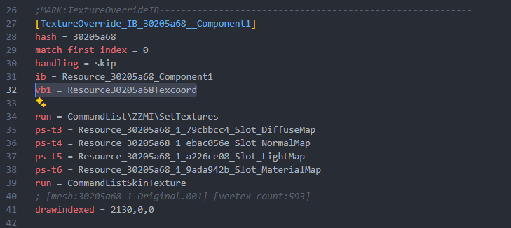
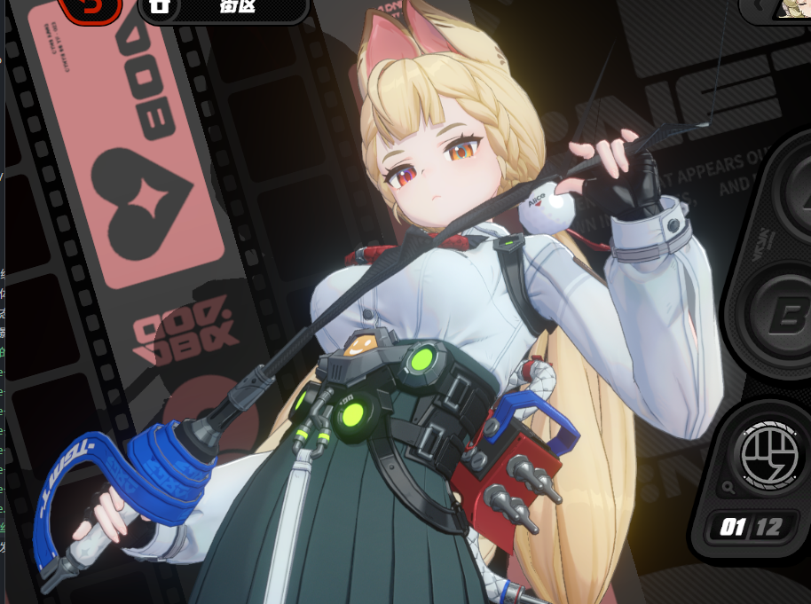

我们都知道，正常情况下使用SSMT生成爱丽丝的剑的Mod，会导致它的剑消失，如下图是原始模型：

下图为放大剑的模型，直接生成Mod的效果：

此时剑消失了，不正常显示，这是因为这个剑的渲染顺序比较特殊，我们需要修改自动生成的模板ini文件才行。

生成Mod后，会自动打开Mod所在文件夹：

打开Mod的ini文件，重点关注如下内容：

我们需要把Position部位的vb2替换以及skip和draw都移动到Blend下面，改完之后是这样：

此时我们游戏中F10刷新，虽然能够显示了，但是贴图对不上：

随后我们把Texcoord下的vb1替换，移动到IB对应的Component替换下面：

游戏中F10刷新可以看到贴图UV也正常了：

总结：制作的过程中正常制作，最后的ini修改一下就行。