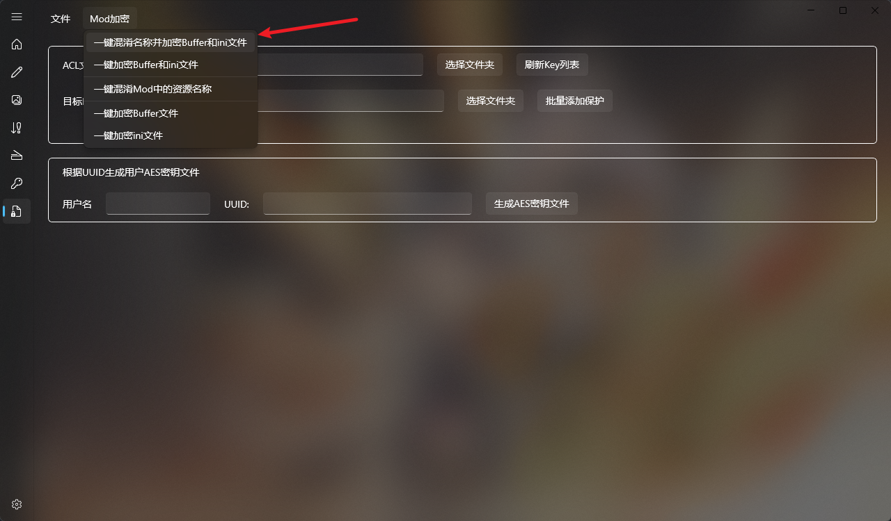
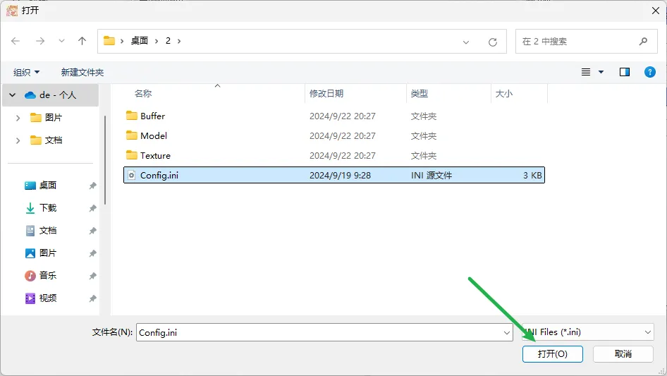
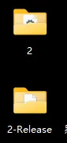
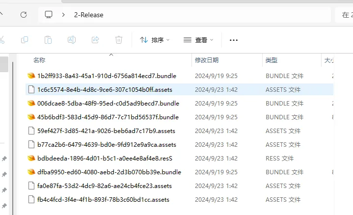
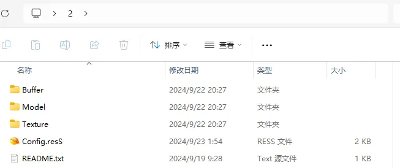
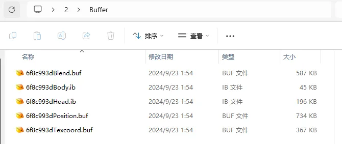
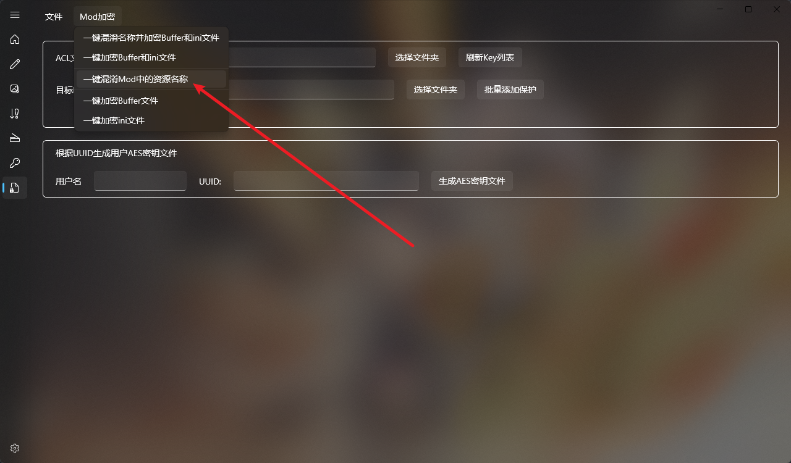
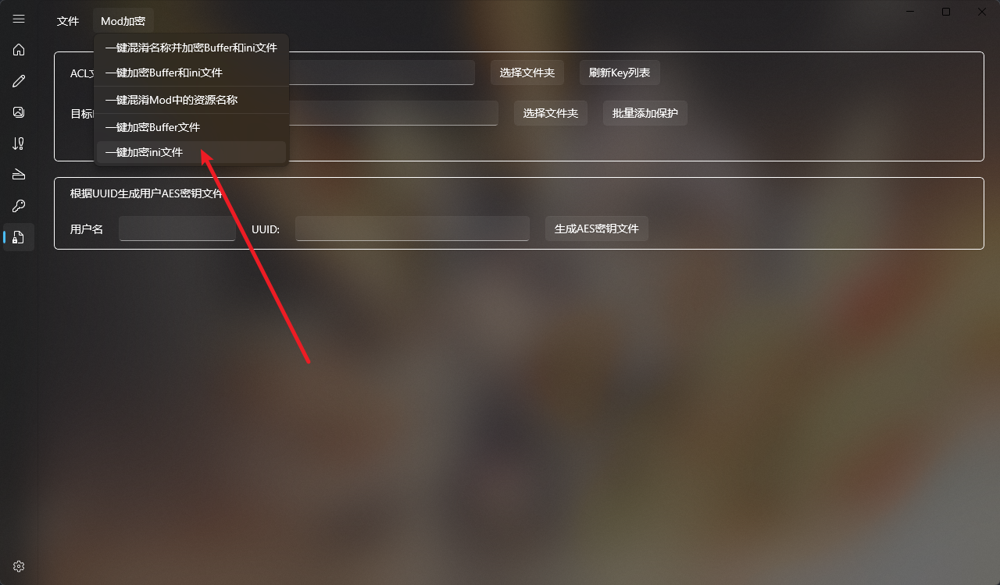

# 一键混淆名称并加密Buffer和ini文件

这个是最高级别的加密，点击后它让你选择一个ini文件，也就是你得选择Mod的ini文件：

它会先混淆文件名称，随后加密Buffer文件，最后加密ini文件，随后把结果文件存到一个以当前Mod文件夹名称为前缀，-Release为后缀的文件夹中：

文件内容如下：

此时Buffer文件、ini文件都被加密了，从010Editor也无法看出明显的特征了，所有文件名也都进行了名称混淆，进一步增加了破解难度，这里如果敌人想要直接通过自动化的脚本来破解，那所需的成本将远大于加密所需成本，远大于更新加密算法所需成本。

这个选项就是工具中最强的加密算法，也是我最推荐使用的算法，点一下选择ini直接生成完全加密后的mod文件，打包发送给客户即可使用。并且我这里定期还会更新加密算法，以无限提高破解成本为目标，实现防止自动化脚本一键逆向提取模型。

# 一键加密Buffer和ini文件

用法还是一样，点击后选择Mod的ini文件，随后其中所有文件都会被原地加密，并不会生成-Release文件夹，这个要注意一下，所以运行这个之前需要备份一下原本的Mod，加密后的文件如下：

表面上看不出什么区别，但Buffer和ini文件的内容已经被加密了。

此方法缺少了混淆的步骤，导致别人可以根据名称直接猜测每个Buffer原本是做什么的，防破解的难度又小了一点。

# 一键混淆Mod中的资源名称

这个运行后会生成Mod文件夹名称-Release文件夹，里面文件的名称就被混淆掉了，这个是加密Buffer或加密ini文件之前的步骤，如果单独使用的话只是改个名字，并没有加密效果。

作为单独选项提供是为了让插件用户可以有混淆 + Buffer加密，混淆 + ini加密的选择空间，因为并不是每种加密都是为了防止逆向提取模型，有些单纯是不想让自己写的ini技术被人偷学，此时就可以混淆名称后只加密ini而不加密buffer，这样其它人也无法通过自动化脚本一键逆向，在防止别人偷学ini技术的同时，也提供一定干扰效果。

# 一键加密Buffer文件

没啥好说的，点击后会让你选择一个目录，加密其中的所有Mod的Buffer文件，能起到一定程度的防逆向功能，这个的选项好处就是不加密ini文件的情况下，如果Mod的hash值发生变更，用户可以自己使用脚本修复ini文件中的内容。

# 一键加密ini文件

没啥好说的，单纯加密ini文件，防别人偷学ini里的技术，但是如果不配合加密Buffer使用的话，起不到防逆向模型的效果，别人手动逆向拖拽几下就解决了。

