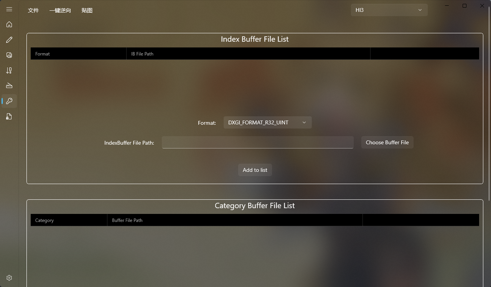

# SSMT-Reverse插件

SSMT-Reverse插件，其实就是我们的3Dmigoto-Sword-Lv5，因为界面整合到了SSMT中，所以现在改名为SSMT-Reverse插件了。

3Dmigoto-Sword-Lv5是一款专业的用于将3Dmigoto Mod里的模型提取出来的工具，它的工作原理是全自动分析ini文件中的语法，并构建抽象的逻辑分析链进行语法分析，从ini内容中识别出Buffer文件可能组合成的模型文件。

可以在爱发电中赞助获取，此小众工具本身属于赞助支持的赠品：

https://afdian.com/item/ec74ee782b2f11efb5a052540025c377

作为SSMT插件安装预览图

# 功能强大
- 无需开启游戏，只要获取到Mod文件，就能一键分析ini的方式把Mod里的模型逆向还原为Mod文件。
- 超复杂ini解析，模拟3Dmigoto解析逻辑。
- C++编写的内核，运行速度超快，3秒内还原模型。
- 操作界面由WinUI3编写，极速响应无卡顿。
- 激活机制保障用户权益，防止工具被恶意倒卖损坏用户权益。
- 设计简洁解压即用，下载和更新都很方便。
- 可以把所有可能的数据类型都逆向出来，确保逆向结果正确。
- 基本上99%的Mod都能逆向，如果配合手动修改ini以及手动逆向，则所有支持的类型的开源格式Mod都能逆向。

# 尽享优势
- 第一时间获取技术支持，任意逆向不出来的Mod可直接找我帮忙解决。
- 持续更新新特性，第一时间修复旧版本的BUG，用起来更方便更顺手。
- 随时提交反馈建议来改进工具，所有反馈都会添加到计划列表稳定更新。
- 内部Mod逆向技术社群，独立圈子共建逆向技术社区。
- 高度自动化，全是一键逆向，操作简单快捷，节省大量无效的浪费时间。
- 支持复杂Mod全自动解析，几千行的分支切换类型Mod也能做到一键全自动化逆向，自动化解析已经持续更新了3年左右了，功能超越市面上所有开源逆向脚本。

工具需要激活后才可以使用，赞助后可联系我进行激活，每份赞助只提供一台设备进行激活，更换设备时可找我重新激活更换绑定，请避免过于频繁的更换绑定。

