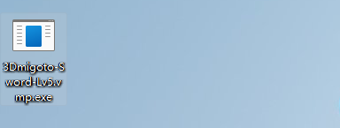
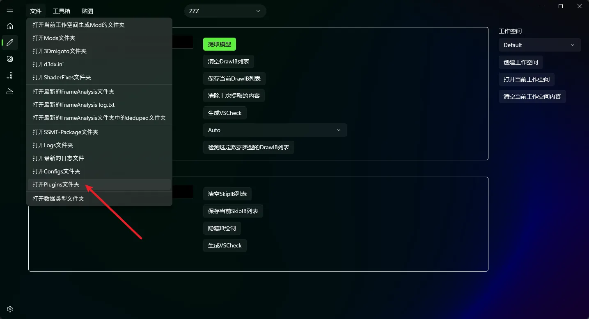
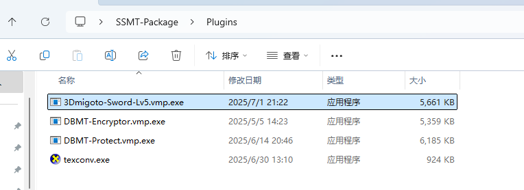
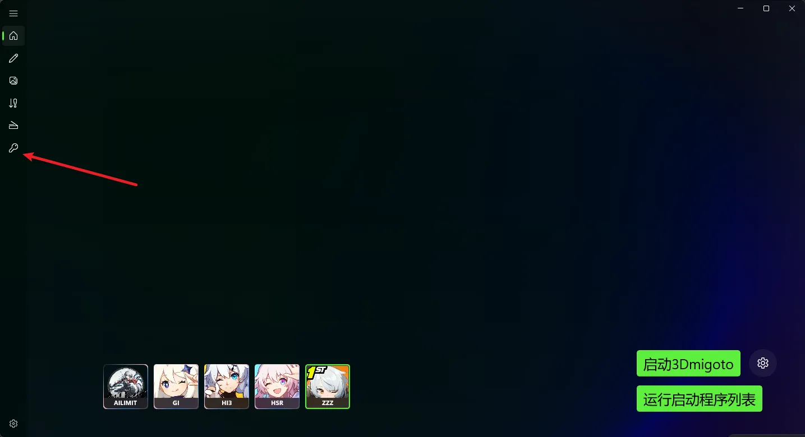
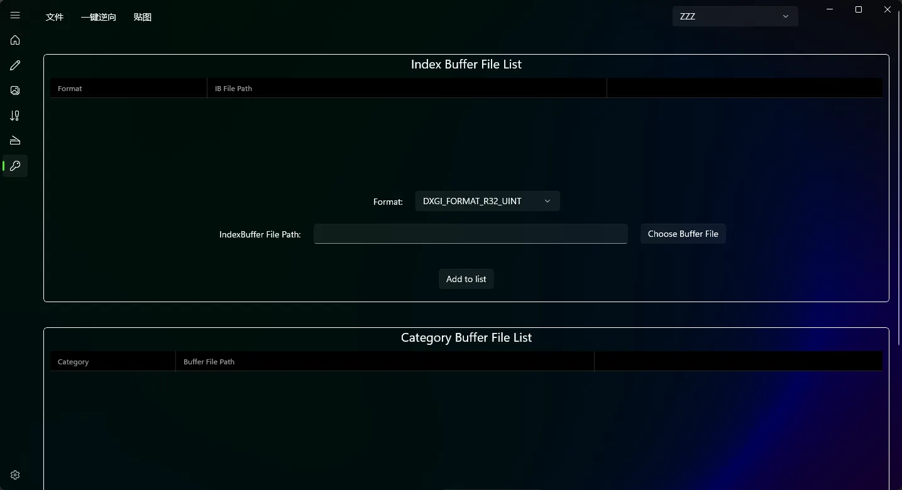
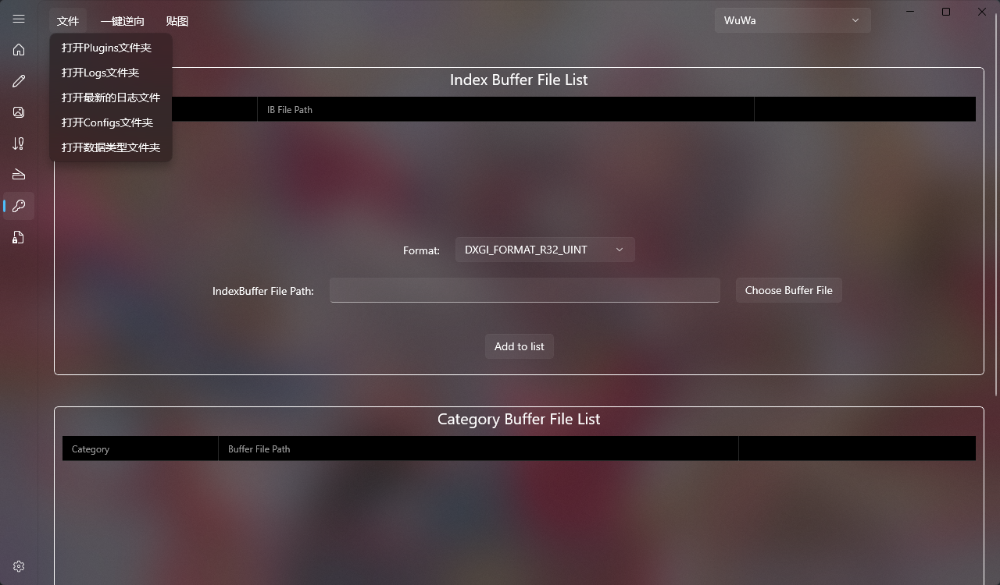
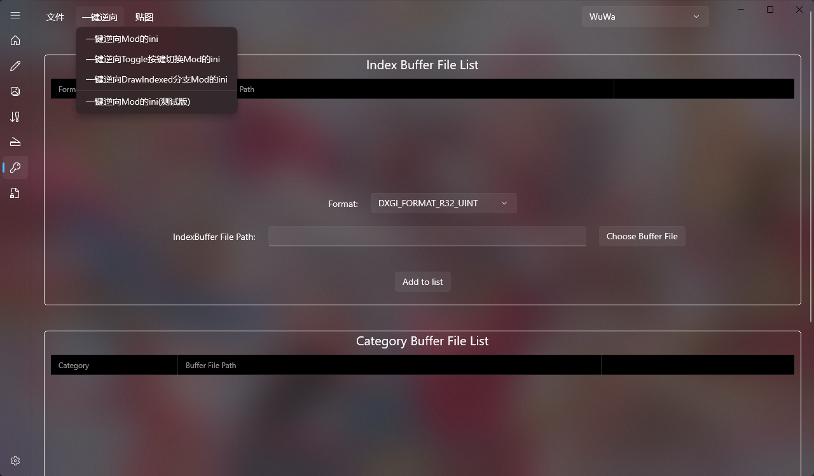
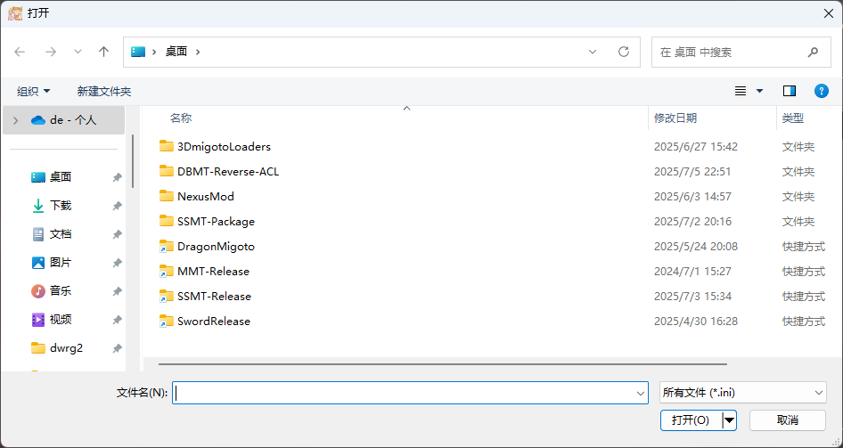
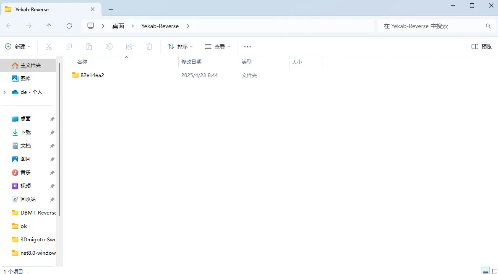
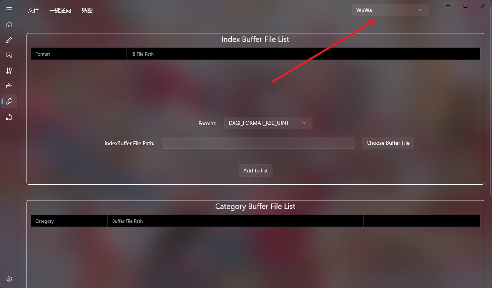

# 激活SSMT-Reverse插件
首先需要激活插件

赞助后可进入SSMT技术社群，在群文件中获取到密钥生成器：

DBMT-KeyGenerator.vmp.exe

运行后会闪过一个黑框框，并立刻在原地生成一个当前日期的.key文件，像这样：

随后你把这个日期.key文件发给我，等我有空激活好只会，我就可以把激活后的3Dmigoto-Sword-Lv5.vmp.exe发给你了。

注意事项：
- 由于使用VMP加壳，密钥生成器可能会被误报，可以关闭杀软管家运行，生成密钥结束后再开启杀软管家等。
- 请把密钥生成器放到纯英文路径，中文路径会导致无法正常生成密钥文件。

# 安装步骤
激活好之后，我会发给你一个名为3Dmigoto-Sword-Lv5.vmp.exe的文件

首先我们打开SSMT，到工作台中点击【文件】，点击【打开Plugins】文件夹

随后你需要把这个文件放到SSMT-Package的Plugins目录下，像这样：

然后，重启SSMT，你会发现左侧多了一个页面，点进去就能使用Mod逆向功能了。

# 基础用法

文件菜单中可以打开各种文件夹，方便查看配置：

一键逆向菜单中包含了我们的主要的功能，分析Mod的ini并将模型提取出来，点击其中一种分析方式后，弹出的文件选择框中选择Mod的ini文件即可开始自动分析：

逆向成功后会自动打开逆向出来的模型所在的文件夹：

右上角可以选择当前逆向的Mod的游戏类型，在逆向Mod之前必须准确选择对应游戏类型名称：

米游有三个一键逆向选项，一般都选第三个【一键逆向DrawIndexed】，鸣潮只有一个一键逆向选项。

如果你会用数据类型，也可以使用手动逆向功能。

