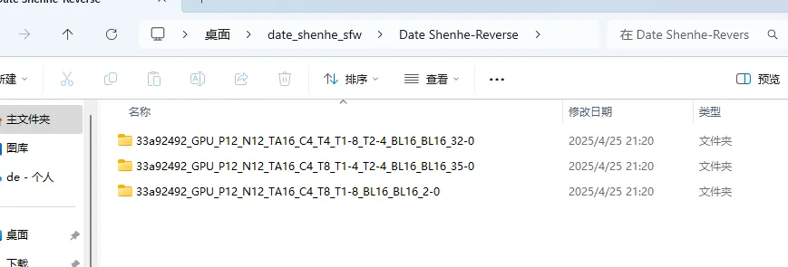
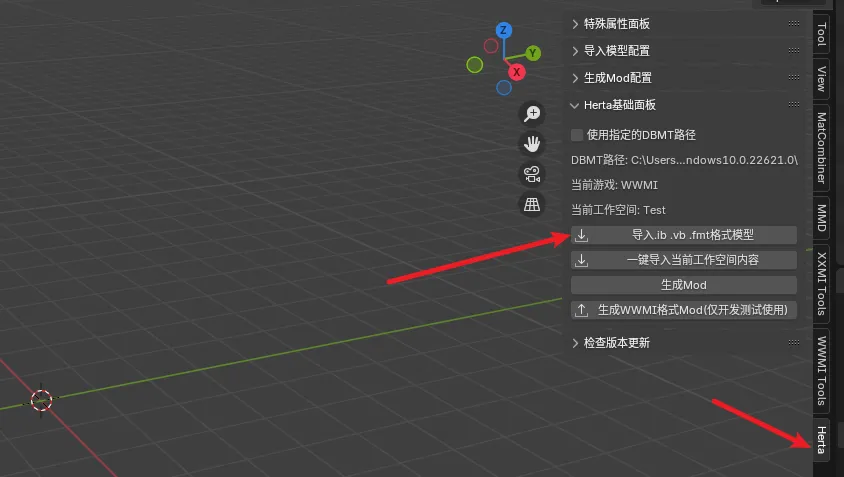
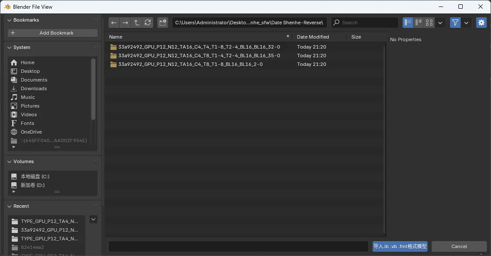
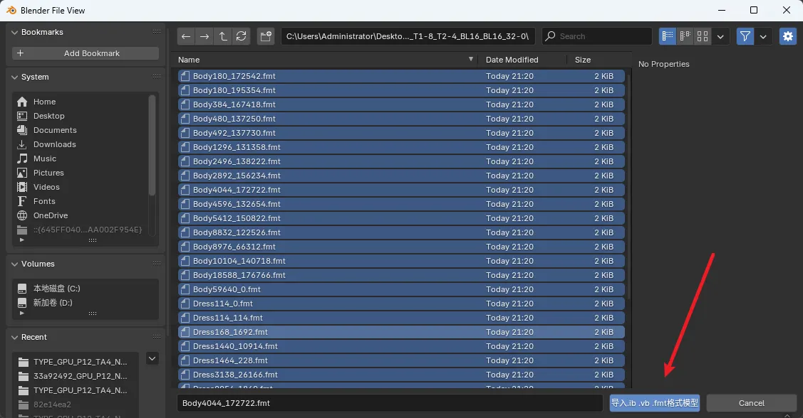
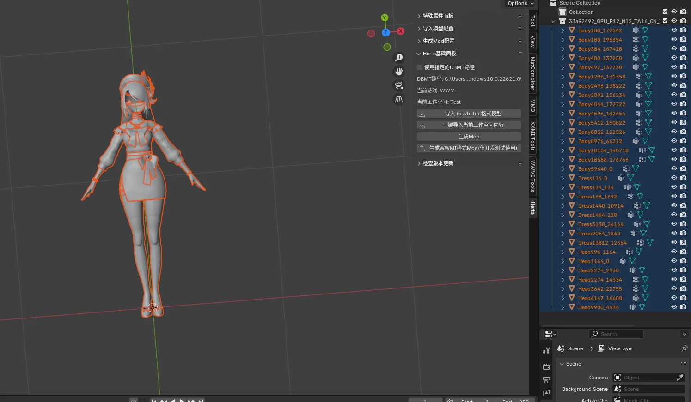
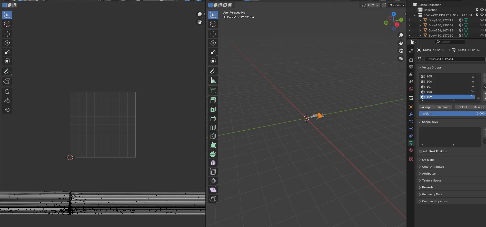
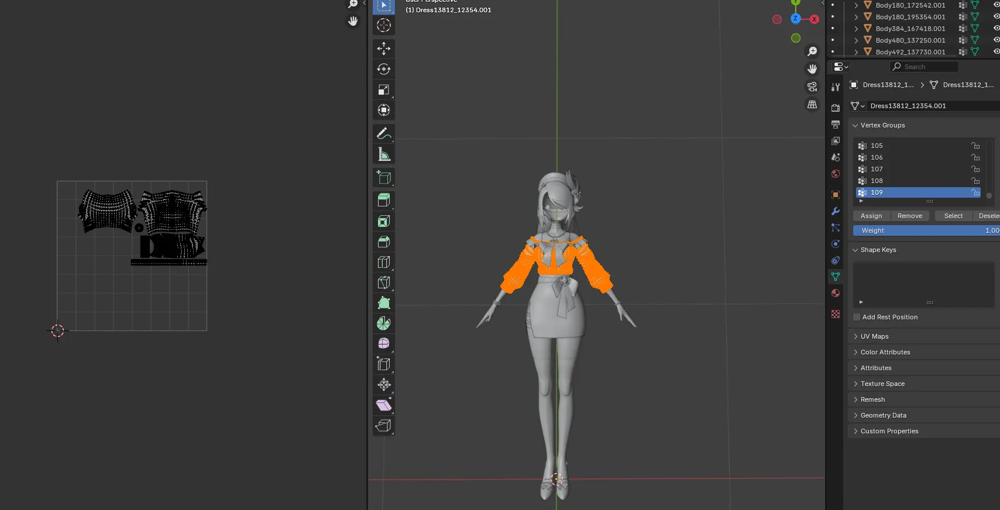

以一个原神Mod为例：

逆向出来之后有多个文件夹，通过观察名称我们可以发现，都是前面8位数字的Hash值，外加数据类型名称来命名的文件夹。

这是因为我们的Sword逆向时，会把这个Mod里的模型所有可能的数据类型都逆向出来，每个数据类型代表了一种对模型文件内容的描述，此时逆向出来的三个文件夹对应的三个数据类型中只有一个数据类型是正确的。

我们需要依次导入到Blender中来验证是否正确，首先打开Blender，打开我们的SSMT插件面板：

如果你没有安装SSMT的Blender插件，可以看这里的教程安装

https://starbobis.github.io/SSMT-Documents/Tutorials/SSMT/(2)SSMT%20Blender%E6%8F%92%E4%BB%B6%E5%AE%89%E8%A3%85%E6%95%99%E7%A8%8B/SSMT%E7%9A%84Blender%E6%8F%92%E4%BB%B6%E5%AE%89%E8%A3%85%E6%95%99%E7%A8%8B.html

点击导入.ib .vb .fmt格式模型：

此时我们按顺序先导入第一个来康康，进入到文件夹里面后，按a键来全选所有模型，点下面的蓝色的按钮导入：

可以看到模型就导入进来了：

此时我们需要查看其UV是否正确来判断数据类型是否正确，选中任意导入进来的模型，依次查看所有UV是否正确：

可以看到这个UV明显不正确，所以第一个数据类型可以排除了，接下来依次导入第二个、第三个、步骤是一样的，直到我们发现导入的模型的UV是正确的，如下图：

这时候说明导入了正确的数据类型，接下来就可以任意使用这个模型来做你想做的事情了。
