当我们逆向出来一大堆模型的时候，会发现它没有贴图：

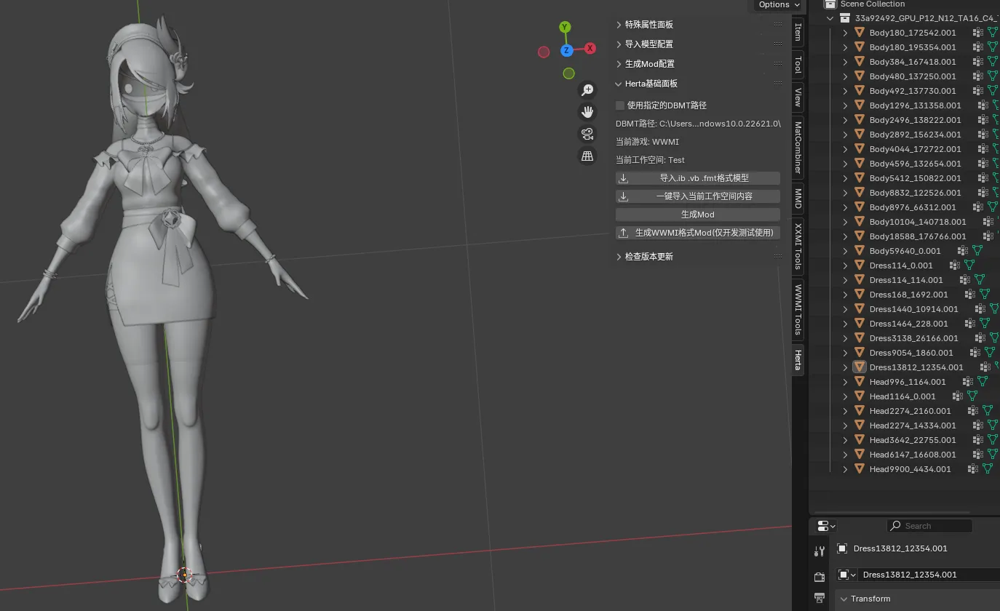

此时我们需要去Mod文件夹内寻找贴图：

可以看到这个Mod用到的所有贴图都在这里了，如果你的电脑没有预览图显示的话，可以安装一个叫Paint.net的贴图工具：

https://github.com/paintdotnet/release/releases

此时观察可以发现，我们找不到Diffuse贴图，这是因为某些贴图是具有Alpha通道的，它的Alpha通道可能被反转了，所以导致看到的贴图是空白的或者只有部分内容，例如当前身体的Diffuse贴图是这样的：

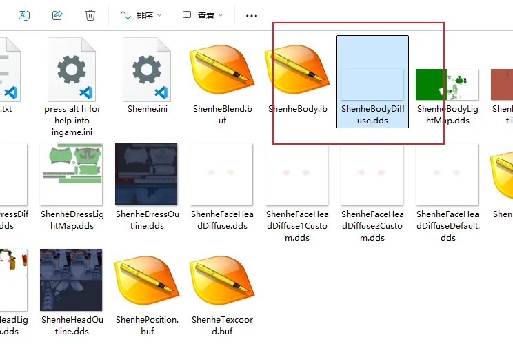

我们可以使用Paint.net来打开它：

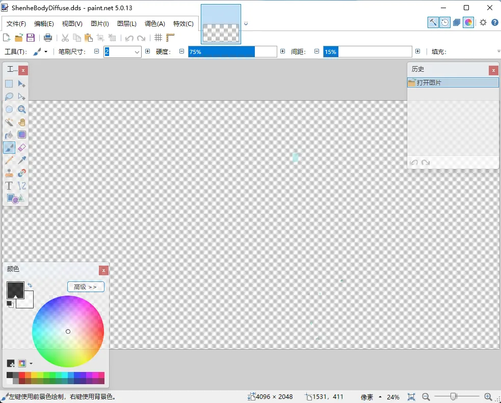

然后点击【调色】=>【透明度反转】

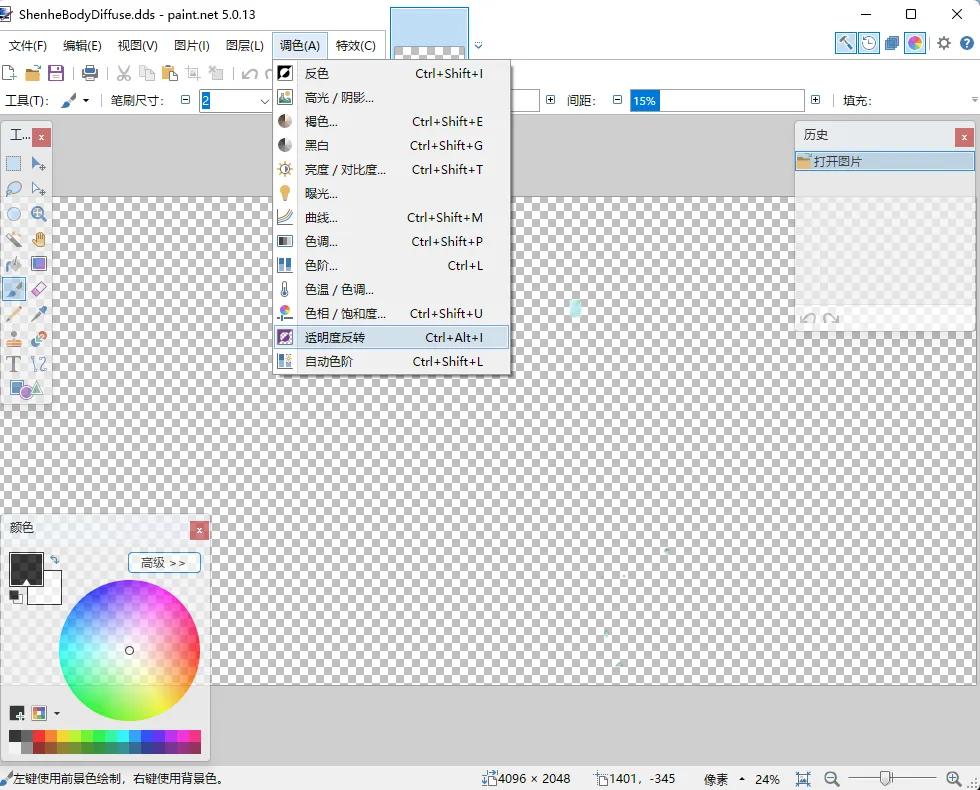

就可以看到正常的贴图了

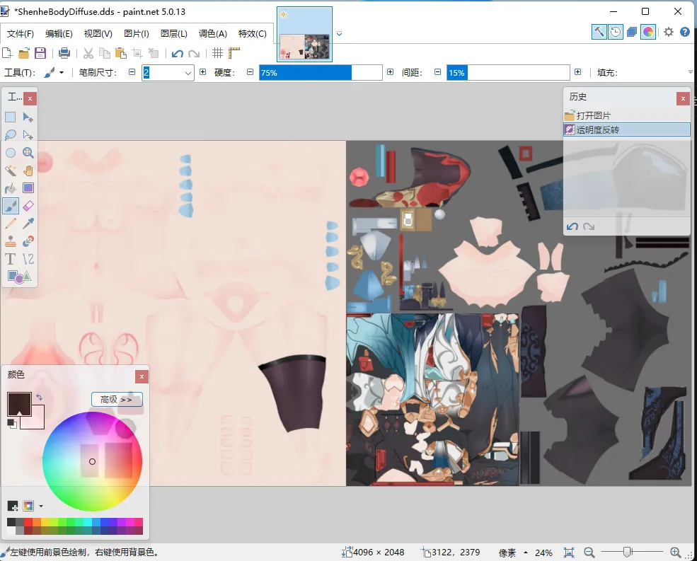

当然你也可以在Photoshop里按通道查看，省去反转的步骤：

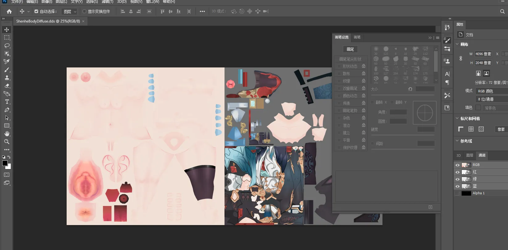

这里我们在paint.net里反转之后，就可以导出为png文件了，这样就能在Blender里上贴图了：

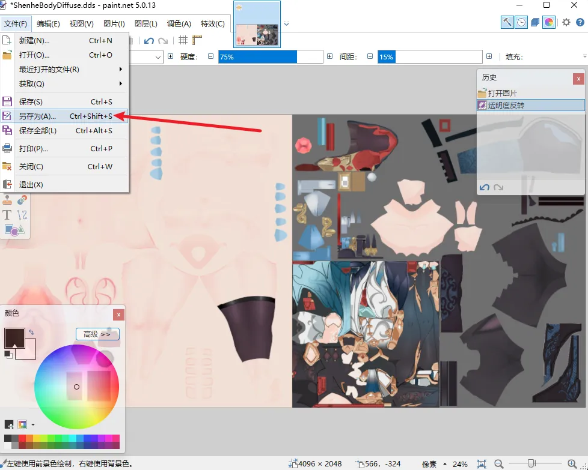

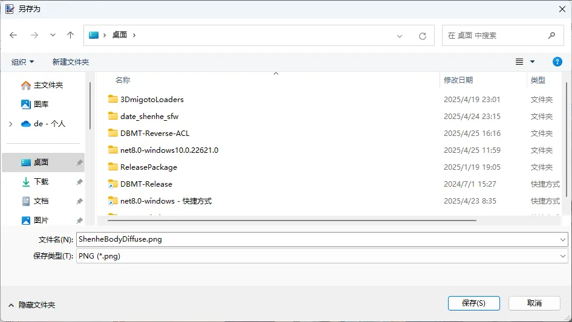

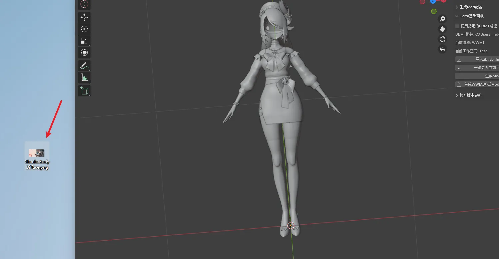

如果贴图没有Alpha通道或者不需要翻转则可以省去翻转的步骤，接下来打开Blender的Shading界面进行上贴图。

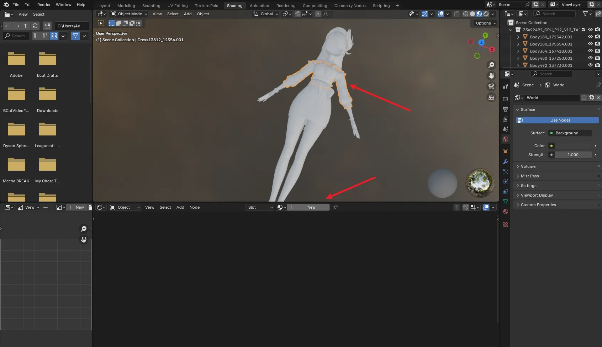

选中要上贴图的部位，点击New新建一个材质：

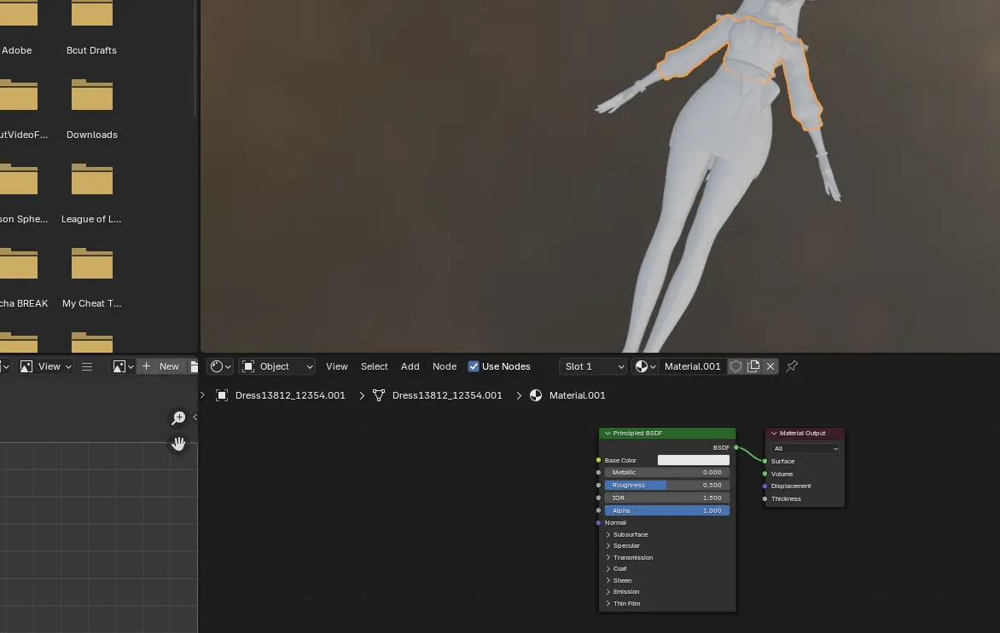

然后把贴图拖进来变成一个节点：

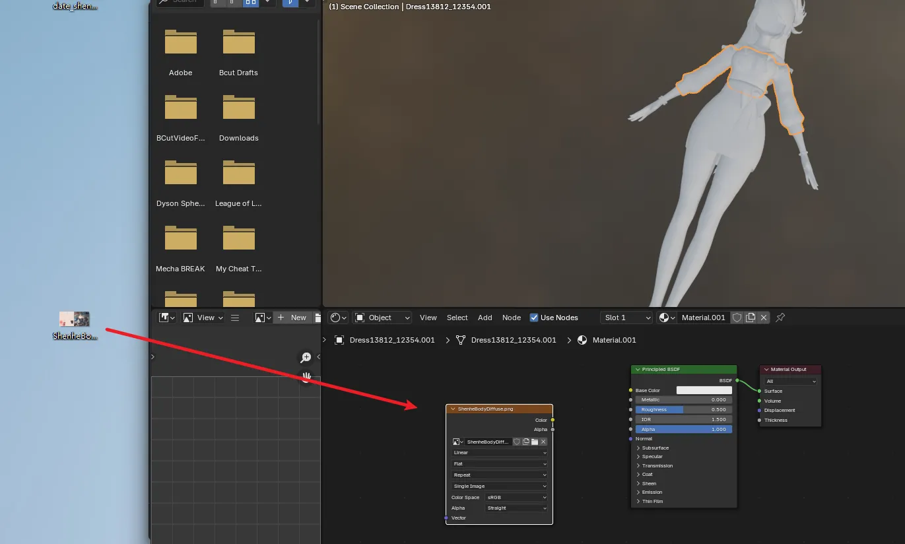

然后贴图节点的黄色Color连接到材质BSDF的Base Color输入上

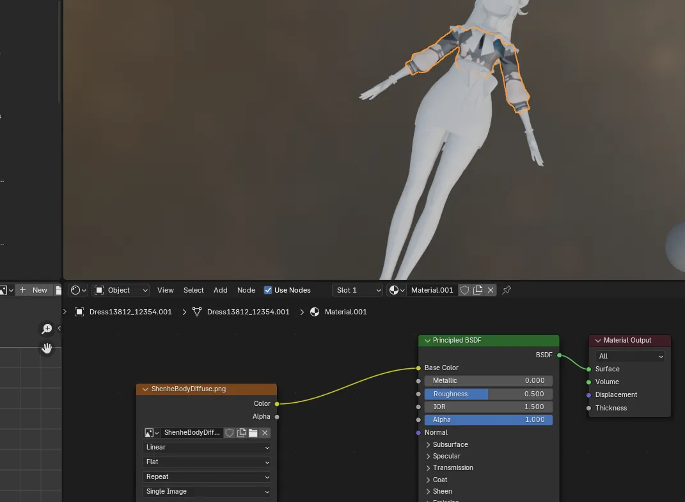

可以看到衣服的贴图就上好了，其它部位的贴图也是一样的流程。

