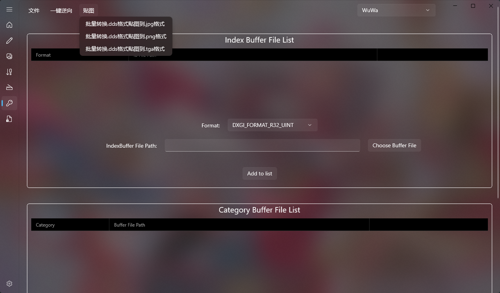
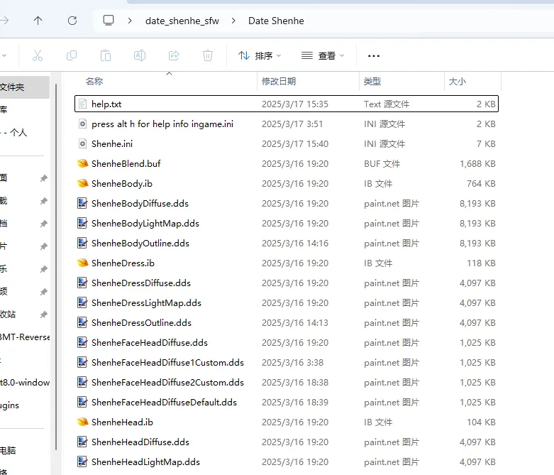
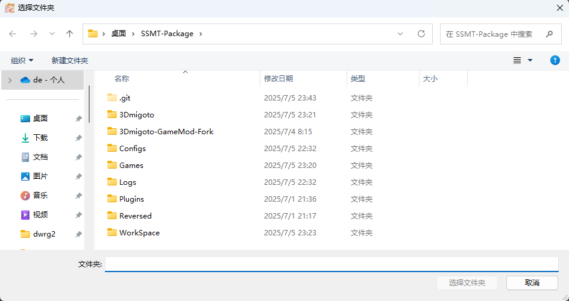
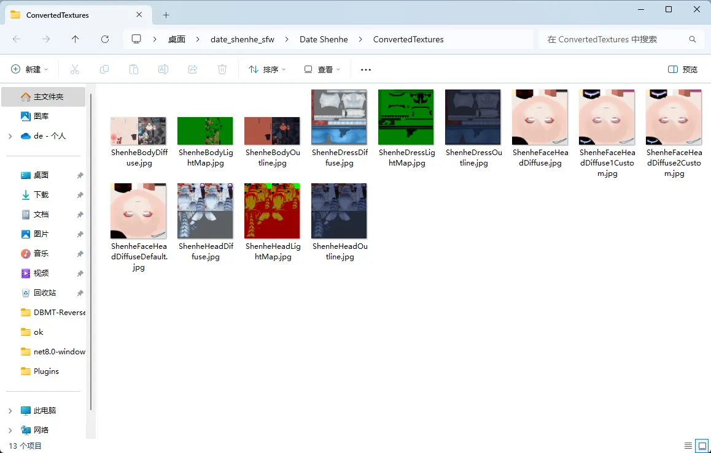
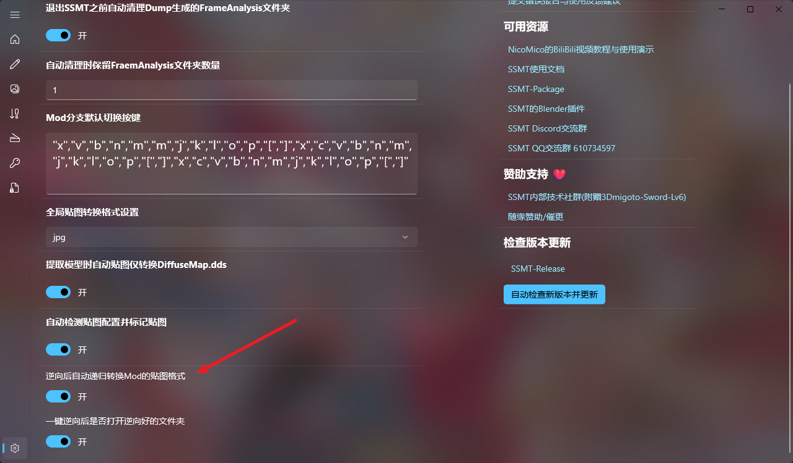

上节内容中我们演示了如何手动转换dds格式到png格式，然后在Blender里上贴图的过程，但是我们会发现贴图实在太多了，如果都要一个一个转换，操作起来会很麻烦。

此时可以使用我们的【贴图】菜单中的批量格式转换功能：

目前内置了三个选项，分别是转换为.jpg .png .tga格式，按照你的喜好去选择即可，下面以批量转换.jpg格式举例，点击后弹出一个文件夹选择框，此时需要我们去选择要批量转换的贴图文件所在的文件夹，以当前的Mod为例：

点击【选择文件夹】后，会自动开始转换，转换完成后会弹出转换后的贴图文件夹：

转换后的贴图文件夹里就包含了目标格式的贴图文件，就可以直接使用了，相比于手动转换更加快捷方便，注意这里转换出来的贴图文件夹的位置默认是你选择的文件夹下面的ConvertedTextures文件夹。

另外，要注意这个转换是递归目标文件夹下所有的贴图文件进行转换，也就是不管藏的有多深，不管嵌套了几层，都会把这个文件夹下面的贴图以及子文件夹下面的所有递归嵌套的文件夹下面的dds格式文件都转换为目标文件，可以说是方便的很。

当然，有兄弟这时候就要问了，这么每次都执行一次批量转换岂不是很麻烦，都要去手动点一下嘛？
那当然我们有自动化的选项，点开设置页面，可以看到如下选项：

只要你勾选了【一键逆向Mod的ini文件后，是否自动递归转换ini所在文件夹及其所有子文件夹的dds格式贴图到目标格式】，那么就会按照你这里选择的【逆向Mod后自动贴图转换格式】里指定的格式，在你逆向ini完成后自动帮你转换所有的贴图，能够节省一次手动点击的操作时间。
