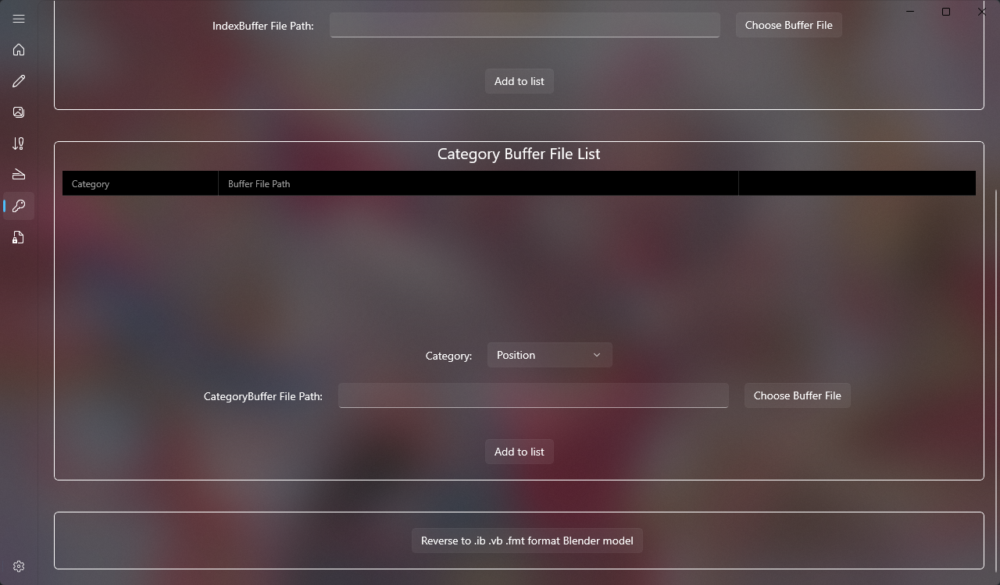
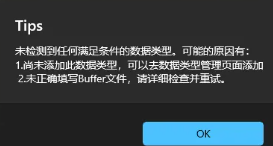
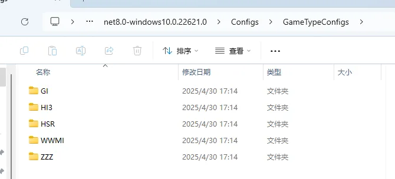
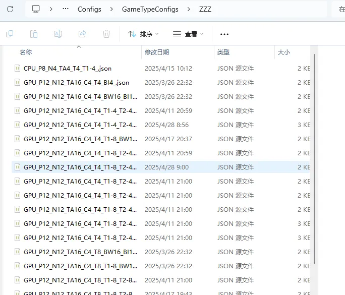

手动逆向功能是最强大的Mod逆向功能，没有之一。

使用手动逆向功能，可以在全自动逆向被特殊ini写法导致失效时，仍然能够进行Mod逆向，并且其上限只取决于用户的操作，不会受到一键逆向的上限影响。

手动逆向要填入Index Buffer File List和 Category buffer File List，全程拖拽，操作简单方便。
且支持在没有对应数据类型的情况下，自己手动添加数据类型。

由于使用过程是简单拖拽的，这里我录制了完整的视频教程，相比于文档演示和学习起来更方便：

https://www.bilibili.com/video/BV1rGR6YbEkf/?spm_id_from=333.1387.upload.video_card.click

手动逆向的缺点就是没有办法自动拆分模型，如果mod是由多个drawindexed构成的则逆向出的模型仍然是一个整体，需要手动进行拆分，此时我们可以使用Herta插件中的Split By DrawIndexed功能进行拆分

具体步骤可查看此教程：

https://www.bilibili.com/video/BV1akjLzoEoo/?spm_id_from=333.1387.upload.video_card.click

如果手动逆向功能没有找到对应的数据类型，则会弹出如下提示：

此时可以把Mod文件发我联系我添加数据类型，也可以在DBMT的数据类型管理页面中自行添加数据类型，并把添加好的数据类型json文件放到Sword对应的数据类型配置文件夹下：

Configs\GameTypeConfigs\对应游戏\

例如ZZZ：

DBMT的数据类型添加可以看这期教程：

https://www.bilibili.com/video/BV1YoZ8YbEpA/?spm_id_from=333.1387.upload.video_card.click

总之，灵活应用手动逆向功能可以解决你遇到的很多Mod无法一键逆向的问题。

比如带有面板可调整的形态键Mod或者使用Slider Impact制作的多切换形态键Mod等等。

