# V1.0.6.3

- 新增WuWa选项。
- 从此版本开始，将只发送3Dmigoto-Sword-Lv5.vmp.exe，放到SSMT-Package的Plugins目录下，即可在SSMT中解锁Mod逆向页面，不再提供单独的3Dmigoto-Sword-Lv6程序。

新的安装方法看这个链接：

https://starbobis.github.io/SSMT-Documents/Tutorials/Plugins/SSMT-Reverse/(2)%E5%AE%89%E8%A3%85%E6%8F%92%E4%BB%B6/(2)%E5%AE%89%E8%A3%85%E6%8F%92%E4%BB%B6.html

# V1.0.6.2-3

- 修复了无法作为SSMT插件使用的BUG，现在可以把3Dmigoto-Sword-Lv5.vmp.exe放到SSMT的SSMT-Package的Plugins目录里，在SSMT最新版中解锁Mod逆向页面了，其用法和Sword-Lv6相同。

# V1.0.6.2-2

- 添加了ZZZ的Trigger的武器的XXMI CategoryExpansion混淆数据类型，现在可以正常逆向出来正确UV的模型了。

# V1.0.6.2
- 重要更新：现在【一键逆向Mod的ini】和【一键逆向DrawIndexed分支Mod的ini】以及【一键逆向Toggle按键切换Mod的ini】均支持全自动解析和破解使用了反Mod逆向之IB膨胀混淆技术的Mod。

# V1.0.6.1

- 重要更新：手动逆向增强，现在可以自动识别出反Mod逆向之IB膨胀技术，并且自动把使用了IB膨胀技术的IndexBuffer文件进行反膨胀处理，确保逆向结果准确。（解决了使用IB膨胀技术的Mod，手动逆向后无法导入到Blender的问题。）（牢记我们工具中最强的技术是手动逆向，如果遇到一键逆向无法处理IB膨胀技术的Mod，则可以使用手动逆向来进行处理，案例Mod ZZZ：FemmySeth）

# V1.0.6.0
- 修复了逆向出的适用于WWMI的数据类型的COLOR的数据类型错误的问题，现已设置为WWMI-Tools所需的R16G16_UNORM。
- 新增一个WWMI的数据类型，现在能逆向所有已知类型的WWMI Mod了。

# V1.0.5.9

- 因为Sword-Lv6依然部分依赖于Sword-Lv5插件，所以无法在中文路径下正常工作，所以添加了程序启动时自动检测是否位于中文路径，如果是则弹出对话框进行提示。
- 现在逆向出来生成的FMT文件中不再含有过时的FlipNormal设计，移除了flip_normal字段。（需要配合SSMT Blender Plugin V1.5.9 或以上版本使用）
- 现在逆向出来生成的FMT文件中新增FlipFaceOrientation设计，用于控制导入Blender时是否翻转面朝向，其它游戏默认为False，只有WWMI为True，解决了WWMI逆向出来的Mod导入到Blender后面朝向不正确的问题。（需要配合SSMT Blender Plugin V1.5.9 或以上版本使用）
- 现在逆向全自动解析新增了对CustomShaderTransparency中的DrawIndexed解析，以后遇到这种不再需要手动复制粘贴过去了。
- 逆向普通单个Mod的ini中的Blend校验进行了升级，输出的文件名后追加_和Resource资源排列索引，在Texcoord和Blend槽位的长度相同时会自动进行校验，即使校验失败也能够正确的逆向出两个不同的数据类型，方便导入Blender时进行选择（而不是像旧版本一样只有一个数据类型且可能是错误的导致导入Blender后卡死，现在即使校验失败也有多个数据类型，确保总有一个是能用的，如果校验成功则只有一个，大大提高了这种特殊情况下的Mod逆向成功率）
- 现在一键逆向后的贴图转换，不会再搜索png格式贴图加入待转换目录了，一定程度上可以避免多次重复执行逆向时，已经转换出来的ConvertedTextures被再次转换，如此嵌套递归导致Mod文件夹充满被转换的冗余贴图导致空间占用越来越大的且重复执行逆向时占用时间越来越长的问题。
- 现在一键逆向后，会把dds贴图转换为对应格式放到逆向出的Reverse文件夹下了，但是要注意，如果文件夹结构出现多层嵌套的贴图如果出现名称重复则会进行覆盖，不过你仍然可以在原始Mod文件夹中找到完整的被转换后的贴图。（逆向执行时间由于额外的贴图转换步骤，会略微延长）

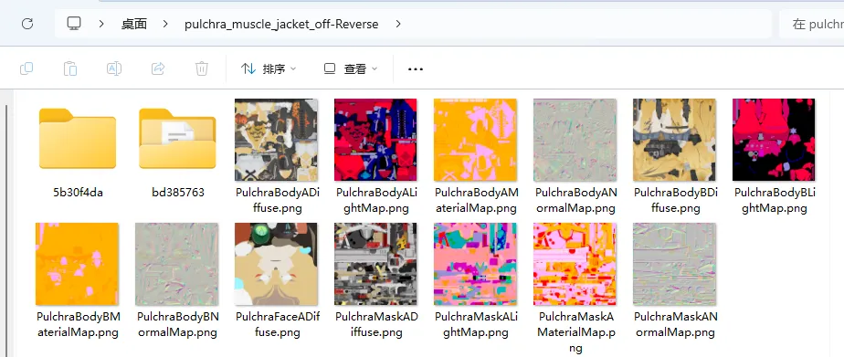

# V1.0.5.8

- 现在一键逆向出的fmt文件新增scale属性，便于控制导入到Blender时的模型比例，需要HertaV1.3.1或以上版本才能生效。（解决鸣潮Mod逆向后模型导入后体积过大，还需要手动调小问题）
- 现在一键逆向出的fmt文件新增flip_normal属性，便于控制导入到Blender时的模型法线问题。（解决鸣潮Mod逆向后模型导入后法线是相反的问题，因为手动翻转是无法得到正常法线的，需要SSMT插件V1.3.8或以上版本生效）
- 现在一键逆向出的fmt文件新增flip_winding属性，便于控制导入到Blender时的模型朝向问题。（解决鸣潮Mod逆向后模型导入后朝向和米游系列相反的问题，需要SSMT插件V1.3.8或以上版本生效）
- 现在一键逆向出的fmt文件新增flip_mirror属性，便于控制导入到Blender时的模型镜像问题。（解决鸣潮Mod逆向后模型导入后模型是镜像的问题，因为部分用户需要用来做其它事情，需要SSMT插件V1.3.8或以上版本生效）

# V1.0.5.7

- 现在一键逆向出的fmt文件新增scale属性，便于控制导入到Blender时的模型比例，需要HertaV1.3.1或以上版本才能生效。（解决模型导入后体积过大，还需要手动调小问题）
- 现在一键逆向出的fmt文件新增rotation_euler_x,rotation_euler_y,rotation_euler_z属性，便于控制导入到Blender时的模型旋转角度，需要HertaV1.3.2或以上版本才能生效。（解决模型导入后默认躺倒，还需要手动旋转扶正问题）

# V1.0.5.6-2

- 修复了鸣潮Mod逆向出来后，WWMI-Tools的数据类型的COLOR1格式错误的问题，现在逆向出的WWMI-Tools的数据类型可以使用WWMI-Tools导出后生成正常的角色轮廓线了。

# V1.0.5.6

- 修复了打开最新的日志文件时，如果不存在日志文件则错误无法被捕获的问题，不会出现闪退让人摸不到头脑的问题了。
- 一键逆向ini的三个选项都加了try-catch捕获异常，不会出现闪退让人摸不到头脑的问题了。
- 一键逆向ini前会检查3Dmigoto-Sword-Lv5插件是否存在，如果不存在则会给出提示，因为这个插件使用vmp加壳，很可能被杀软提前干掉了。
- 修复了点击一键逆向ini，然后点击取消后，此时不存在log文件会导致闪退，存在日志文件则会打开上一次运行的日志文件的BUG，此BUG曾造成理解混淆。

# V1.0.5.5

现在逆向成功后，如果你没有开启这个设置项：

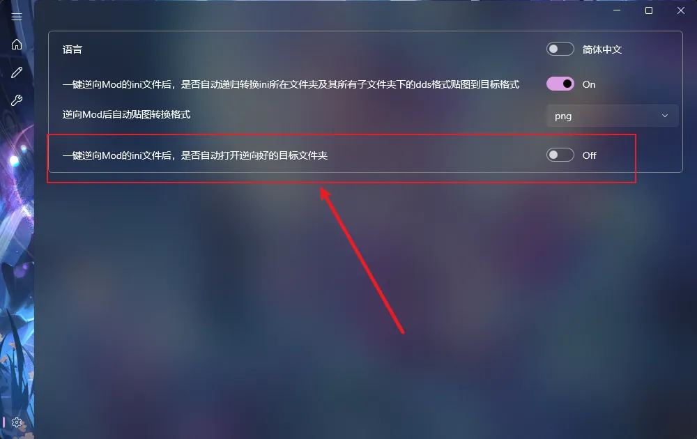

则会弹出一个提示，此功能诞生的原因是大批量Mod逆向时，会弹出超多文件夹导致桌面混乱，
而如果什么都不提示，又很容易让人心里没底，因为看不到什么时候成功，逆向需要3到5秒，可能会因为没有成功提示多等很长时间。

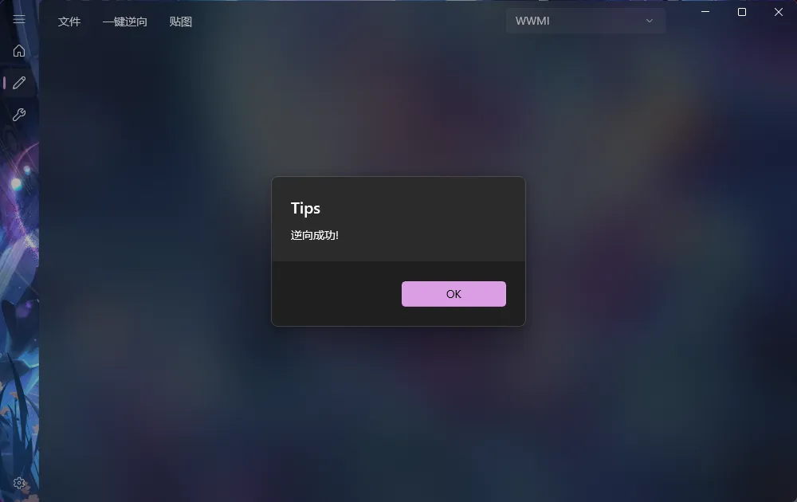

总之此版本解决了这个问题。。
另外手动逆向现在也同样适用于这个机制了。。

# V1.0.5.4

## 1.鸣潮一键逆向出来的模型文件名称变更
现在鸣潮Mod逆向出来，会自动把各个拆分的小部位的名称后面加上_IndexCount_IndexOffset
第一个数字是绘制索引数，第二个数字是索引偏移值，如下图

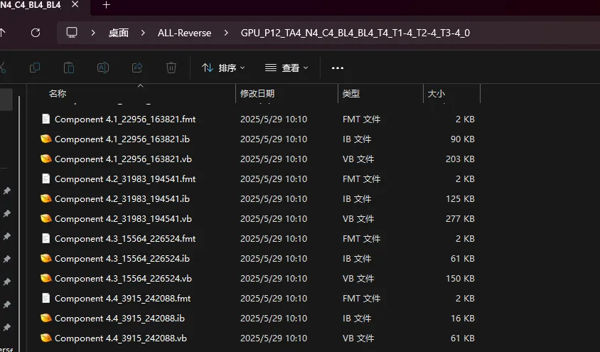

正好可以跟ini中drawindexed = 的用法的顺序对的上，这样就能直观的感受到每个部位的模型是哪一个drawindexed = 逆向出来的。
而同时，一般良好习惯的Mod作者都会有规律的重命名各个模型的名称，这就会导致Mod的ini文件里，都会给drawindexed = 添加上对应的注释，如下图：

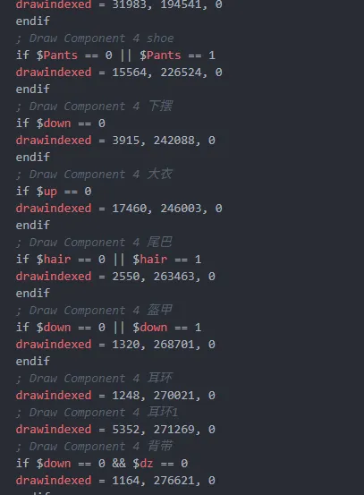

这样我们就可以对照ini，快速的根据注释知道我们逆向出来的每个部位是什么内容，在进行Mod修复时，能够更加灵活方便。

## 2.鸣潮一键逆向按钮名称变更
我们之前的按钮是这样的：

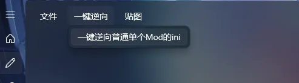

由于其它游戏都有三个逆向按钮，鸣潮只有一个会给人一种混淆的感觉，错认为这个只能逆向普通单个Mod的ini而不能逆向多个drawindexed类型的。
所以对名称进行了修改，改为如下不含有歧义的名称：

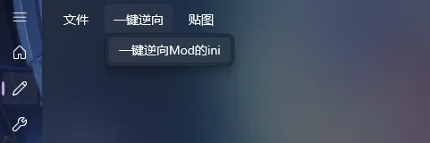

英文对应：

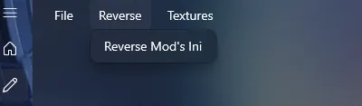

# V1.0.5.3
- 现在手动逆向之前会提示你上次手动逆向的结果是否需要删除后再进行逆向，点是则清除Reversed文件夹下所有内容并继续逆向，点否则直接进行逆向不删除历史文件。

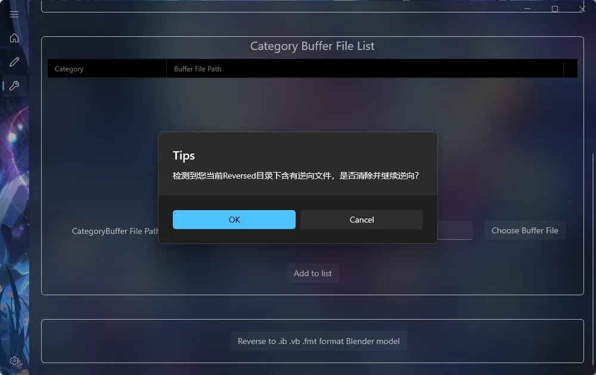

- 新增设置项【一键逆向Mod的ini文件后，是否自动打开逆向好的目标文件夹】，勾选后一键逆向Mod的ini后会自动打开Mod的文件夹，不勾选则只弹出逆向成功的提示：

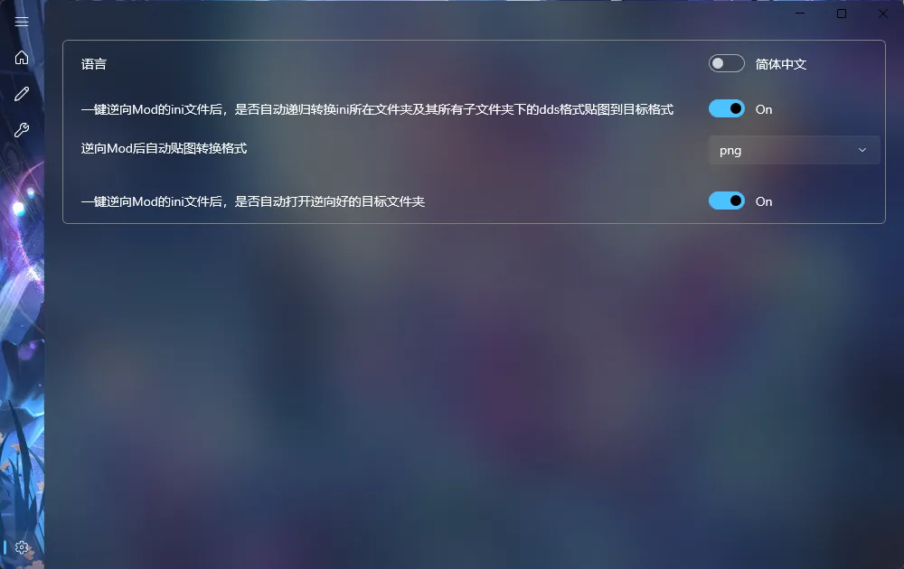

- 现在一键逆向Mod的ini失败后，会自动打开最新的日志文件方便排查错误了。

# V1.0.5.2
- 修复了BLENDINDICES校验对物体Mod总是报错的BUG。
# V1.0.5.1
- 修复了选择游戏那里可以自己填写的问题，因为并不需要自己填写，所以会导致点上去卡一下，现在改成不能填写了，点上去不会有一瞬间的卡顿感了，优化使用体验。
- 优化了手动Mod逆向页面的拖拽流程，现在直接拖拽到列表里就能根据当前选择的Format或Category来新往下增一行啦，用起来更加丝滑流畅。如图所示，黑色部分也可以直接拖拽文件上去：

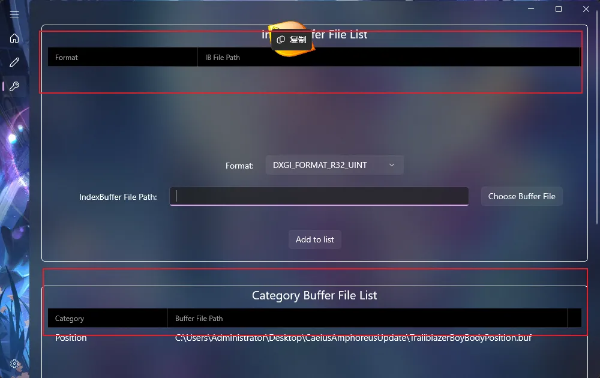

# V1.0.5.0
- 设置页面新增是否在逆向Mod的ini完成后自动转换贴图格式的勾选项配置，勾选后即可节省手动转换贴图的步骤，但是会延长执行速度。
- 设置页面新增逆向完ini后自动转换贴图的格式。
# V1.0.4.9
- 更新了背景图。
- 优化了WWMI一键逆向Mod时的数据类型识别算法。
- 修复了WWMI一键逆向只能识别出一种数据类型的BUG，现在会把识别到的所有可能的数据类型都逆向出来，优先GPU数据类型（也就是说现在支持逆向出WWMI-Tools使用的把Texcoord1当Color1的那个数据类型了，导入Blender即可直接用于WWMI-Tools的Mod制作）。

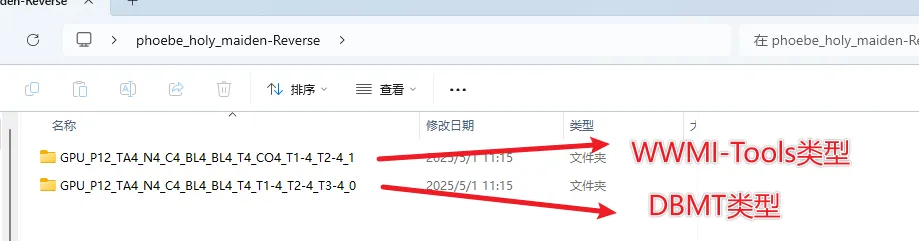

# V1.0.4.8
- 更新了全新的GUI。
- 修复了切换到WWMI后再切换到其它游戏时，无法显示另外两个逆向按钮的BUG。
- Mod手动逆向从DBMT中迁移过来了。
# V1.0.4.7
- 算法优化：添加了部分数据类型的BLENDINDICES校验，减少导入Blender中卡死的几率。(修复了 ZZZ的大猫猫的Mod使用一键逆向DrawIndexed逆向出来，同个数据类型存在两个文件夹，此时其中一个错误的中的模型导入Blender会导致Blender卡死的问题)。
# V1.0.4.6
- 切换到WWMI游戏时，现在只会显示一键逆向普通单个Mod的ini了，因为对于WWMI来说另外两个按钮是无效的。
- 添加了贴图批量转换功能，目前可以转换为常用的.jpg .png 或 .tga格式。
# V1.0.4.5
- 添加了对DrawIndexed = Skip的解析。
# V1.0.4.4
- 更新了崩铁3.2版本之后格式Mod的逆向支持。
# V1.0.4.3
- 添加了图标
- 修复了点击逆向选择ini文件后如果啥都不选会错误弹出无意义提示的BUG。
# V1.0.4.2-2
- 更新了文档链接的地址，现在3Dmigoto-Sword-Lv5有了独立的文档链接了。
# V1.0.4.2
- 3Dmigoto-Sword-Lv5有了单独的GUI界面，现已作为独立工具发布。
# V1.0.4.1-2
- 修复了在DBMTV1.1.6.5版本开始无法使用逆向插件的BUG。
- 移除了从Dump文件中逆向提取的功能，因为太少用了，而且最近的Mod越来越复杂，几乎无法从游戏里dump到正确的Buffer内容，所以后面还得靠一键逆向ini。
# V1.0.4.1
- 此版本修复了由于旧的PatchBLENDWEIGHTS处理不当导致的BUG，该BUG会导致Blend槽位中仅存在BLENDINDICES时逆向出来的fmt文件描述错误，现已移除弃用的PatchBLENDWEIGHTS机制，请更新到最新版Catter以支持此特性。（说人话：修复了绝区零扳机武器Mod无法逆向的BUG，但是需要更新Catter到最新版才能支持导入到Blender。）

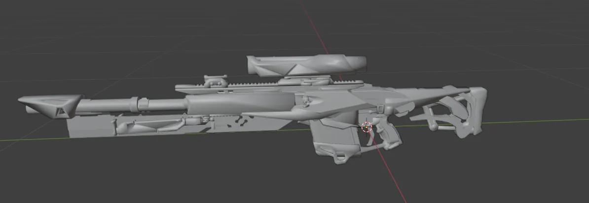

# V1.0.4.0
- 此版本主要更新了一个鸣潮的数据类型，用于兼容WWMI-Tools中含有COLOR1的数据类型（在DBMT正确的数据类型中，WWMI-Tools对应的COLOR1是DBMT的TEXCOORD1）以解决逆向出的模型在使用WWMI-Tools导出时缺失COLOR1，以及生成Mod后轮廓线丢失的问题。
