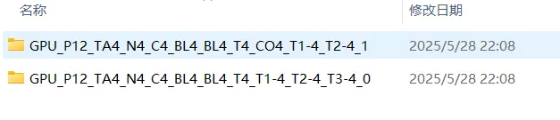
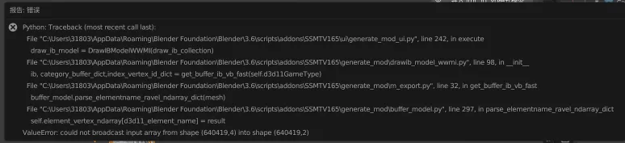

其中第一个带有CO4的是给WWMITools用的
下面第二个是带有额外TEXCOORD3的是给SSMT用的

因为WWMI-Tools会把正确的TEXCOORD1放到错误的COLOR1里，所以WWMI-Tools的数据类型少了一个TEXCOORD，多了一个COLOR，DBMT正相反。

如果使用SSMT制作Mod，则用的逆向的类型和提取的类型都必须是SSMT的类型，否则如果你逆向出来的类型是SSMT的类型，但是提取的原模型是WWMI的类型，则会报错如下：

# 新版本已解决此问题

在V1.0.6.3版本开始，如果选择游戏为WuWa，则逆向出来的数据类型都是给SSMT用的

如果选择的是WWMI，则逆向出来的数据类型都是给WWMI-Tools用的
