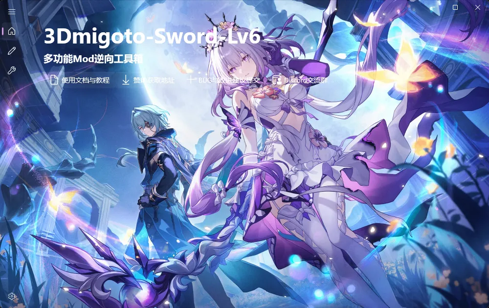
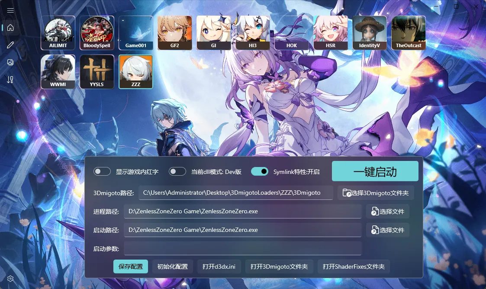
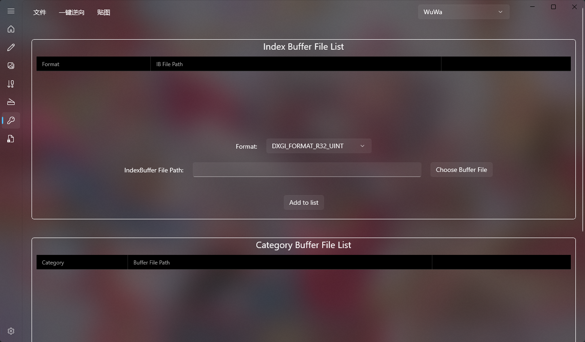

# 为什么工具界面和BiliBili视频里的不一样？
因为工具一直在更新新版本，目前逆向工具和Mod制作工具已经拆开了。

3Dmigoto-Sword-Lv6是专门负责Mod逆向还原为模型的，长这样：

制作Mod用的是SSMT，长这样：

新版本工具，经过不断的技术积累和细节打磨，功能上一定是强于旧版本的，只是界面发生了变更，实际上用法相差不大，不用担心。

目前最新版是作为SSMT的插件使用：

# MMT、DBMT、SSMT、3Dmigoto-Sword各版本有什么区别
DBMT是加强版的MMT

SSMT是加强版的DBMT

MMT => DBMT => SSMT本质上是同一个工具的不同版本号，就像安卓系统不同版本称呼不同一样，每当称呼发生了变化，那说明整体功能一定得到了划时代的增强。

3Dmigoto-Sword系列，从Lv1发展到至今的Lv6，一直是专注于Mod逆向还原为模型的工具。

# 我想把Mod中逆向出来的模型重新生成为Mod怎么做？

使用SSMT和SSMT的Blender插件来进行Mod制作，是最方便的。

其次也可以使用老外的工具，例如gui_collect和XXMI-Tools,WWMI-Tools。

Mod逆向只是拿到了模型，拿到了模型剩下的你想干嘛都不是你说了算嘛，要区分这个概念，拿到了模型剩下的步骤就和Mod逆向无关了，要生成Mod就是Mod制作的部分。

实际上，逆向工具只是为了获取Mod中包含的模型，获取到模型之后，剩余的流程就和3Dmigoto-Sword-Lv6的关系不大了，主要是Mod制作流程。

那么如何把模型制作为Mod呢？

对于米家游戏来说，可以使用gui_collect或GIMI，SRMI，HIMI，ZZMI等仓库的模型收集脚本来提取模型，然后用XXMI-Tools导入模型后生成Mod，也可以使用SSMT提取模型，然后用SSMT的Blender插件生成Mod。

对于鸣潮来说，可以用WWMI-Tools来制作Mod，也可以用SSMT来制作Mod。

对于工具的选择我的推荐是哪个好用用哪个，没必要绑定死在一个工具上，因为开发者不同所以每个工具都有其特色和优缺点。

在鸣潮Mod制作方面WWMI-Tools的优势更大，次选SSMT流程。

在米家游戏制作上面SSMT流程做的也不错，和老外的工具各有优劣。

当然最好是全部都能掌握，早日成为Mod大师，加油。

SSMT下载地址：

https://github.com/StarBobis/SSMT

XXMITools插件下载地址（老外的米家游戏生成Mod工具）：

https://github.com/leotorrez/XXMITools

gui_collect（老外的米家游戏模型提取工具）：

https://github.com/Petrascyll/gui_collect

WWMI-Tools（老外的鸣潮模型提取和Mod生成工具）：

https://github.com/SpectrumQT/WWMI-Tools

# 为什么最强的功能是手动逆向？我觉得一键逆向更方便
因为部分Mod加了复杂的ini写法和混淆机制，一键逆向并不能保证所有稀奇古怪的格式都能解析出来

尽管长达2.5年的更新期间已经完善了大多数Mod格式以及混淆格式ini的解析，但是Mod格式这个东西本身就是日新月异的

一键逆向只能解决99%的Mod逆向问题，剩下的1%就得用我们的手动逆向功能了。

目前一键逆向仍在持续更新中，结合手动逆向可解决所有Mod逆向问题。

# Mod逆向还原为模型后，导入Blender时只能手动上贴图吗？

是的，只能手动上贴图，目前会把贴图文件转换为设置中的目标格式，方便你拖拽上贴图。

不是不想加自动上贴图，而是仅凭Mod的ini文件中的Hash值，是无法分辨出哪个贴图是DiffuseMap的，所以几乎不可能做到完全的自动上贴图，不如手动上，更加精准。

# 逆向出来的模型如何绑定骨骼

GI的逆向配合骨骼用起来更方便哦，每个游戏都可以配合游戏原生骨骼

实现逆向出来模型后一键绑骨的操作，因为逆向出的模型是有顶点组的，做到了轻松使用其它人的Mod中的模型进行二次创作：

https://github.com/zeroruka/GI-Bones （部分旧版本骨骼地址）

案例演示：

https://www.bilibili.com/video/BV1oi421h7mz/?spm_id_from=333.999.0.0

https://www.bilibili.com/video/BV1St5VzrE16/?spm_id_from=333.1387.homepage.video_card.click

当然你也可以自己创建骨骼，SSMT的Blender插件有个方便的功能可以初始化骨骼：

# 机器码锁了之后是不是只要不换主板就没事
是

# 老版本激活逆向插件 新版本是不是还得激活啊
不需要，新版本都附带旧的激活，从旧版本更新到新版本只需要下载最新版即可

