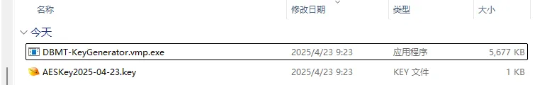

# 激活方式
SSMT 的所有插件都需要激活后才能够使用。

赞助后可进入内部更新群，获取到密钥生成器：

`DBMT-KeyGenerator.vmp.exe`

运行后会立刻在同目录生成一个 `AESKeyYYYY-MM-DD.key` 文件，像这样：

随后你把这个 `.key` 文件发给我，我就可以把激活后的工具发给你了。

# 注意事项：
- 由于使用 VMP 加壳，密钥生成器可能会被误报，可以关闭杀软管家运行，生成密钥结束后再开启杀软管家等。
- 请把密钥生成器放到纯英文路径，中文路径可能导致无法正常生成密钥文件。

