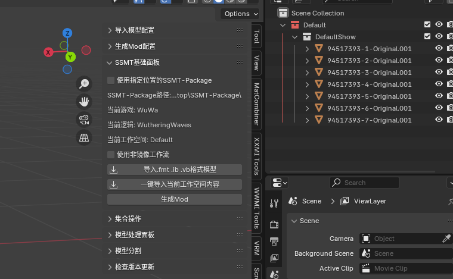
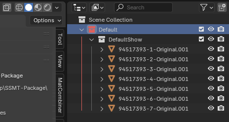
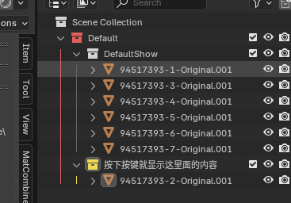
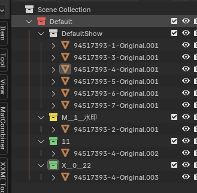
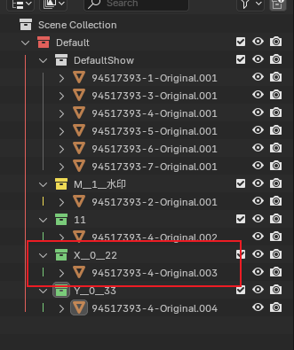

# 一键导入

新版本SSMT插件在【一键导入当前工作空间内容】后如下图

修改后可以直接生成Mod，但是部分用户存在分支Mod需求，可以看下面的内容来自行添加分支架构。

可以看到，我们导入之后，就只有一个工作空间集合，然后下面就直接存放模型了。

默认导入之后会自动创建一个白色的组集合，用于把导入的模型默认分组到【默认显示】的组里。

因为在Mod制作的过程中，非常频繁的需要创建一个用于【默认显示】的组集合，所以把这个功能设为默认的了。

关于导入的模型的名称，这里就要引入新的概念：【模型命名规则】

# 模型命名规则

目前导入的模型都是以DrawIB - Component Count - Alias 这个结构来命名的

这里的DrawIB就是你在工作台里填写的DrawIB，Component Count是一个数字，代表它属于哪个Component，从1开始逐渐增加。

Alias就是你的DrawIB的别名。

注意：你的模型的命名必须遵循这个规则，才正常生成Mod，否则在生成Mod时会导致报错。

# 分支架构
简要叙述：
| 层级 | 集合颜色 | 名称 | 简要用途 |
|--|--|--|--|
|最外层| **红色** | 工作空间集合| 界定 Mod 内容 |
|任意嵌套| 白色 | 组集合 | 仅分组 |
|任意嵌套| **黄色** | 按键开关集合 | 顾名思义 |
|任意嵌套| **绿色** | 按键切换集合 | 顾名思义|

## 【工作空间集合】

一键导入后，这个红色的集合，就是工作空间集合。

我们在生成Mod时，必须选中这个红色的集合才能正常生成Mod。

## 【组集合】
- 白色的集合称之为【组集合】它就是个分组的概念。

- 组集合的用处是给模型分组，它本身不会具有按键开关或者按键切换的特性，它只要出现，它下面的模型就是默认生效的。

例如一键导入后，默认被分到了DefaultShow的组里，意思是分到默认显示的组里。

- 组集合里面的内容会默认显示，所以你可以把身体模型拆分分为多个部位方便制作，即使即使它们是分开的，它们也会在游戏中一起被渲染，也就是我们的分组概念起到了效果，只要放在一个组集合下面的东西都属于这个组。

- 任意集合同时都具有组集合的作用，所以工作空间集合本身也是一个组集合
- 其它颜色的集合，只要不是工作空间集合的红色，按键开关集合的黄色，按键切换集合的绿色，都算作组集合，因为那些集合不具备特殊功能的话，就算作组集合。

## 【按键开关集合】

在任意【组集合】下面创建一个集合，并且标记为黄色，此黄色集合就是一个【按键开关集合】。
如下图：

此时黄色集合下面的所有内容，会处于一个按键开关的控制下，按键开关只有开启或关闭的状态，会默认分配一个按键去控制。

支持嵌套特性，如下图：

含义：只有当【饰品开关】生效时，下面的所有内容才会在游戏中被显示，
下面的【首饰组】是一个组，所以默认生效，下面的【项链开关】是一个按键开关集合，可通过按键开关控制。

# 按键开关集合命名规则

在新版集合架构中，我们可以直接在集合名称中进行命名，来控制这个集合所使用的按键切换具体的键，以及初始化设置的默认值了。

旧版则必须依赖于SSMT里设置的按键的值，非常的不方便，在新版通过这个命名就能很方便的设置，符合所见即所得特性。

具体的命名规则如下：

按键 __ 初始值 __ 集合的名称

这里的按键，指的就是你要指定什么按键作为按下去之后触发切换的键，这里的【按键】的内容会直接写到ini中key生成部分的key = 

所以要满足3Dmigoto的按键条件，如果不知道该怎么写的，建议去查看3Dmigoto源码来了解所有的按键组合和按键可以填写的值

初始值就不用多解释了吧，默认是0，如果你给按键开关集合的初始值设为1，则它就是默认显示的，因为我们默认的初始值是0，所以是默认不显示这个开关集合的。

所以如果你有特殊的需求，比如有一个模型水印，你想让这个水印默认显示，然后必须按某个键来关闭，就可以创建一个按键开关集合，并将初始值设为1来实现

如下图：

此时模型水印就是默认显示的，用户按下M键即可关闭，这样不管别人怎么合购搬运倒卖模型，你都能让拿到Mod的人第一时间知道是谁做的Mod。

当然用法不止这一种，只是作为案例来说明，你只需要知道我们可以通过指定【按键开关集合】的名称来实现自定义按键和初始值就行了。

## 【按键切换集合】
任意集合下面只要存在多个绿色集合，那么它们之间互为切换。

案例1：

此时会默认分配一个按键用来控制这个白色的组集合下面的体型1和体型2两个按键切换类型集合的切换。

同样支持嵌套，案例如下：

此时当按键切换来到【身体 体型2】时：

- 【体型2 默认】是一个组集合所以默认会生效
- 【体型2的特殊物品】是一个按键开关集合，所以会分配一个按键开关
- 【身体 体型2 分支1】和【身体 体型2 分支2】是一个按键切换，所以会分配一个按键用于在这两个之间切换。

# 按键切换集合命名规则

按键切换集合的命名，和我们的按键开关集合还不一样。

我们都知道，按键切换集合位于哪个集合下面时，如果只有一个，会被当成白色的组集合，如果有多个，则会生成一个按键，让这些集合互为按键切换。

此时，如果我们在某个集合下有两个或两个以上的按键切换集合，就会生成一个按键，但是我们要靠命名来指定键和初始值，该设置到其中哪一个上面呢？

答案是从上往下第一个符合按键切换集合命名规则的，和按键开关集合的命名规则一样：

按键 __ 初始值 __ 集合的名称

例如，如下图虽然这个符合名称的集合出现在第二个，但是仍然能被识别到：

例如，如下图，虽然两个按键切换集合都符合命名规则，但是按照从上往下第一个的顺序，只有第一个集合的名称会被识别用作ini生成的内容：

# 命名规则总结

如果不使用集合命名规则，即不加入__的话，那么就默认使用SSMT设置中分配的按键。

# 灵活运用三种集合实现复杂效果
- 三种集合都支持任意层级嵌套。
- 嵌套特性支持层数为Blender的最大层数，一般做Mod不会有特别多层嵌套，不然用户用的时候也很难理解用法，所以是足够用的，尽量不要做太多嵌套否则不仅制作起来眼花缭乱，Mod用户也很难理解。
- 通过灵活运用【组集合】【按键开关集合】【按键切换集合】的嵌套集合架构，可以实现非常灵活的分支Mod制作（可以说是目前市面上所有工具中，一种比较灵活、简单、直观的 按键切换架构）。
- 唯一的缺点是暂时不支持任意两个层级下物体的OR逻辑，要么分在两个按键切换集合中实现OR，要么生成Mod后简单的手改一下ini，但是并不影响制作，如果要实现A出现时B不能出现，则必须手改ini。

# 工作空间集合架构
在生成Mod时，我们需要选中一键导入时导入的工作空间架构，如下：

1.因为当前工作空间是123

2.所以选中工作空间名称为123的集合（后面的.001会在多次导入时出现自动拼接的后缀，如果不懂多用用Blender就知道了，同名称模型在多次导入时会自动追加递增的数字后缀）

3.生成Mod

# 集合操作面板与集合右键菜单

集合操作面板：

集合右键菜单：

## 标记集合为【按键开关集合】或【按键切换集合】

选中一个集合，在该集合上右键或者在【集合操作面板】上，可以点【分支：标记为按键开关类型】来把集合标记为【按键开关集合】，可以点【分支：标记为按键切换类型】来吧集合标记为【按键切换集合】

这两种集合本质上是颜色的不同，所以这俩按钮做的事情也只是标记了集合的颜色，如果不嫌麻烦，右键手动标记选颜色也是一样的：

## 通过链接功能实现模型复用节省Mod顶点数

如果要让【小饰品】在【首饰组】中复用，如果复制一份过去就会浪费Mod宝贵的顶点数，后面修改也需要手动同步，很麻烦

所以我们可以先选中任意多个物体，再最后选中目标集合，点击集合右键或者在【集合操作】面板上点击【链接：链接物体到集合】功能：

此时你选中任意一个【小饰品】，进行修改或者隐藏或者任意功能，其它的【小饰品】都会生效，它们本质上是一个东西，且生成Mod后会复用这个模型。

如果不想要的时候，千万不能直接删除，因为对任意【小饰品】的删除操作，都会影响所有【小饰品】，所以这时候我们可以先选中物体，再选中集合，使用 集合右键或者在【集合操作】面板上点击【链接：从集合中移除选中的链接物体】

即可安全移除链接，而不会导致所有的【小饰品】被删除。

以此方式，实现模型复用，灵活运用可以很方便的实现各种效果。

# 结语
是不是觉得这样太复杂了？其实用熟练之后是很直观的，其设计满足【所见即所得】特性。

同样，我们也可以不使用分支架构，导入后直接修改直接生成，因为80%以上的的Mod作者都用不到分支架构。

而且你也可以像这样每做完一个部分就把它隐藏起来，等到生成Mod时再取消隐藏（当然我是不建议隐藏的，如果有多个显示器一般会把这个Outliner整个放到另外一个显示器上显示，不会出现嵌套过多层级显示不下的情况）：

另外提一嘴，如果你制作的Mod顶点数特别多，每个Component 135W的索引上限已经无法满足你用集合架构制作切换的话，此时你应该去使用Mod合并脚本而不是自带的集合架构来制作切换Mod。

Mod合并脚本推荐基于namespace的Mod合并脚本的v2版本：

https://gamebanana.com/tools/15804

实际上Mod制作的过程中，大部分游戏的模型原本顶点数都在2万以下，制作超过10万顶点数的Mod在游戏中是很难看到额外效果的，因为大部分游戏就算你开到4K，也无法显示那么多细节，所以这套集合架构对于正常的Mod制作需求是足够用的。

