# 一键导入

新版本SSMT插件在【一键导入当前工作空间内容】后如下图

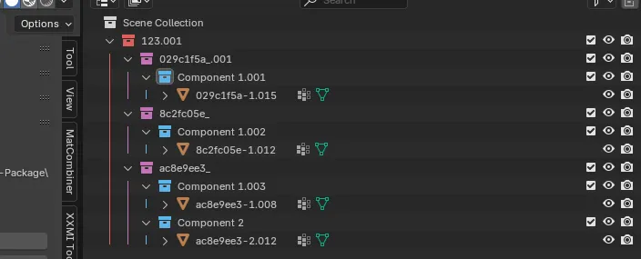

修改后可以直接生成Mod，但是部分用户存在分支Mod需求，可以看下面的内容来自行添加分支架构。

# 分支架构
## 【组集合】
白色的集合称之为 组集合（你也可以叫Group集合）它就是个分组的概念。

组集合的用处是给模型分组，它本身不会具有按键开关或者按键切换的特性，它只要出现就是默认生效的。

每个Component集合中可以分出多个组出来，每个组中又可以放多个组，支持嵌套。

组里面的内容会默认显示，所以你可以把身体模型拆分分为多个部位方便制作，即使即使它们是分开的，它们也会在游戏中一起被渲染，也就是我们的分组概念起到了效果，只要放在一个组集合下面的东西都属于这个组。

## 【按键开关集合】

在任意【组集合】下面创建一个集合，并且标记为黄色，此黄色集合就是一个【按键开关集合】。
如下图：

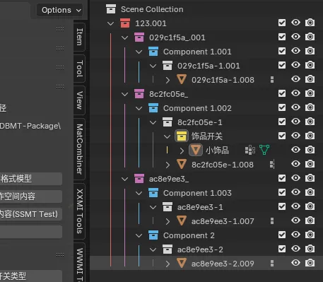

此时黄色集合下面的所有内容，会处于一个按键开关的控制下，按键开关只有开启或关闭的状态，会默认分配一个按键去控制。

支持嵌套特性，如下图：

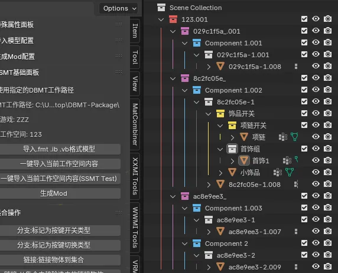

含义：只有当【饰品开关】生效时，下面的所有内容才会在游戏中被显示，
下面的【首饰组】是一个组，所以默认生效，下面的【项链开关】是一个按键开关集合，可通过按键开关控制。

## 【按键切换集合】
任意集合下面只要存在多个绿色集合，那么它们之间互为切换。

案例1：

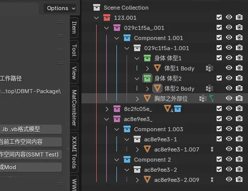

此时会默认分配一个按键用来控制这个白色的组集合下面的体型1和体型2两个按键切换类型集合的切换。

同样支持嵌套，案例如下：

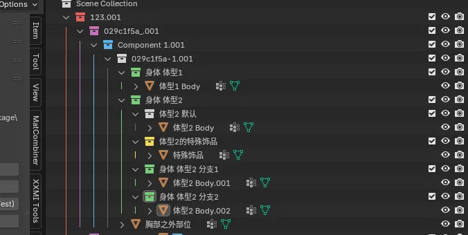

此时当按键切换来到【身体 体型2】时：

- 【体型2 默认】是一个组集合所以默认会生效
- 【体型2的特殊物品】是一个按键开关集合，所以会分配一个按键开关
- 【身体 体型2 分支1】和【身体 体型2 分支2】是一个按键切换，所以会分配一个按键用于在这两个之间切换。

# 灵活运用三种集合实现复杂效果
- 三种集合都支持任意层级嵌套。
- 嵌套特性支持层数为Blender的最大层数，一般做Mod不会有特别多层嵌套，不然用户用的时候也很难理解用法，所以是足够用的，尽量不要做太多嵌套否则不仅制作起来眼花缭乱，Mod用户也很难理解。
- 通过灵活运用【组集合】【按键开关集合】【按键切换集合】的嵌套集合架构，可以实现非常灵活的分支Mod制作（可以说是目前市面上所有工具中，一种比较灵活、简单、直观的 按键切换架构，甩其它架构几条街）。

# 工作空间集合架构
在生成Mod时，我们需要选中一键导入时导入的工作空间架构，如下：

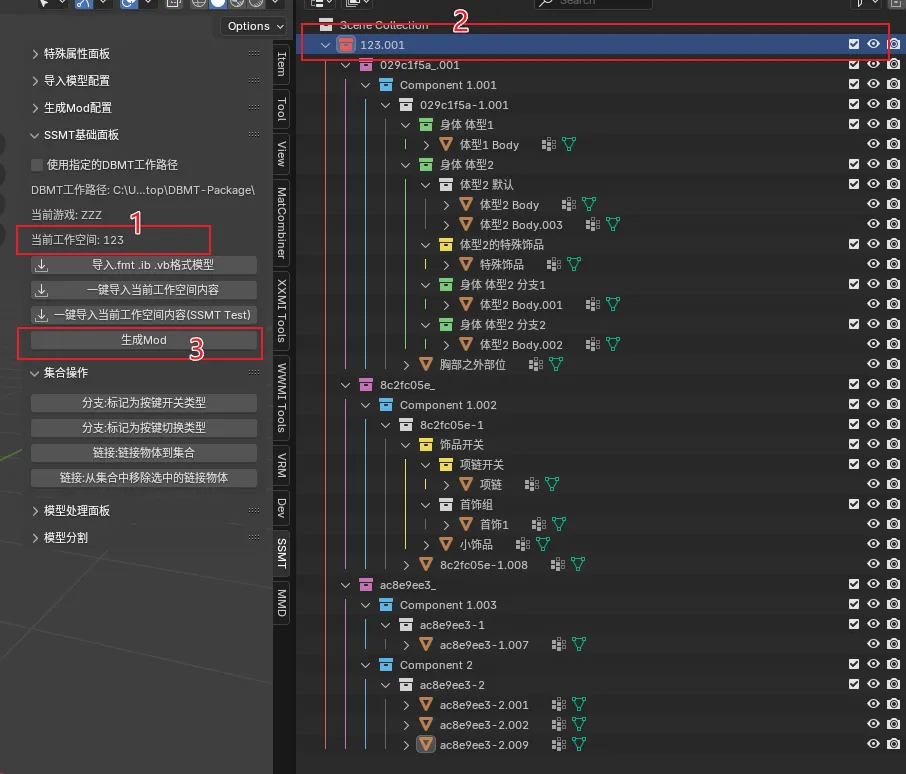

1.因为当前工作空间是123

2.所以选中工作空间名称为123的集合（后面的.001会在多次导入时出现自动拼接的后缀，如果不懂多用用Blender就知道了，同名称模型在多次导入时会自动追加递增的数字后缀）

3.生成Mod

## (1) 【工作空间集合】
工作空间集合下面的东西不能随便修改，现在我们来具体说一下：

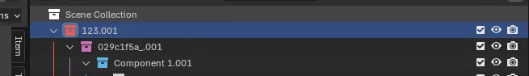

首先最外面这个红色的【123.001】叫做【工作空间集合】

它的存在就是用来导出Mod时使用的。

## (2) 【DrawIB集合】

再往下一个层级粉色的集合是【DrawIB集合】

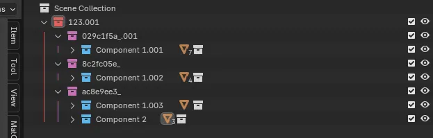

这是因为每个工作空间中，我们在提取模型的时候可以提取出多个DrawIB，所以导入进来每个工作空间会有多个DrawIB。

此集合的名称为DBMT界面中填写的DrawIB和Alias组合起来的，一般是DrawIB_Alias，中间是下划线，如果不填写Alias就是图里看到的那样一个hash值加下划线。

注意不要随便修改DrawIB集合的名称！（也许你可以在下划线后面改一下别名Alias的内容，但是一般没必要）

## (3) 【Component集合】
因为每个DrawIB对应可能有多个DrawCall，而每个DrawCall对应IB文件的match_first_index可能不同，从而实现使用不同的Shader实现不同的效果，所以我们这里分为多个【Component集合】方便模型放到指定Component下面来使用对应的Shader进行渲染。

【Component集合】的名称绝对不能修改，否则会导致生成Mod失败！

## (4) 【Component集合】下面的内容

下面的内容在文章开头的【组集合】【按键开关集合】【按键切换集合】 中已经详细说明了，在【Component集合】下面基本上就是不断嵌套灵活应用的三种分组集合，来实现多分支Mod的制作。

注意事项
- 如果没有特殊情况或者没有100%的把握，尽量不要修改【工作空间集合】【DrawIB集合】【Component集合】的名称，防止无法生成mod。
- 到了【Component集合】下面的所有子集合或者子物体的内容的名称都是可以随便修改的。

# 集合操作面板与集合右键菜单

集合操作面板：

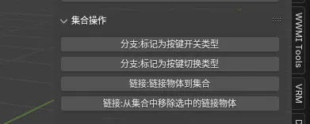

集合右键菜单：

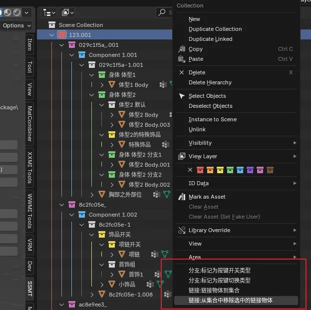

## 标记集合为【按键开关集合】或【按键切换集合】

选中一个集合，在该集合上右键或者在【集合操作面板】上，可以点【分支：标记为按键开关类型】来把集合标记为【按键开关集合】，可以点【分支：标记为按键切换类型】来吧集合标记为【按键切换集合】

这两种集合本质上是颜色的不同，所以这俩按钮做的事情也只是标记了集合的颜色，如果不嫌麻烦，右键手动标记选颜色也是一样的：

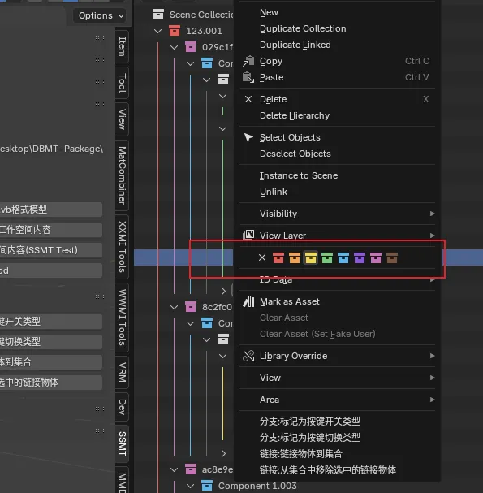

## 通过链接功能实现模型复用节省Mod顶点数

如果要让【小饰品】在【首饰组】中复用，如果复制一份过去就会浪费Mod宝贵的顶点数，后面修改也需要手动同步，很麻烦

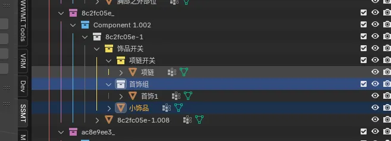

所以我们可以先选中任意多个物体，再最后选中目标集合，点击集合右键或者在【集合操作】面板上点击【链接：链接物体到集合】功能：

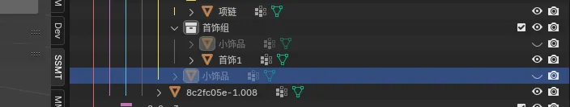

此时你选中任意一个【小饰品】，进行修改或者隐藏或者任意功能，其它的【小饰品】都会生效，它们本质上是一个东西，且生成Mod后会复用这个模型。

如果不想要的时候，千万不能直接删除，因为对任意【小饰品】的删除操作，都会影响所有【小饰品】，所以这时候我们可以先选中物体，再选中集合，使用 集合右键或者在【集合操作】面板上点击【链接：从集合中移除选中的链接物体】

即可安全移除链接，而不会导致所有的【小饰品】被删除。

以此方式，实现模型复用，灵活运用可以很方便的实现各种效果。

# 结语
是不是觉得这样太复杂了？其实用熟练之后是很直观的，其设计满足【所见即所得】特性，是很人性化的设计。

同样，我们也可以不使用分支架构，导入后直接修改直接生成，因为80%以上的的Mod作者都用不到分支架构，总之，非常灵活。

可以对照WWMI-Tools新版本的分支架构，以及XXMI-Tools的分支架构，你会发现SSMT的架构设计很独特（至少我自己是足够用了）。

而且你也可以像这样每做完一个部分就把它隐藏起来，等到生成Mod时再取消隐藏（当然我是不建议隐藏的，如果有多个显示器一般会把这个Outliner整个放到另外一个显示器上显示，不会出现嵌套过多层级显示不下的情况）：

我自己测试使用的过程中，每做一个Mod都可以很直观的感受到每个分支的内容（且分支越多越有成就感，也是一个心理学小设计）

另外提一嘴，如果你制作的Mod顶点数特别多，每个Component 135W的索引上限已经无法满足你用集合架构制作切换的话，此时你应该去使用Mod合并脚本而不是自带的集合架构来制作切换Mod。

Mod合并脚本推荐基于namespace的Mod合并脚本的v2版本：

https://gamebanana.com/tools/15804

实际上Mod制作的过程中，大部分游戏的模型原本顶点数都在2万以下，制作超过10万顶点数的Mod在游戏中是很难看到额外效果的，因为大部分游戏就算你开到4K，也无法显示那么多细节，所以这套集合架构对于正常的Mod制作需求是足够用的。

