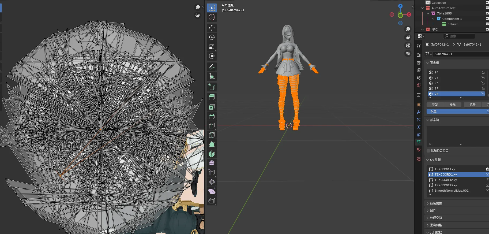
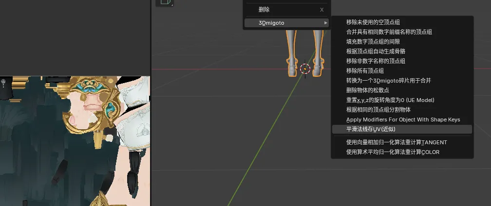
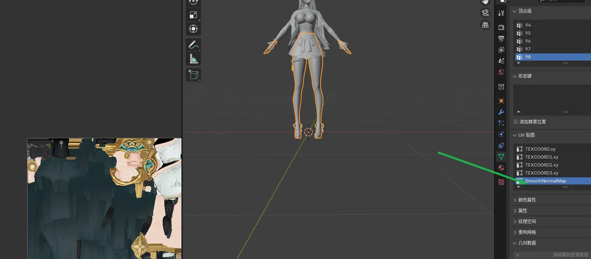
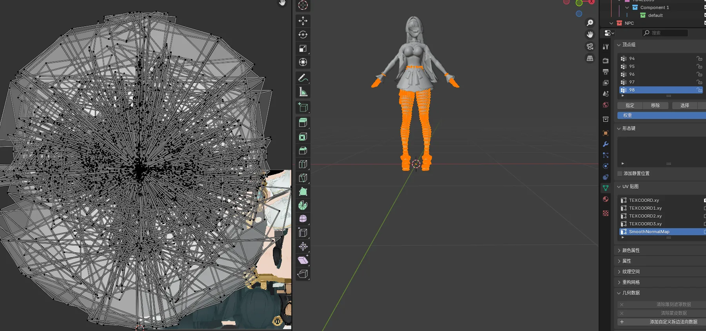

# 概念介绍
在ZZZ和WuWa中，部分UV中的内容很奇怪，比如以ZZZ模型举例：

这个实际上是把模型的平滑法线存到UV里了，那么我们在修改模型之后，这个TEXCOORD1.xy里的内容肯定也需要跟着变

# 使用方法
所以在Blender里可以右键模型=>3Dmigoto=>平滑法线存UV(近似)

点击后会生成一个名为SmoothNormalMap的UV：

点开可以发现其内容和TEXCOORD1.xy的差不多：

然后你只要删除原本的TEXCOORD1.xy，然后把这个UV改名为对应TEXCOORD1.xy，即可实现复现平滑法线存UV

# 用途
- 修复ZZZ轮廓线
- 修复WuWa轮廓线

# 缺点
- 这个算法只能达到近似实现，无法完美还原TEXCOORD1.xy中的内容，不过足够用了
