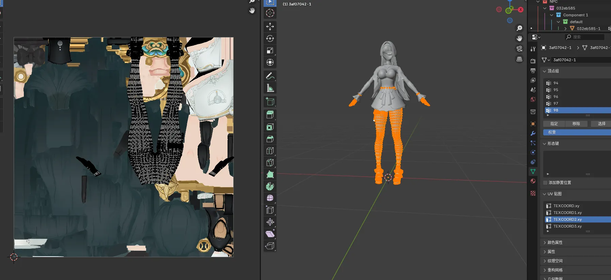
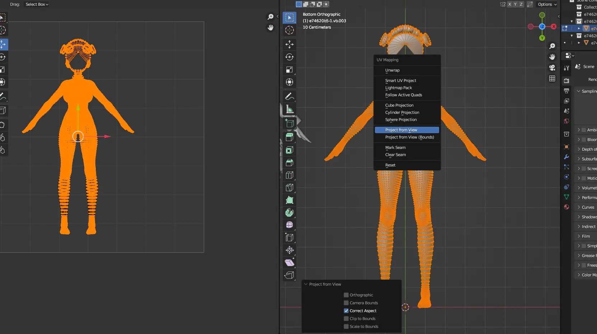
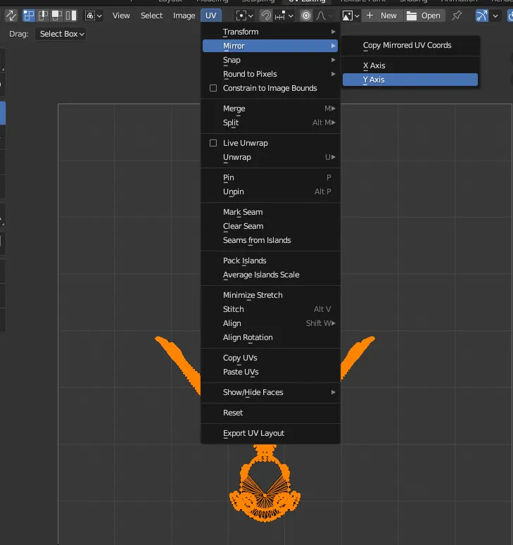

# 概念介绍
在ZZZ和WuWa中，偶尔能见到TEXCOORD2.xy中的内容很奇怪：

但是如果我们不去复现这个，就会导致部分轮廓线出问题，所以得想办法搞个和它一样的。

# 操作步骤

首先找一个合适的摄像机机位，切换到前面，然后从UV投影，只勾选Correct Aspect

然后再UV=>Mirror=>Y

即可得到完美的Texcoord2中的投影，这里要注意摄像机机位的把控。
做完之后可能还需要进行手动偏移和原本的位置差不多对上，如果左右相反也可以手动再Mirrot X一下。

# 用途
- ZZ轮廓线渲染还原
- WuWa轮廓线渲染还原
# 缺点
- 这个值理论上应该是程序自动生成，但是我们并没有米哈游建模师的生成脚本，只能用近似方法代替了。