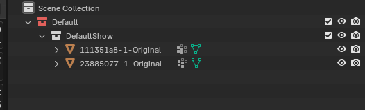
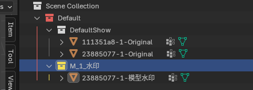
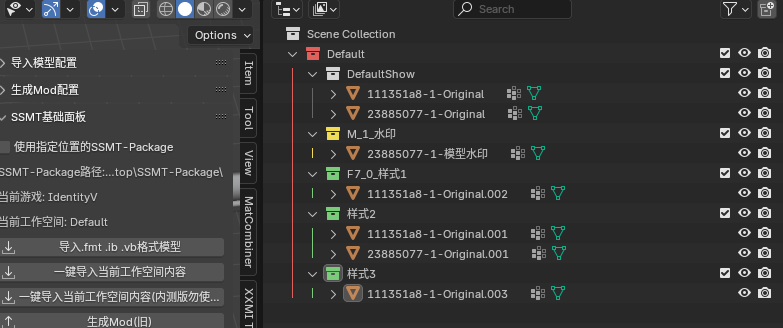
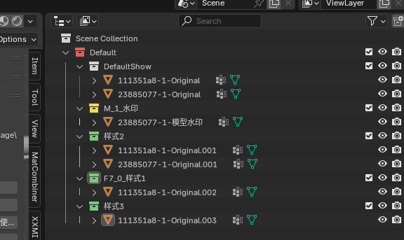
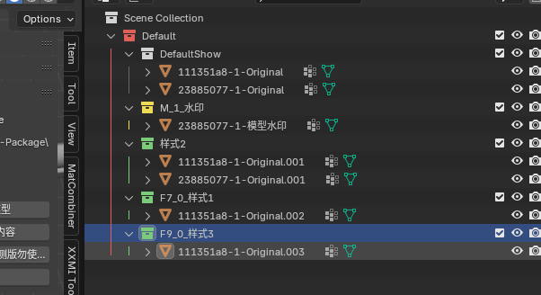

# 诞生背景

旧的集合架构是基于Component的，只能在Component中进行嵌套使用。

存在致命的缺点：无法跨Component进行分支控制，无法跨DrawIB进行分支控制。

为了解决此问题，新的分支集合架构得到了全新升级，

但是由于升级后使用方法存在很大的变更，和之前的用法并不能无缝兼容，

而使用旧的集合架构的人又特别多，所以我们必须保留旧版本，所以我直接把SSMT-Blender-Plugin这个仓库Archive掉了。

然后开了新的仓库TheHerta，意为大黑塔。

https://github.com/StarBobis/TheHerta

如果需要使用下面介绍的新的分支架构，可以去安装TheHerta插件。

# 一键导入当前工作空间内容

目前导入后的内容和之前发生了很大的变更，如图：

可以看到，我们导入之后，就只有一个工作空间集合，然后下面就直接存放模型了。

默认导入之后会自动创建一个白色的组集合，用于把导入的模型默认分组到【默认显示】的组里。

白色集合在这里没有特殊含义，用法和之前的组集合一样，因为在Mod制作的过程中，非常频繁的需要创建一个用于【默认显示】的组集合，所以把这个功能设为默认的了。

然后变更的就是导入的模型的名称，这里就要引入新的概念：【模型命名规则】

# 模型命名规则

目前导入的模型都是以DrawIB - Component Count - Alias 这个结构来命名的

这里的DrawIB就是你在工作台里填写的DrawIB，Component Count是一个数字，代表它属于哪个Component，从1开始逐渐增加。

Alias就是你的DrawIB的别名。

注意：你的模型的命名必须遵循这个规则，才正常生成Mod，否则在使用新架构生成Mod时会导致报错。

# 按键开关集合命名规则

在新版集合架构中，我们可以直接在集合名称中进行命名，来控制这个集合所使用的按键切换具体的键，以及初始化设置的默认值了。

旧版则必须依赖于SSMT里设置的按键的值，非常的不方便，在新版通过这个命名就能很方便的设置，符合所见即所得特性。

具体的命名规则如下：

按键 _ 初始值 _ 集合的名称

这里的按键，指的就是你要指定什么按键作为按下去之后触发切换的键，这里的【按键】的内容会直接写到ini中key生成部分的key = 

所以要满足3Dmigoto的按键条件，如果不知道该怎么写的，建议去查看3Dmigoto源码来了解所有的按键组合和按键可以填写的值

初始值就不用多解释了吧，默认是0，如果你给按键开关集合的初始值设为1，则它就是默认显示的，因为我们默认的初始值是0，所以是默认不显示这个开关集合的。

所以如果你有特殊的需求，比如有一个模型水印，你想让这个水印默认显示，然后必须按某个键来关闭，就可以创建一个按键开关集合，并将初始值设为1来实现

如下图：

此时模型水印就是默认显示的，用户按下M键即可关闭，这样不管别人怎么合购搬运倒卖模型，你都能让拿到Mod的人第一时间知道是谁做的Mod。

当然用法不止这一种，只是作为案例来说明，你只需要知道我们可以通过指定【按键开关集合】的名称来实现自定义按键和初始值就行了。

# 按键切换集合命名规则

如图，按键切换集合的命名，和我们的按键开关集合还不一样。

我们都知道，按键切换集合位于哪个集合下面时，如果只有一个，会被当成白色的组集合，如果有多个，则会生成一个按键，让这些集合互为按键切换。

此时，如果我们在某个集合下有两个或两个以上的按键切换集合，就会生成一个按键，但是我们要靠命名来指定键和初始值，该设置到其中哪一个上面呢？

答案是从上往下第一个符合按键切换集合命名规则的，和按键开关集合的命名规则一样：

按键 _ 初始值 _ 集合的名称

例如，如下图虽然这个符合名称的集合出现在第二个，但是仍然能被识别到：

例如，如下图，虽然两个按键切换集合都符合命名规则，但是按照从上往下第一个的顺序，只有第一个集合的名称会被识别用作ini生成的内容：

# 总结

新的集合架构相比于旧的集合架构，有如下优势：

- 能够跨IB、跨Component进行分支控制。
- 仍然支持嵌套使用，以达成复杂的分支条件控制。

上面这两条加起来，就能做出很复杂的分支Mod了。

- 能够在集合名称中直接指定生成的按键名称和初始值，不再依赖于SSMT设置页面中的值，更符合所见即所得。
- 相比于旧的集合架构，少了一层DrawIB集合和Component集合，用法更加简洁。
- 更低的下限，更高的上限。

