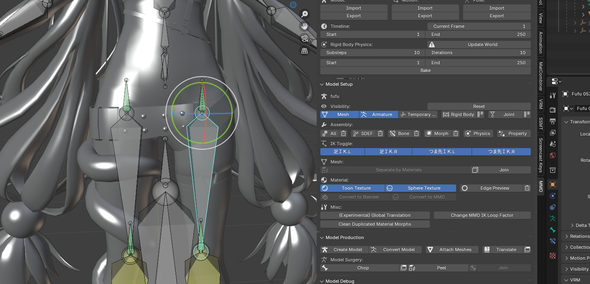
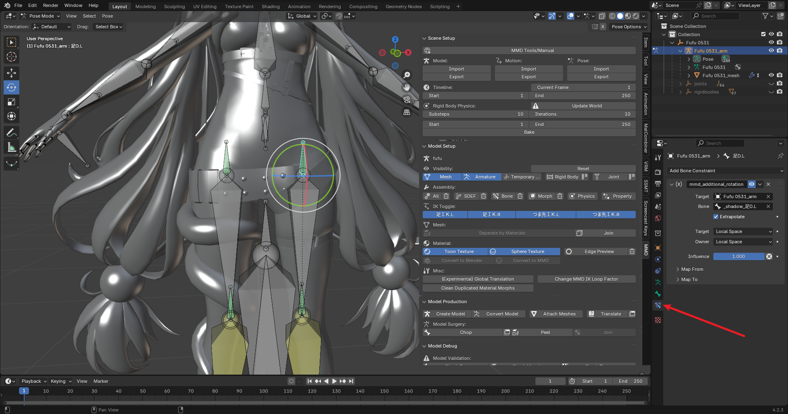
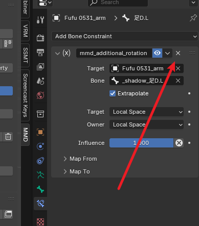
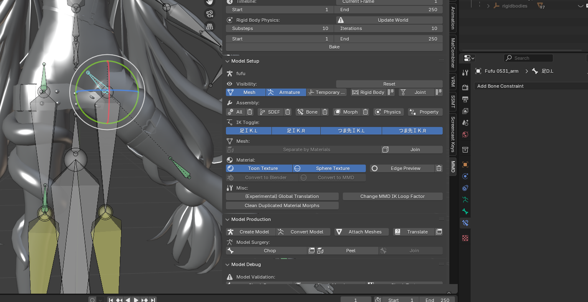

# 骨骼约束
如图，导入MMD模型后，绿色的大腿根部骨骼约束导致腿部不能按照特定角度旋转

这是因为Blender中黄色和绿色的骨骼都是加了约束的。

此时我们点击这个绿色的约束骨骼，然后去骨骼约束栏

把右边的约束全部删掉，有几个删几个。

删掉约束的骨骼会变成灰色，我们删掉了旋转约束，这样就可以自由旋转了

一般这个问题只有Blender萌新会遇到，如果你也遇到了这个问题，说明你仍然没有掌握Blender基础，这个问题属于Blender基础里的骨骼部分，你需要补习这方面的知识了，打好基础未来才能走得更远。

