# SSMT(Super Simple Migoto Tools)
- 下载后直接解压即可使用。

- SSMT自带的3Dmigoto在SSMT-Package的3Dmigoto目录下。
- SSMT和SSMT插件的版本是对应配套的，如果发现不兼容，请全部更新到最新版。
- 请勿将SSMT-Package放到U盘或外接可插拔USB接口的硬盘里，否则会出现Dump内容全是软链接且失效的问题（放到U盘中由于权限不足，即使不开启Symlink特性也会Dump下来一堆链接文件，且无法被SSMT识别）。

# (0) 第一次安装
https://github.com/StarBobis/SSMT-Package

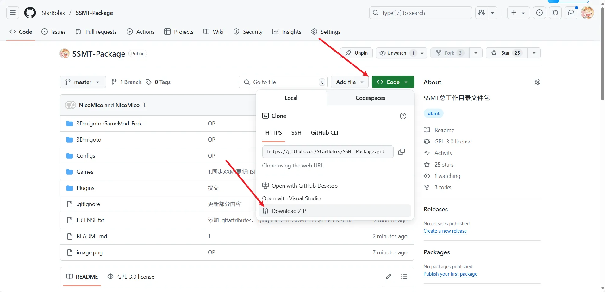

下载SSMT-Package，这个里面的内容是SSMT依赖的，且经常更新的，比如会添加一些新的数据类型进去，以及会添加一些新贴图配置进去。下载完随便找个位置解压（别放U盘或者外置可插拔USB接口磁盘，别放中文路径下），这里我直接放桌面了：

群公告或群文件下载解压并打开SSMT.exe:

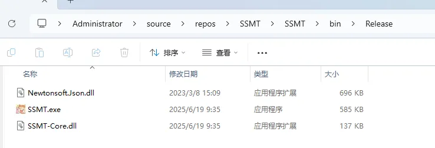

点击设置=>首选项页面：

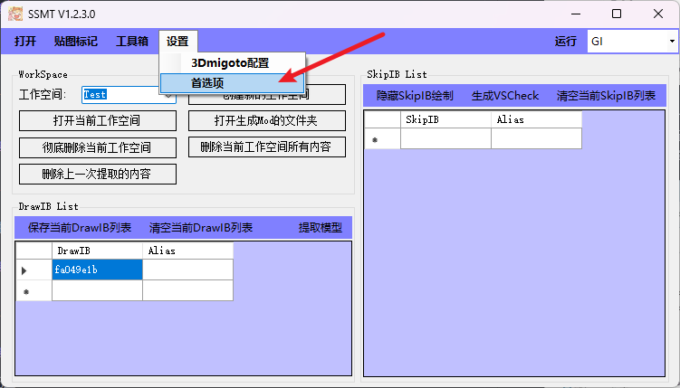

在首选项页面中选择SSMT总工作文件夹路径为这个下载的文件夹路径（确保路径无中文且不是U盘或外接可插拔USB磁盘）：

设置完成后，接下来就可以正常使用SSMT了

# (1) 选择游戏
点击右上角下拉菜单可以选择当前工作的游戏：

# (2) 进行3Dmigoto配置
启动SSMT后，大概是这个样子：

此时需要先进行3Dmigoto配置

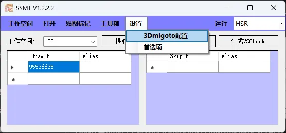

选择3Dmigoto文件夹，因为SSMT是依赖于3Dmigoto运行的，这里你可以选一个这个游戏对应的3Dmigoto，比如我这里直接用桌面的：

SSMT自带的各个游戏的3Dmigoto在SSMT-Package的Games目录下，尽量不要使用其它人提供的3Dmigoto否则可能不适配：

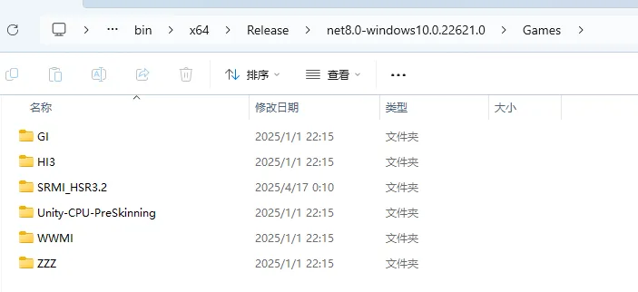

选择后，3Dmigoto路径，进程路径和启动路径，以及启动参数会自动从你选择的3Dmigoto文件夹中的d3dx.ini中识别并填写（如果是空的，请看后续如何填写的教程）。

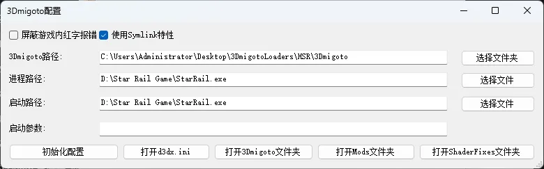

随后就可以关闭此窗口，去主页界面开始使用了。

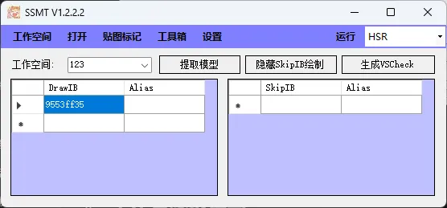

# (3) 各参数填写
这里的进程路径，对应d3dx.ini中的target = 
启动路径对应d3dx.ini中的launch = 
启动参数对应d3dx.ini中的launch_args = 

## 进程路径
一般是目标游戏的主程序的路径
一般米游的进程路径和启动路径填写相同的即可，米游不需要填写启动参数，除非你有自定义的需求，那么请自行填写。

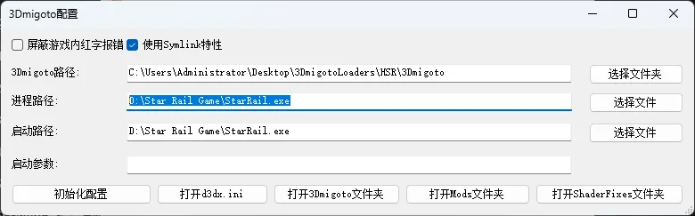

## 启动路径
一般为游戏的启动器或者进程路径。
米游比较特殊，它允许不经过官方启动器直接调起进程启动，但是其它游戏不一定允许，所以这里的启动路径，一般我们填写的是能够调起这个游戏的游戏的启动器路径。

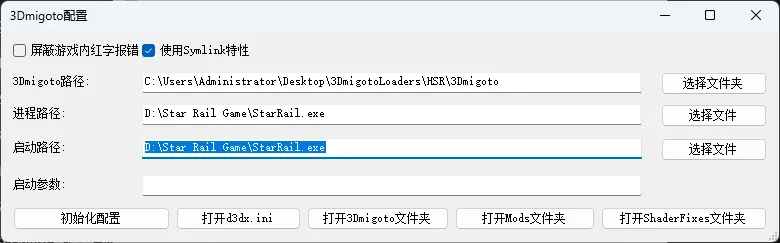

## 启动参数
虽然有些游戏不允许直接启动它的进程路径，但是当你附加了启动参数之后，是可以直接启动进程路径的，比如Naraka：

例如进程路径和启动路径相同，代表我要在运行3Dmigoto Loader之后，立刻调起游戏进程路径并进行注入，正常情况没有启动参数是会报错失败的，但是我们通过Process Hacker、Open Ark等工具获取了进程的启动参数后，就可以实现方便的一键调起游戏了。

## 如何查找游戏的进程路径
(进程路径 即 d3dx.ini中的target = 路径)

这里我们填写的target = 后面的路径，是游戏进程的文件所在路径，一般情况下我们可以通过任务管理器查到。

首先启动游戏，以ZZZ为例，可以在进程中看到它：

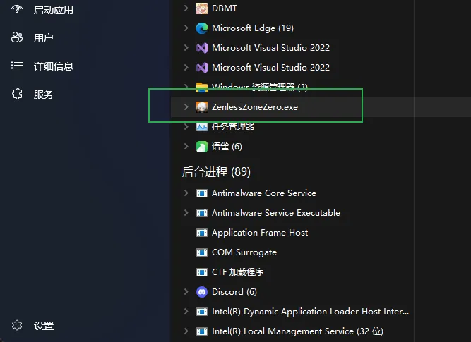

右键，打开文件所在位置：

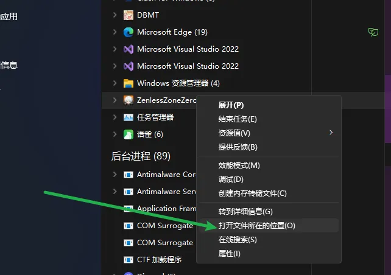

出来如下内容，文件名会被自动选中：

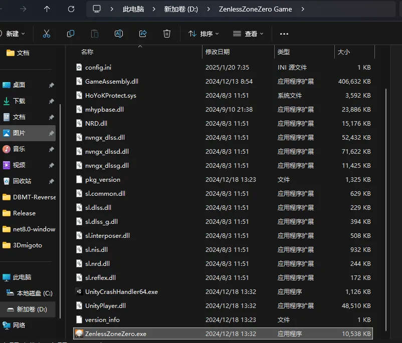

此时我们可以从地址栏得到：

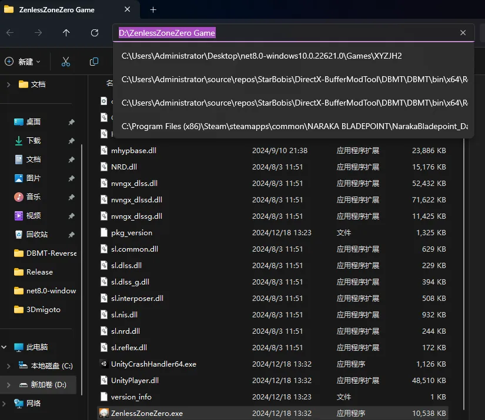

D:\ZenlessZoneZero Game

此时拼接路径和文件名即可得到完整路径：

D:\ZenlessZoneZero Game\ZenlessZoneZero.exe

## 什么情况下进程路径和启动路径相同
如果游戏的进程能够在不附加任何启动参数的情况下，被第三方程序启动，那么此时进程路径和启动路径就可以填一样的，就可以点击 启动3Dmigoto Loader.exe后自动启动游戏了。

否则则需要特定启动参数，可以用ProcessHacker自行查看并添加（看不懂说明你用不到这个特性，无需考虑这个）。

