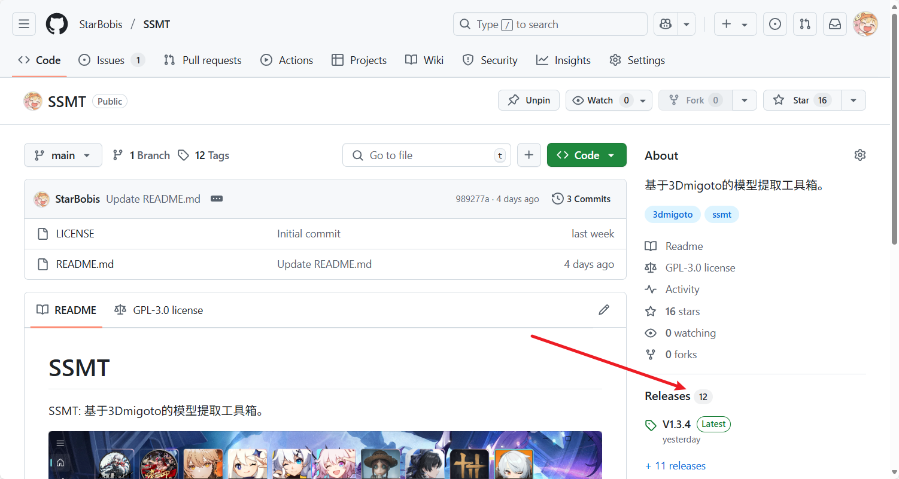
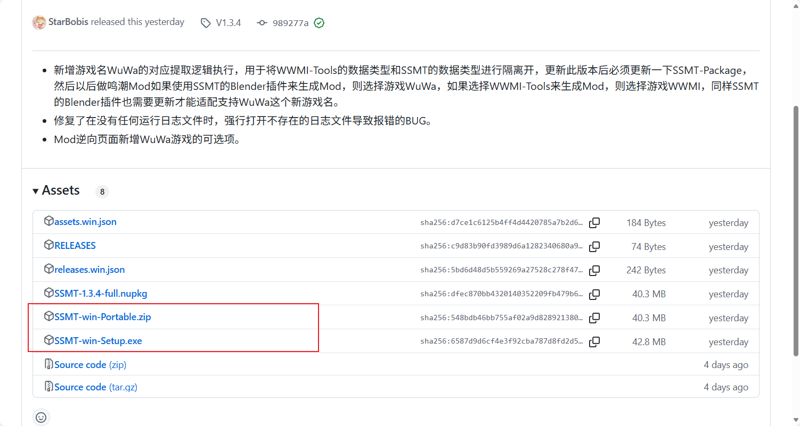
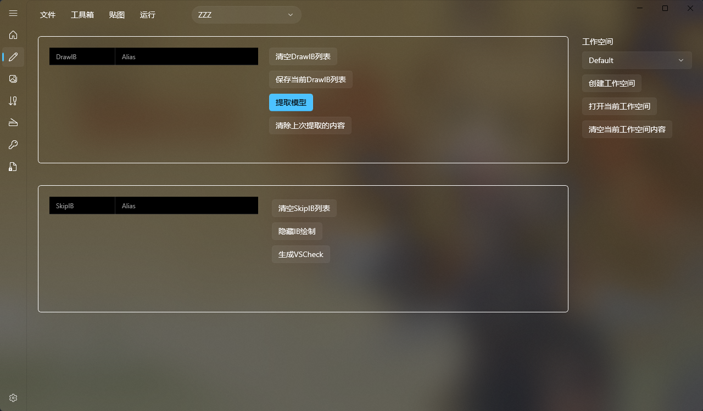
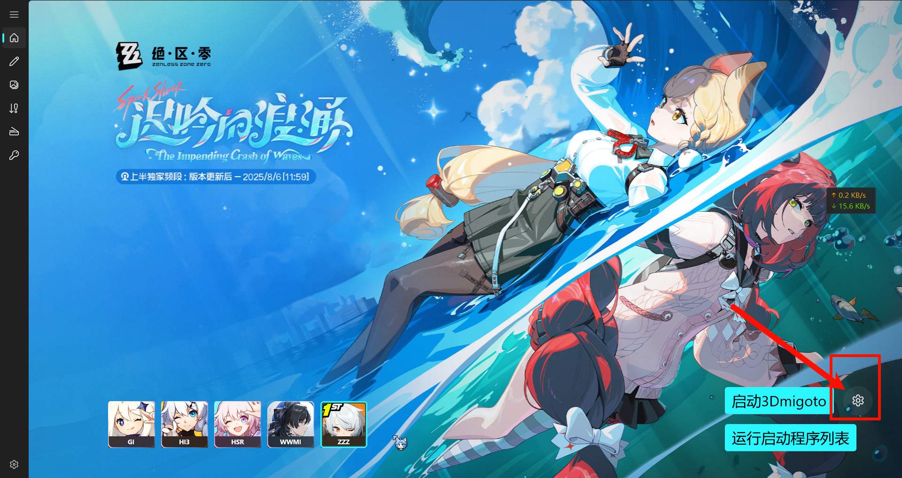
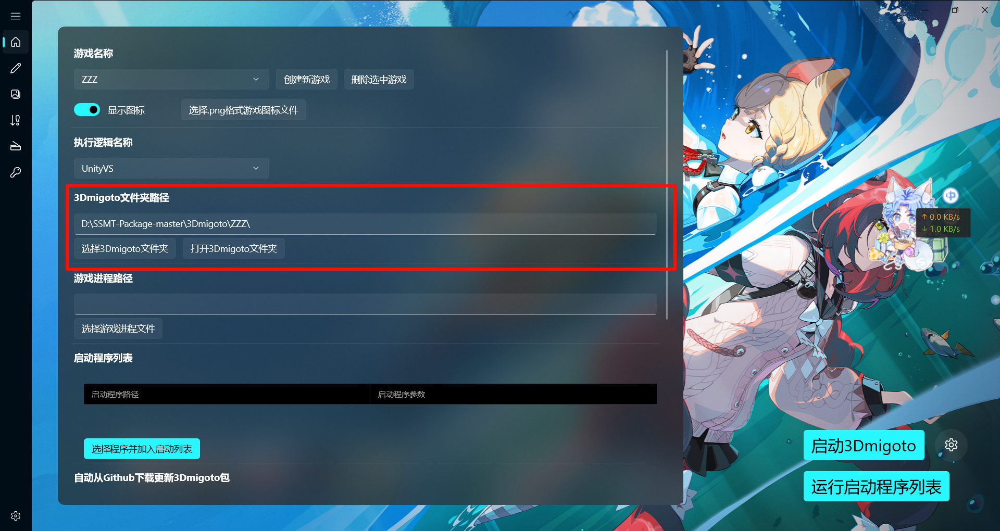

SSMT 分为两部分，SSMT 本体与 SSMT 工作目录，即后面要说到的 SSMT-Package。SSMT 本体包含 GUI 和绝大多数运行逻辑，而 SSMT-Package 存储了本体依赖的所有实际工作内容，包括游戏配置、3Dmigoto、工作空间等，后者经常更新，如新的数据类型或新的贴图配置等。

# SSMT(Super Simple Migoto Tools) 本体

浏览器进入 SSMT 的 [GitHub 仓库](https://github.com/starbobis/ssmt)，点击进入 Release 界面：

翻动到 Assets，其中列出了可下载的资源文件：

列表中：

* `SSMT-win-Portable.zip` 为包含必要文件的压缩包，解压后开启根目录下的 `SSMT.exe` 即可使用。
* `SSMT-win-Setup.exe` 为自动化安装程序，运行该程序将自动安装 SSMT 至 `C:` 盘下。

## 更新 SSMT

建议采用 SSMT 现有的内置更新功能，如图：

.png)

也可以在 GitHub 重新下载并覆盖安装，但不推荐，尤其是版本跨度较大时，因为文件结构可能有所更改。

# 安装SSMT-Package

有以下几种安装方式：

#### A. 克隆仓库

1. 确保电脑已安装 Git，如果没有，请前往 [Git 官网](https://git-scm.com/downloads/win)安装所需版本，在终端运行 `git --version` 查看已安装的 Git 版本，从而确认是否安装成功；
2. 终端定位到希望放置 `SSMT-Package` 文件夹的目录，运行 `git clone https://github.com/StarBobis/SSMT-Package.git`，等待即可。

> 注意：很多情况下需要通过代理访问 GitHub，此时 Git 需要额外配置才能正确定位到 GitHub 上的远程仓库，请自行查找配置方案。

#### B. 下载 `.zip`文件

进入 SSMT-Package 的 [GitHub 仓库](https://github.com/StarBobis/SSMT-Package)：

按图中方式以 `.zip` 格式打包下载本仓库，解压到希望放置的目录。

<!-- 

群公告或群文件下载解压并打开SSMT:

 -->

### 配置 SSMT-Package

打开 SSMT，在设置界面选择 SSMT-Package 的根目录：

<!-- 打开 SSMT，在设置页面中选择SSMT-Package路径为这个下r载的文件夹路径（确保路径无中文且不是U盘或外接可插拔USB磁盘）： -->

.2.png)

如果配置正确，此时即可正常使用 SSMT。

# 注意

- SSMT 自带一些游戏特定的 3Dmigoto，位于 `SSMT-Package/3Dmigoto/` 内。
- 出于精力因素，SSMT、SSMT-Package、SSMT 的 Blender 插件，版本容差相对较低，如果使用过程中出现一些奇怪的问题，建议首先更新所有部分至最新版。
- 请勿将 SSMT-Package 部署在 U 盘或外接热插拔 USB 接口硬盘中，否则制作 Mod 时，Dump 得到的 FrameAnalysis 中全是软链接。这是因为 U 盘中存在权限问题，即使不启用 Symlink 特性，Dump 得到的也是软链接，而 SSMT 并不能识别这样的软链接。

# 游戏配置

## (1) 选择游戏

主页图标可以选择当前工作的游戏：

## (2) 进行3Dmigoto配置

SSMT 依赖 3Dmigoto 运行，须要首先配置 3Dmigoto，选择 3Dmigoto 文件夹。在这里选择一个该游戏对应的 3Dmigoto：

<!-- 需要先进行3Dmigoto配置，选择3Dmigoto文件夹，因为SSMT是依赖于3Dmigoto运行的，这里你可以选一个这个游戏对应的3Dmigoto，比如我这里直接用桌面的： -->

`SSMT-Package/3Dmigoto/` 下自带已支持游戏的 3Dmigoto，尽量不要使用其他来源的 3Dmigoto，否则可能不适配，除非有特殊需求。mihoyo 的游戏，其 3Dmigoto 也可以直接使用 XXMI 提供的版本。

选择后，SSMT 将自动读取其目录下的 `d3dx.ini`，识别填写对应的 3Dmigoto 路径、进程路径、启动路径、启动参数。有时这些值没有正确填写，处理方式见下文。

<!-- 
SSMT自带的各个游戏的3Dmigoto在SSMT-Package的Games目录下，没有特殊目的尽量不要使用其它人提供的3Dmigoto否则可能不适配，米游的3Dmigoto可以直接用XXMI下面的：

选择后，3Dmigoto路径，进程路径和启动路径，以及启动参数会自动从你选择的3Dmigoto文件夹中的d3dx.ini中识别并填写（如果是空的，请看后续如何填写的教程）。 -->

## (3) 各参数填写

| 项目 | `d3dx.ini` 键名 | 应填写键值 |
| ---- | ---- | ---- |
|  进程路径    |  `target =`      | 需注入程序的路径     |
|   启动路径   |  `launch =`      |   启动 3Dmigoto 后启动特定程序的路径   |
|启动参数|`launch_args =`| `launch` 键所启动程序的启动参数|

> 说明：米游允许不通过官方启动器启动游戏进程，其启动路径可以同样填写为进程路径的值，但其他游戏不一定允许，直接启动游戏进程会导致报错，因而启动路径应填写其官方启动器路径。此外，部分游戏可以以特定启动参数直接启动游戏进程，这里的启动参数同样可以用于 Windows 终端，能够通过 Process Hacker、Open Ark 等工具获取该参数。

<!-- 这里的进程路径，对应d3dx.ini中的target =
启动路径对应d3dx.ini中的launch =
启动参数对应d3dx.ini中的launch_args =

## 进程路径

一般是目标游戏的主程序的路径
一般米游的进程路径和启动路径填写相同的即可，米游不需要填写启动参数，除非你有自定义的需求，那么请自行填写。

## 启动路径

一般为游戏的启动器或者进程路径。
米游比较特殊，它允许不经过官方启动器直接调起进程启动，但是其它游戏不一定允许，所以这里的启动路径，一般我们填写的是能够调起这个游戏的游戏的启动器路径。

## 启动参数

虽然有些游戏不允许直接启动它的进程路径，但是当你附加了启动参数之后，是可以直接启动进程路径的，比如Naraka：

例如进程路径和启动路径相同，代表我要在运行3Dmigoto Loader之后，立刻调起游戏进程路径并进行注入，正常情况没有启动参数是会报错失败的，但是我们通过Process Hacker、Open Ark等工具获取了进程的启动参数后，就可以实现方便的一键调起游戏了。 -->

#### 如何查找游戏的进程路径
<!-- 
(进程路径 即 d3dx.ini中的target = 路径) -->
<!-- 
这里我们填写的target = 后面的路径，是游戏进程的文件所在路径， -->

一般情况下，可以按下快捷键 `Ctrl + Shift + Esc` 打开任务管理器，右键游戏进程，左键选择 “打开文件所在的位置”，即可定位到游戏本体路径。

以下是示例：
首先启动游戏，以ZZZ为例，可以在进程中看到它：

右键，打开文件所在位置：

出来如下内容，文件名会被自动选中：

此时我们可以从地址栏得到：

D:\ZenlessZoneZero Game

此时拼接路径和文件名即可得到完整路径：

D:\ZenlessZoneZero Game\ZenlessZoneZero.exe

<!-- ## 什么情况下进程路径和启动路径相同

如果游戏的进程能够在不附加任何启动参数的情况下，被第三方程序启动，那么此时进程路径和启动路径就可以填一样的，就可以点击 启动3Dmigoto Loader.exe后自动启动游戏了。

否则则需要特定启动参数，可以用ProcessHacker自行查看并添加（看不懂说明你用不到这个特性，无需考虑这个）。 -->
