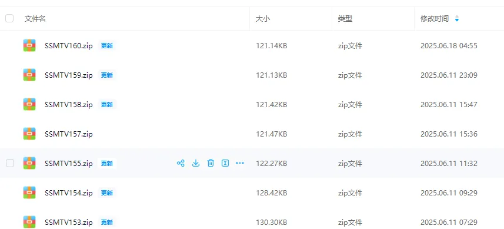
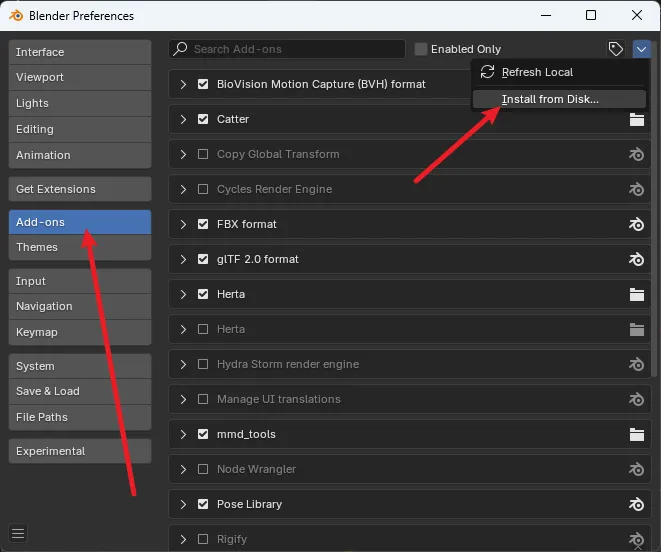
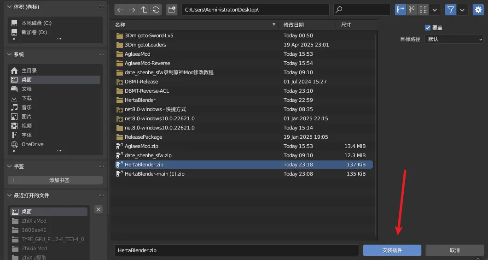
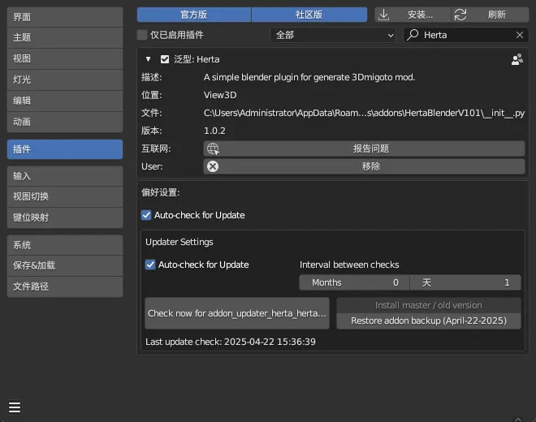
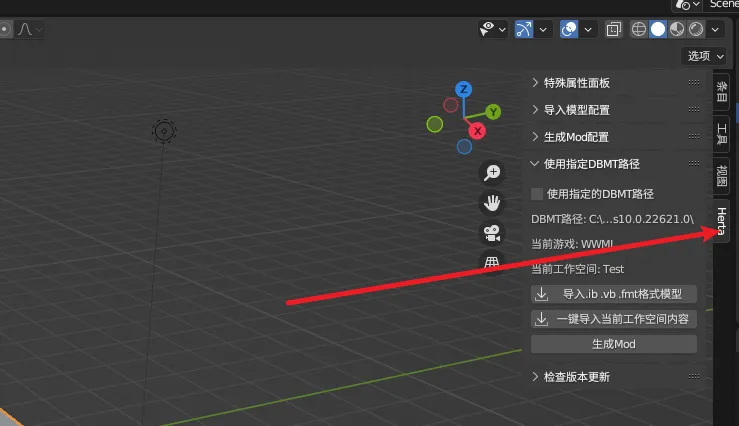

建议提前准备好Blender4.2LTS或更高的版本，其它的Blender版本可能无法按照预期正常工作。
(最低版本为Blender3.6LTS)
# SSMT的Blender插件安装教程

下载完成后，我们就可以进行安装了：

注意，以下内容使用的是SSMT的旧版本Herta插件作为演示，实际安装过程中，要使用我们的SSMT插件：

(1) 编辑菜单中选择偏好设置：

(2) 选择插件，点击安装：

上图为3.6的界面，如果是4.2的界面是下面这样的：

(3) 弹出的对话框选择我们打包好的zip文件，然后点击安装插件

(4) 安装后，在插件栏中搜索Herta，并勾选启用：

勾选后变成这样展开的形式：

(5) 接下来就可以关闭插件界面了，随后在侧边栏可以看到一个名为Herta的面板按钮：

到这里安装就完成了，可以使用了。