# (1) 找开发者添加
把整个Dump下来的FrameAnalysis文件夹都发过来，以及提取用的DrawIB列表。

如果文件太大可以开启Symlink特性来dump，这样压缩后体积就很小了。


Dump下来的FrameAnalysis文件夹在你当前选定的3Dmigoto目录下，点这个按钮就能打开查看：

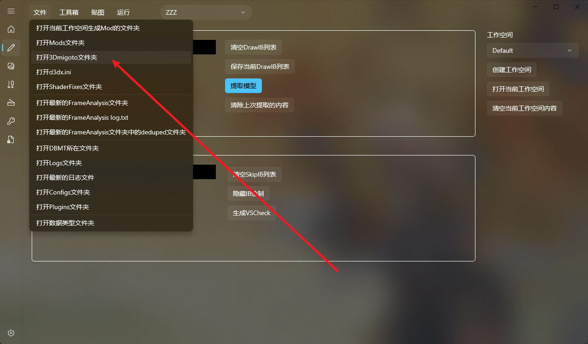


一般F8下来的，看文件夹的名字和日期就能知道是最新的，必须发我最新Dump的，然后就是DrawIB列表也一起发来。


# (2) 自己在数据类型页面添加

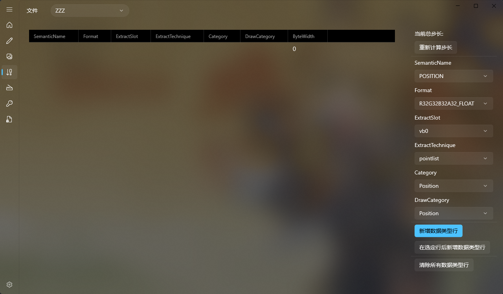

如果不会用的话，建议还是联系我，发我FrameAnalysis文件夹和提取用的DrawIB我来添加。
 
这个其实不难，难就难在每个游戏的数据类型都是不一样的，且有一部分需要更改模型提取逻辑来进行适配。

而由于SSMT是闭源的，所以用户基本上无法100%掌握数据类型的全部添加方法。

所以，尽量发我我来添加就好了，当然，你自己添加好的也可以提交PR到SSMT-Package里让其他人也方便使用，目前掌握添加数据类型的人至少有十几个，并不是完全不可能学会。

## 绝区零数据类型添加步骤(简单)


在提取的日志中找到PointlistIndex和TrianglelistIndex:

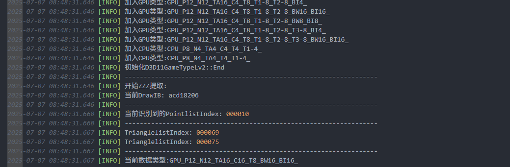

对于绝区零来说，这里如果有PointlistIndex，大概率是GPU-PreSkinning，如果没有大概率是CPU-PreSkinning，仅适用于绝区零，并不绝对。

我们先去来PointlistIndex的000010, 再看Trianglelist的000069和000075

点击打开最新的FrameAnalysis文件夹：

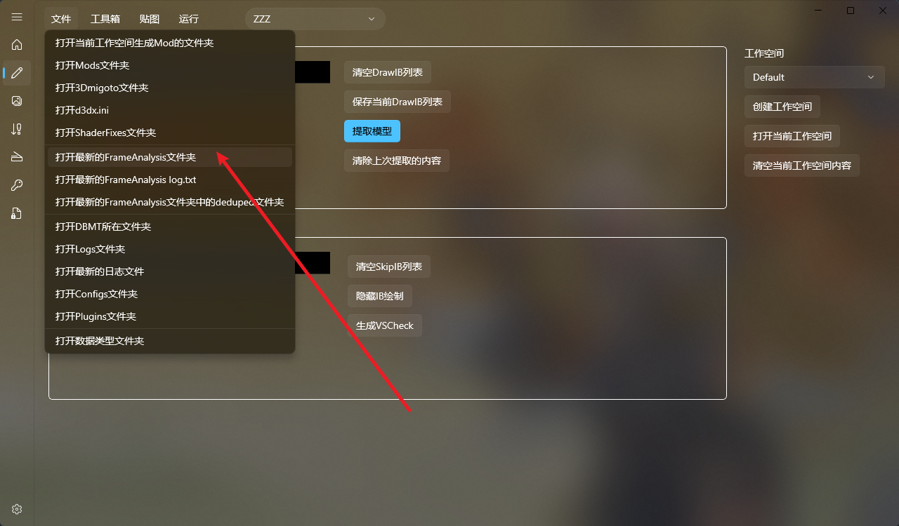

然后分别观察vb0,vb1,vb2三个槽位文件：


000010-vb0=f8002ea0-vs=9684c4091fc9e35a.txt开头的内容如下：
```
stride: 40
first vertex: 0
vertex count: 3776
topology: pointlist
element[0]:
  SemanticName: POSITION
  SemanticIndex: 0
  Format: R32G32B32_FLOAT
  InputSlot: 0
  AlignedByteOffset: 0
  InputSlotClass: per-vertex
  InstanceDataStepRate: 0
element[1]:
  SemanticName: NORMAL
  SemanticIndex: 0
  Format: R32G32B32_FLOAT
  InputSlot: 0
  AlignedByteOffset: 12
  InputSlotClass: per-vertex
  InstanceDataStepRate: 0
element[2]:
  SemanticName: TANGENT
  SemanticIndex: 0
  Format: R32G32B32A32_FLOAT
  InputSlot: 0
  AlignedByteOffset: 24
  InputSlotClass: per-vertex
  InstanceDataStepRate: 0
element[3]:
  SemanticName: COLOR
  SemanticIndex: 0
  Format: R8G8B8A8_UNORM
  InputSlot: 1
  AlignedByteOffset: 0
  InputSlotClass: per-vertex
  InstanceDataStepRate: 0
element[4]:
  SemanticName: TEXCOORD
  SemanticIndex: 0
  Format: R16G16_FLOAT
  InputSlot: 1
  AlignedByteOffset: 4
  InputSlotClass: per-vertex
  InstanceDataStepRate: 0
element[5]:
  SemanticName: TEXCOORD
  SemanticIndex: 1
  Format: R32G32_FLOAT
  InputSlot: 1
  AlignedByteOffset: 8
  InputSlotClass: per-vertex
  InstanceDataStepRate: 0
element[6]:
  SemanticName: TEXCOORD
  SemanticIndex: 2
  Format: R16G16_FLOAT
  InputSlot: 1
  AlignedByteOffset: 16
  InputSlotClass: per-vertex
  InstanceDataStepRate: 0
element[7]:
  SemanticName: TEXCOORD
  SemanticIndex: 3
  Format: R8G8B8A8_UNORM
  InputSlot: 0
  AlignedByteOffset: 0
  InputSlotClass: per-vertex
  InstanceDataStepRate: 0
element[8]:
  SemanticName: TEXCOORD
  SemanticIndex: 4
  Format: R8G8B8A8_UNORM
  InputSlot: 0
  AlignedByteOffset: 0
  InputSlotClass: per-vertex
  InstanceDataStepRate: 0
element[9]:
  SemanticName: TEXCOORD
  SemanticIndex: 5
  Format: R8G8B8A8_UNORM
  InputSlot: 0
  AlignedByteOffset: 0
  InputSlotClass: per-vertex
  InstanceDataStepRate: 0
element[10]:
  SemanticName: TEXCOORD
  SemanticIndex: 6
  Format: R8G8B8A8_UNORM
  InputSlot: 0
  AlignedByteOffset: 0
  InputSlotClass: per-vertex
  InstanceDataStepRate: 0
element[11]:
  SemanticName: TEXCOORD
  SemanticIndex: 7
  Format: R8G8B8A8_UNORM
  InputSlot: 0
  AlignedByteOffset: 0
  InputSlotClass: per-vertex
  InstanceDataStepRate: 0
element[12]:
  SemanticName: BLENDWEIGHTS
  SemanticIndex: 0
  Format: R8G8B8A8_UNORM
  InputSlot: 3
  AlignedByteOffset: 16
  InputSlotClass: per-vertex
  InstanceDataStepRate: 0
element[13]:
  SemanticName: BLENDINDICES
  SemanticIndex: 0
  Format: R32_UINT
  InputSlot: 2
  AlignedByteOffset: 0
  InputSlotClass: per-vertex
  InstanceDataStepRate: 0

vertex-data:

vb0[0]+000 POSITION: -1.80380487, -0.0186858177, 0.563420177
vb0[0]+012 NORMAL: -0.969902813, -1.82696351e-06, 0.243492216
vb0[0]+024 TANGENT: -0.24173516, -0.119910501, -0.962904811, -1
vb0[0]+000 TEXCOORD3: 0.0784313753, 0.890196085, 0.90196079, 0.749019623
vb0[0]+000 TEXCOORD4: 0.0784313753, 0.890196085, 0.90196079, 0.749019623
vb0[0]+000 TEXCOORD5: 0.0784313753, 0.890196085, 0.90196079, 0.749019623
vb0[0]+000 TEXCOORD6: 0.0784313753, 0.890196085, 0.90196079, 0.749019623
vb0[0]+000 TEXCOORD7: 0.0784313753, 0.890196085, 0.90196079, 0.749019623

vb0[1]+000 POSITION: -1.80611265, -0.0299987793, 0.55422765
vb0[1]+012 NORMAL: -0.969902813, -1.82696351e-06, 0.243492216
vb0[1]+024 TANGENT: -0.241735175, -0.119910516, -0.962904811, -1
vb0[1]+000 TEXCOORD3: 0.701960802, 0.180392161, 0.905882359, 0.749019623
vb0[1]+000 TEXCOORD4: 0.701960802, 0.180392161, 0.905882359, 0.749019623
vb0[1]+000 TEXCOORD5: 0.701960802, 0.180392161, 0.905882359, 0.749019623
vb0[1]+000 TEXCOORD6: 0.701960802, 0.180392161, 0.905882359, 0.749019623
vb0[1]+000 TEXCOORD7: 0.701960802, 0.180392161, 0.905882359, 0.749019623


```
可以推断出要添加如下数据类型行：

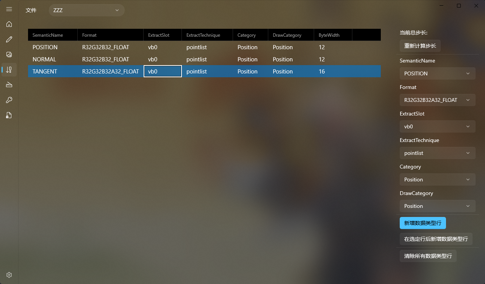

000010-vb1=45a83742-vs=9684c4091fc9e35a.txt开头的内容如下：

```hlsl
stride: 20
first vertex: 0
vertex count: 3776
topology: pointlist
element[0]:
  SemanticName: POSITION
  SemanticIndex: 0
  Format: R32G32B32_FLOAT
  InputSlot: 0
  AlignedByteOffset: 0
  InputSlotClass: per-vertex
  InstanceDataStepRate: 0
element[1]:
  SemanticName: NORMAL
  SemanticIndex: 0
  Format: R32G32B32_FLOAT
  InputSlot: 0
  AlignedByteOffset: 12
  InputSlotClass: per-vertex
  InstanceDataStepRate: 0
element[2]:
  SemanticName: TANGENT
  SemanticIndex: 0
  Format: R32G32B32A32_FLOAT
  InputSlot: 0
  AlignedByteOffset: 24
  InputSlotClass: per-vertex
  InstanceDataStepRate: 0
element[3]:
  SemanticName: COLOR
  SemanticIndex: 0
  Format: R8G8B8A8_UNORM
  InputSlot: 1
  AlignedByteOffset: 0
  InputSlotClass: per-vertex
  InstanceDataStepRate: 0
element[4]:
  SemanticName: TEXCOORD
  SemanticIndex: 0
  Format: R16G16_FLOAT
  InputSlot: 1
  AlignedByteOffset: 4
  InputSlotClass: per-vertex
  InstanceDataStepRate: 0
element[5]:
  SemanticName: TEXCOORD
  SemanticIndex: 1
  Format: R32G32_FLOAT
  InputSlot: 1
  AlignedByteOffset: 8
  InputSlotClass: per-vertex
  InstanceDataStepRate: 0
element[6]:
  SemanticName: TEXCOORD
  SemanticIndex: 2
  Format: R16G16_FLOAT
  InputSlot: 1
  AlignedByteOffset: 16
  InputSlotClass: per-vertex
  InstanceDataStepRate: 0
element[7]:
  SemanticName: TEXCOORD
  SemanticIndex: 3
  Format: R8G8B8A8_UNORM
  InputSlot: 0
  AlignedByteOffset: 0
  InputSlotClass: per-vertex
  InstanceDataStepRate: 0
element[8]:
  SemanticName: TEXCOORD
  SemanticIndex: 4
  Format: R8G8B8A8_UNORM
  InputSlot: 0
  AlignedByteOffset: 0
  InputSlotClass: per-vertex
  InstanceDataStepRate: 0
element[9]:
  SemanticName: TEXCOORD
  SemanticIndex: 5
  Format: R8G8B8A8_UNORM
  InputSlot: 0
  AlignedByteOffset: 0
  InputSlotClass: per-vertex
  InstanceDataStepRate: 0
element[10]:
  SemanticName: TEXCOORD
  SemanticIndex: 6
  Format: R8G8B8A8_UNORM
  InputSlot: 0
  AlignedByteOffset: 0
  InputSlotClass: per-vertex
  InstanceDataStepRate: 0
element[11]:
  SemanticName: TEXCOORD
  SemanticIndex: 7
  Format: R8G8B8A8_UNORM
  InputSlot: 0
  AlignedByteOffset: 0
  InputSlotClass: per-vertex
  InstanceDataStepRate: 0
element[12]:
  SemanticName: BLENDWEIGHTS
  SemanticIndex: 0
  Format: R8G8B8A8_UNORM
  InputSlot: 3
  AlignedByteOffset: 16
  InputSlotClass: per-vertex
  InstanceDataStepRate: 0
element[13]:
  SemanticName: BLENDINDICES
  SemanticIndex: 0
  Format: R32_UINT
  InputSlot: 2
  AlignedByteOffset: 0
  InputSlotClass: per-vertex
  InstanceDataStepRate: 0

vertex-data:

vb1[0]+000 COLOR: 0.501960814, 0.501960814, 0.0470588244, 0
vb1[0]+004 TEXCOORD: 0.991210938, 0.834472656
vb1[0]+008 TEXCOORD1: -0.443332762, 0.315481067
vb1[0]+016 TEXCOORD2: 0.991699219, 0.265136719

vb1[1]+000 COLOR: 0.501960814, 0.501960814, 0.0470588244, 0
vb1[1]+004 TEXCOORD: 0.996582031, 0.827636719
vb1[1]+008 TEXCOORD1: 0.435200036, -0.399171859
vb1[1]+016 TEXCOORD2: 0.9921875, 0.260742188

```

可以推断出需要添加如下数据类型行：

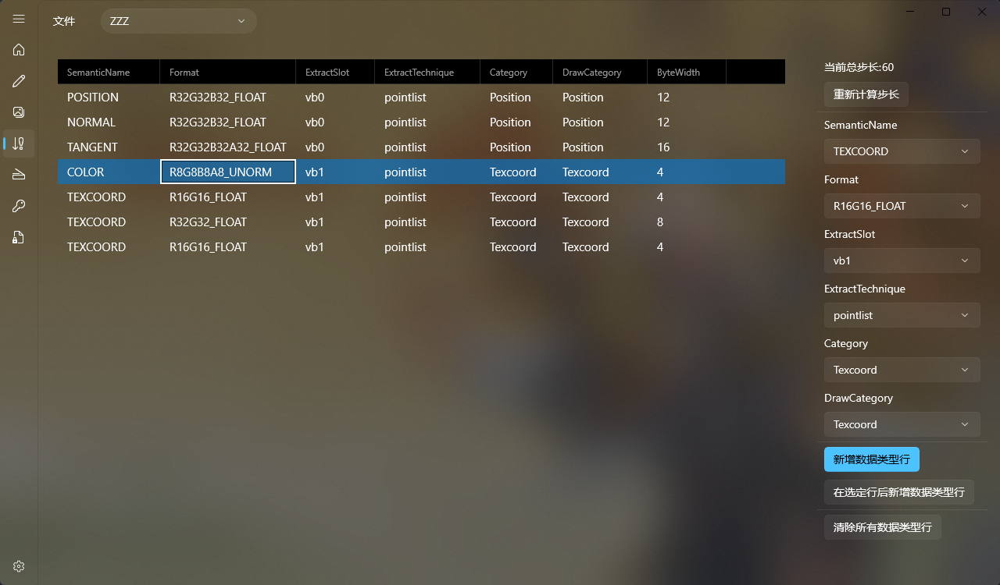

最后000010-vb2=e59479bf-vs=9684c4091fc9e35a.txt开头的内容如下

```
stride: 4
first vertex: 0
vertex count: 3776
topology: pointlist
element[0]:
  SemanticName: POSITION
  SemanticIndex: 0
  Format: R32G32B32_FLOAT
  InputSlot: 0
  AlignedByteOffset: 0
  InputSlotClass: per-vertex
  InstanceDataStepRate: 0
element[1]:
  SemanticName: NORMAL
  SemanticIndex: 0
  Format: R32G32B32_FLOAT
  InputSlot: 0
  AlignedByteOffset: 12
  InputSlotClass: per-vertex
  InstanceDataStepRate: 0
element[2]:
  SemanticName: TANGENT
  SemanticIndex: 0
  Format: R32G32B32A32_FLOAT
  InputSlot: 0
  AlignedByteOffset: 24
  InputSlotClass: per-vertex
  InstanceDataStepRate: 0
element[3]:
  SemanticName: COLOR
  SemanticIndex: 0
  Format: R8G8B8A8_UNORM
  InputSlot: 1
  AlignedByteOffset: 0
  InputSlotClass: per-vertex
  InstanceDataStepRate: 0
element[4]:
  SemanticName: TEXCOORD
  SemanticIndex: 0
  Format: R16G16_FLOAT
  InputSlot: 1
  AlignedByteOffset: 4
  InputSlotClass: per-vertex
  InstanceDataStepRate: 0
element[5]:
  SemanticName: TEXCOORD
  SemanticIndex: 1
  Format: R32G32_FLOAT
  InputSlot: 1
  AlignedByteOffset: 8
  InputSlotClass: per-vertex
  InstanceDataStepRate: 0
element[6]:
  SemanticName: TEXCOORD
  SemanticIndex: 2
  Format: R16G16_FLOAT
  InputSlot: 1
  AlignedByteOffset: 16
  InputSlotClass: per-vertex
  InstanceDataStepRate: 0
element[7]:
  SemanticName: TEXCOORD
  SemanticIndex: 3
  Format: R8G8B8A8_UNORM
  InputSlot: 0
  AlignedByteOffset: 0
  InputSlotClass: per-vertex
  InstanceDataStepRate: 0
element[8]:
  SemanticName: TEXCOORD
  SemanticIndex: 4
  Format: R8G8B8A8_UNORM
  InputSlot: 0
  AlignedByteOffset: 0
  InputSlotClass: per-vertex
  InstanceDataStepRate: 0
element[9]:
  SemanticName: TEXCOORD
  SemanticIndex: 5
  Format: R8G8B8A8_UNORM
  InputSlot: 0
  AlignedByteOffset: 0
  InputSlotClass: per-vertex
  InstanceDataStepRate: 0
element[10]:
  SemanticName: TEXCOORD
  SemanticIndex: 6
  Format: R8G8B8A8_UNORM
  InputSlot: 0
  AlignedByteOffset: 0
  InputSlotClass: per-vertex
  InstanceDataStepRate: 0
element[11]:
  SemanticName: TEXCOORD
  SemanticIndex: 7
  Format: R8G8B8A8_UNORM
  InputSlot: 0
  AlignedByteOffset: 0
  InputSlotClass: per-vertex
  InstanceDataStepRate: 0
element[12]:
  SemanticName: BLENDWEIGHTS
  SemanticIndex: 0
  Format: R8G8B8A8_UNORM
  InputSlot: 3
  AlignedByteOffset: 16
  InputSlotClass: per-vertex
  InstanceDataStepRate: 0
element[13]:
  SemanticName: BLENDINDICES
  SemanticIndex: 0
  Format: R32_UINT
  InputSlot: 2
  AlignedByteOffset: 0
  InputSlotClass: per-vertex
  InstanceDataStepRate: 0

vertex-data:

vb2[0]+000 BLENDINDICES: 0

vb2[1]+000 BLENDINDICES: 0


```

可以推断出要添加如下数据类型行：


这里需要注意的是，我们的BLENDINDICES的Category填写的是Blend，但是DrawCategory填写的是Position。

这是因为Category代表它所属的分类，也就是ExtractSlot的一个别名，而DrawCategory决定了在ini中它是在哪个分类中进行资源替换，绝区零的Blend都在Position里进行替换。

到这里数据类型就添加好了，我们点击文件，保存当前数据类型：

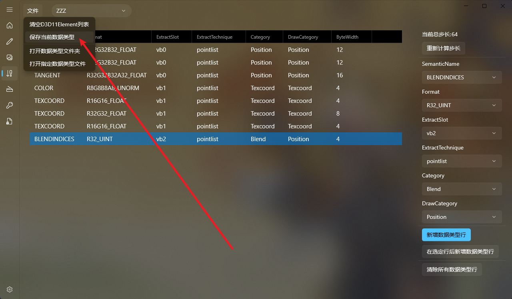

保存成功后自动打开当前数据类型文件夹，可以看到我们刚保存的文件：

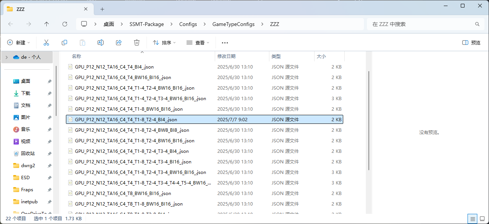

这个文件名就是数据类型的简称。

添加完数据类型我们就可以重新去提取了：

可以看到，提取成功了：

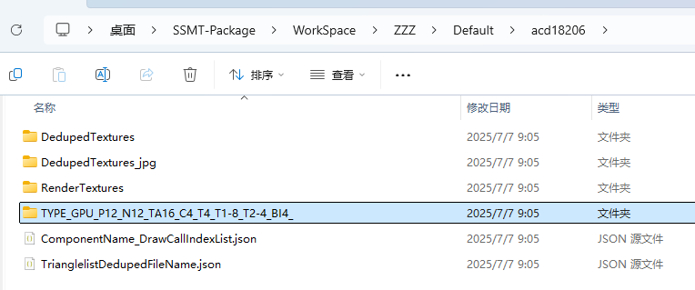

导入Blender再次检查UV和权重是否正确：

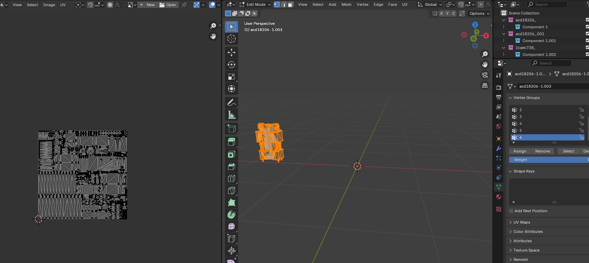

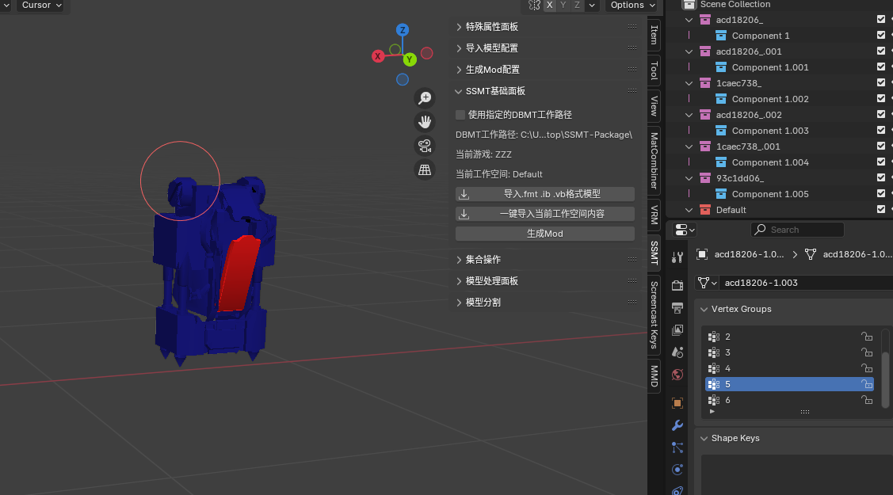

确认没有问题，到这里一个绝区零的数据类型就添加完成了。

