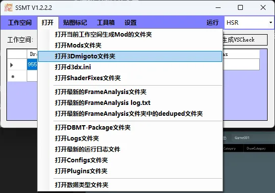
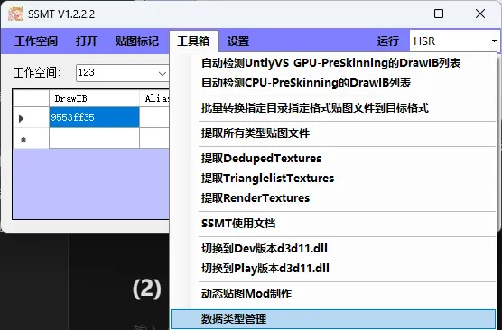
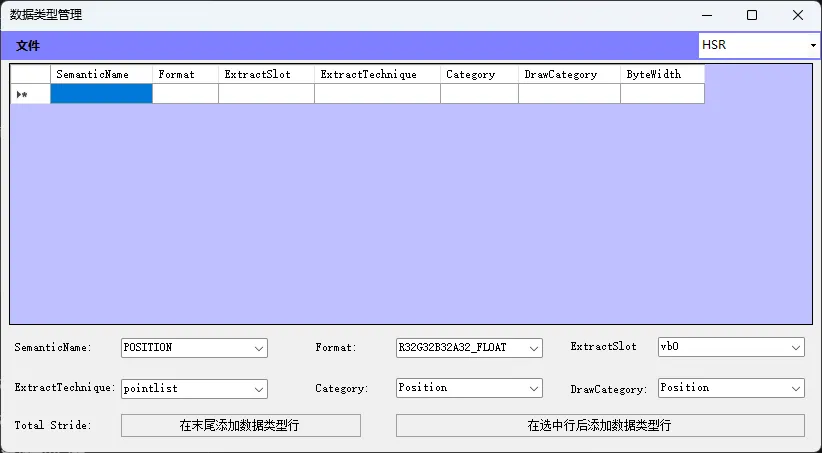

# (1) 找开发者添加
把整个Dump下来的FrameAnalysis文件夹都发过来，以及提取用的DrawIB列表。

如果文件太大可以开启Symlink特性来dump，这样压缩后体积就很小了。

Dump下来的FrameAnalysis文件夹在你当前选定的3Dmigoto目录下，点这个按钮就能打开查看：

一般F8下来的，看文件夹的名字和日期就能知道是最新的，必须发我最新Dump的，然后就是DrawIB列表也一起发来。

# (2) 自己在数据类型页面添加

不会用建议放弃，这个功能是给开发者用的，除非你真的会用。
