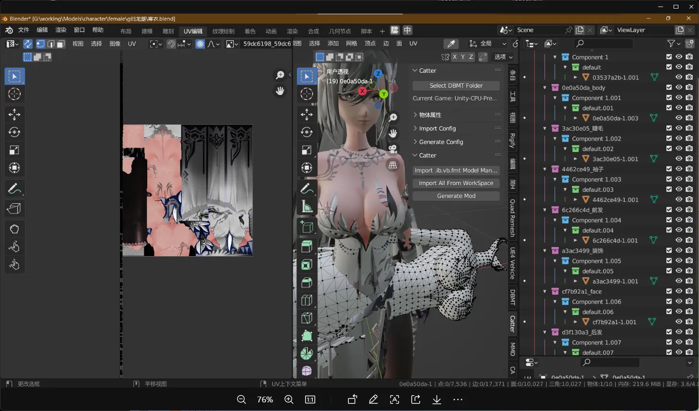
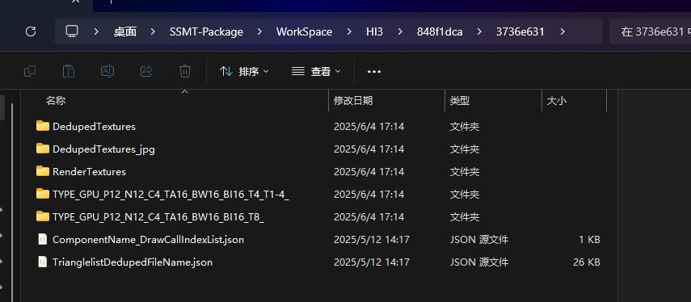

SSMT提取时会把符合Buffer步长的数据类型都提取出来，大部分时候都是正确的。

但是如果导入后UV不正确，例如下图，可以看看是不是导入Blender的数据类型错了。

如果有多个数据类型则换个数据类型导入。

比如上图中有两个数据类型，他们的UV的数据类型分别是T4_T1-4和T8，即把Dump下来的Buffer描述为R16G16_FLOAT类型的两个UV，或者把Dump下来的Buffer描述为R32G32_FLOAT类型的一个UV。

虽然总长度都是8，但是两种不同的UV描述会导致Blender解析数据时完全不同的结果。

如果只有一个还错误，说明SSMT暂未添加支持，可以联系我添加这个数据类型的支持。

