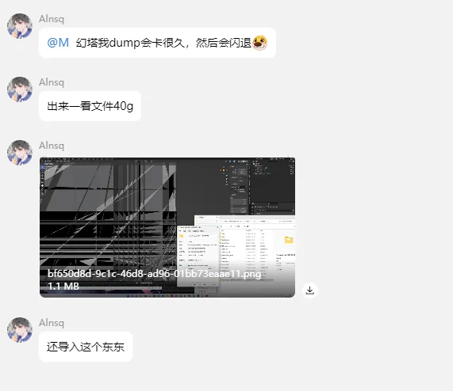

- 这取决于你当前的Hunting界面有多少个IB
- IB越多，dump的文件越多
- 记得在Dump之前，让IB的总数尽可能小，控制在100个以内最好
- 按小键盘+号键可以把累计的IB清空，每次Dump之前都要按的，不然IB数值会很多且容易报错。
- Dump时尽量摄像机朝天，同时让你要dump的物品出现在摄像机里，这样能减少很多IB，一般的游戏都是天空上不会放很多物体。
- Unity游戏如果Dump很多的话，会导致游戏卡住断线直到Dump完重连为止。
- UE游戏如果Dump很多的话，会一直Dump直到120秒触发UE崩溃自检自动卡退游戏。
- 可以开启Symlink特性来减小Dump文件的大小以及减少Dump时间。

