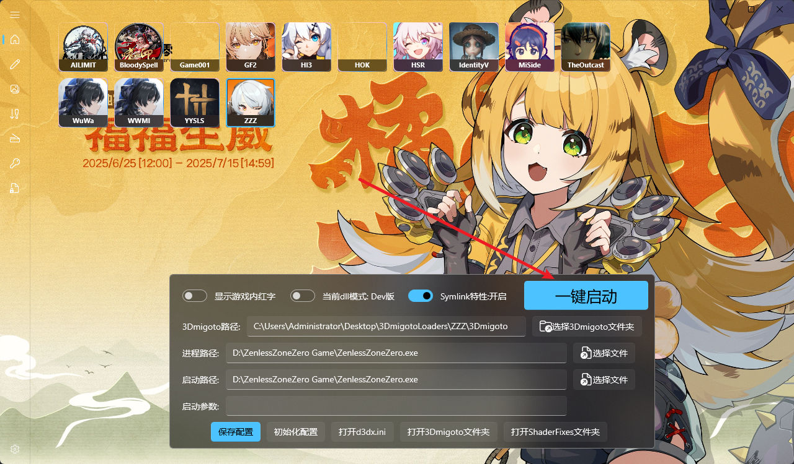
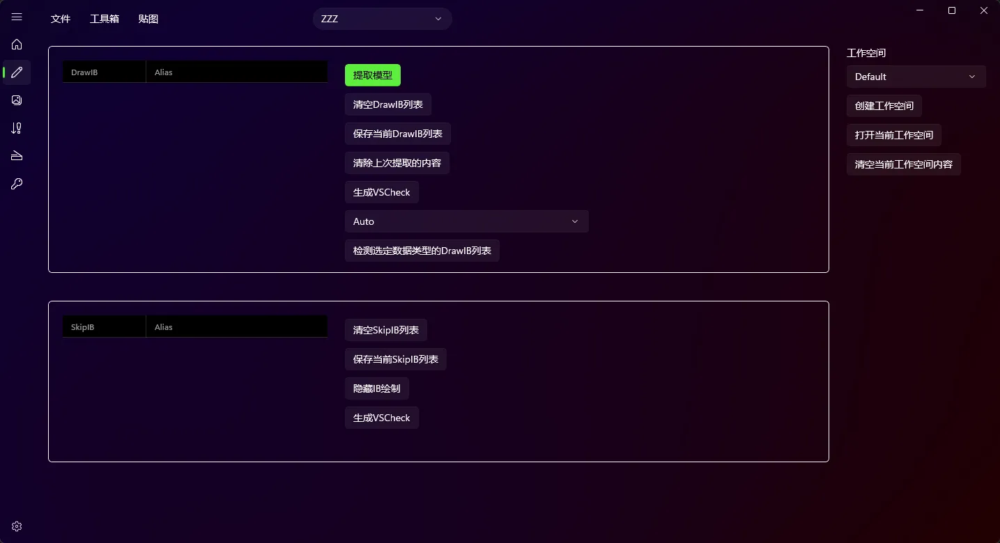
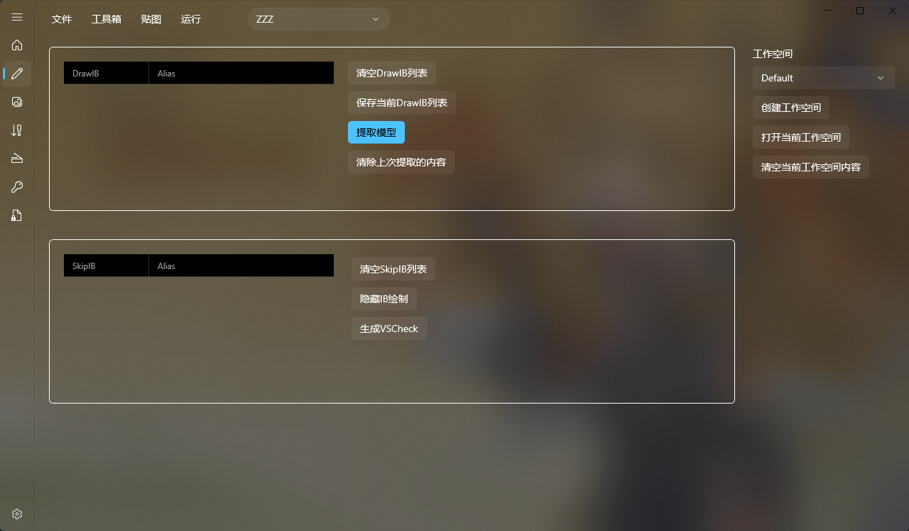

SSMT的用法涉及细节比较多，所以专门制作了视频教程，可以在内群的公告的百度网盘里查看。

# (1) 启动游戏并注入3Dmigoto

参数全部填写正确后，点击一键启动，即可自动启动3Dmigoto Loader.exe并注入3Dmigoto到游戏中

# (2) 创建工作空间
什么是工作空间？

工作空间，如图：

新用户第一次打开SSMT切换到控制台时，会全自动创建一个名为Default的工作空间。

工作空间就是用来隔离不同的Mod制作的工作内容的。

一般情况下，我们进行一次F8 Dump，然后输入里面的IB来提取模型，此时提取出的内容就会放到一个工作空间中。

直觉上来讲，就是每次我要做一个新角色的Mod，我就会创建一个单独的工作空间来提取模型。

创建工作空间

在工作台里右侧有【创建工作空间】按钮，你可以在上面的下拉框里填写一个工作空间名称，然后点击【创建工作空间】，这样就会自动创建并切换到一个新的工作空间。

工作空间的名称会直接用于创建的文件夹的名称，所以凡是Windows系统文件夹名称不允许的字符，你都不能使用，这里我建议使用纯英文或简单的中文，尽量简短且不要有特殊符号。

打开当前工作空间

这个在Mod制作时非常常用，当我们提取完成模型后虽然会自动打开当前的工作空间文件夹，但是有时候我们关掉了这个文件夹之后，就需要点击这个来再次打开，方便手动查看贴图，数据类型，以及提取出来的文件内容等等。

清空当前工作空间内容

这个按钮存在的原因是，有些人很懒，不想考虑工作空间的概念，只是提取模型做一些测试啥的。

此时就会一直用默认的Default，所以点一下这个清空，就能把旧的清空，方便测试新的。

# (3) 提取模型

进入工作台界面

输入DrawIB后，点击提取模型
