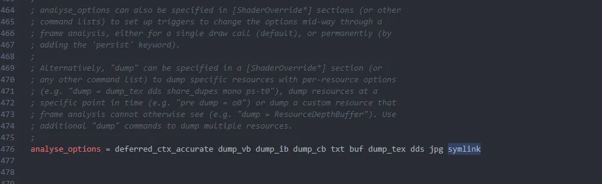
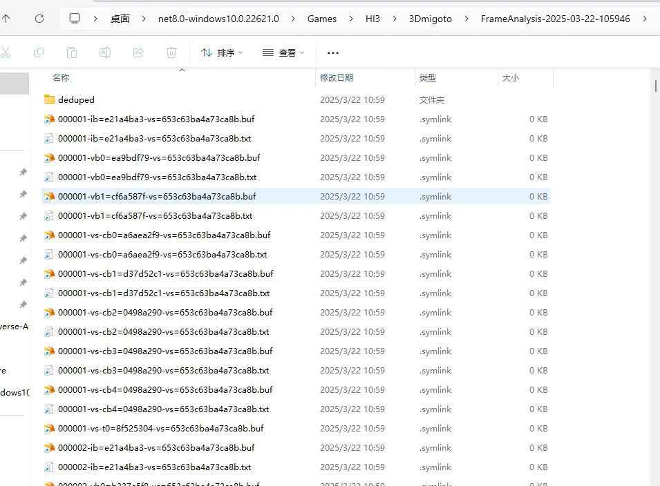
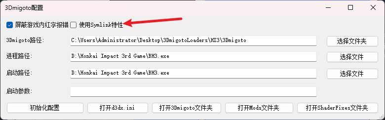

# 开启Symlink特性以减少FrameAnalysis文件夹大小

在使用3Dmigoto的过程中，开启Hunting界面之后如果再按F8，默认的配置会把所有的东西全部Dump出来，平均大小3-20个G不等，但是如果开启了symlink特性，就可以大幅度减少Dump所需时间，并且减少Dump下来的文件的空间占用。

如图，我们在d3dx.ini中找到analyse_options设置：

这里一般情况下你用的旧的3Dmigoto是不会在结尾有symlink这个东西的
我们加上之后再去dump，就会发现dump出来的文件全部都是快捷方式：

也就是Windows系统的symlink，也就是软链接，这个是我推荐的一个标准设置。
如果软链接失败会尝试创建硬链接。

# 说明
- 此功能对标gui_collect中的部分dump，但是不需要额外的学习成本，更加简单方便好用直接。

# 优点：
- 节省Dump下来的FrameAnalysis空间大小，开启之前Dump下来有5个G，开启后只有500MB，大小节省了10倍左右，随着Dump的内容增多，这个比例还会逐渐增大。
- 减少Dump时间，正常Dump可能要5-10秒左右，部分游戏可能要1分钟多，但是开启symlink特性后，Dump时间缩短到1-2秒。

# 缺点：
- 不是每种工具都支持处理symlink文件，目前我测试下来只有DBMT支持，使用老外编写的Python脚本可能由于过于古董而无法处理symlink文件导致报错，也许老外后续会添加支持，也许不会。
- 在测试新游戏时需要频繁观察文件大小，但是symlink需要额外使用010Editor打开文件才能查看大小，有点不方便。

# SSMT的集成
因为Symlink是个很常用的特性，所以我们在SSMT的3Dmigoto配置界面做了集成

如果要开启Symlink特性，只需要在这里进行简单的勾选即可，如果是游戏时更改别忘了F10重载配置。

